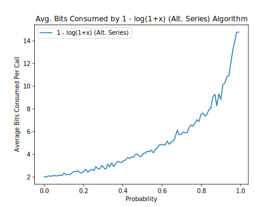
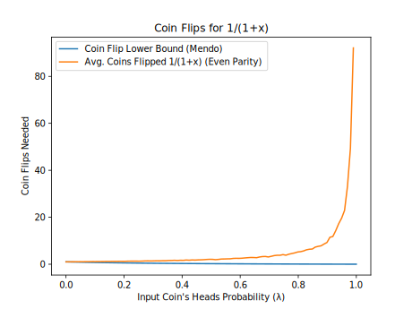
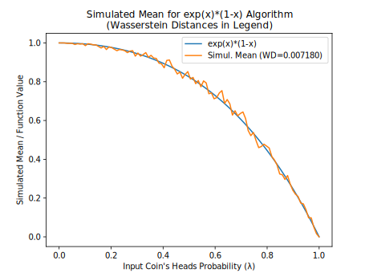
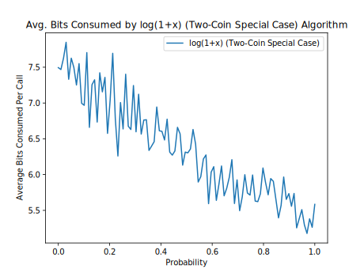
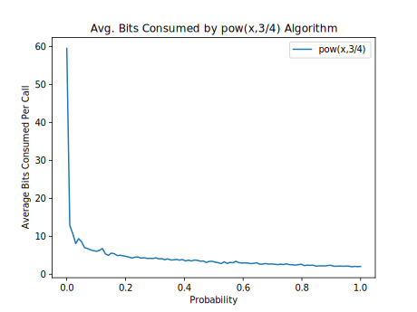
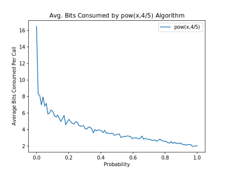
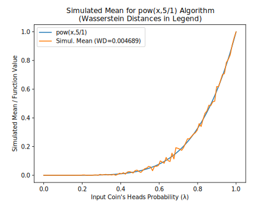
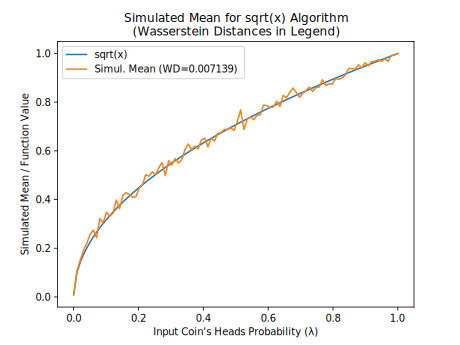

# Bernoulli Factory Algorithms

[**Peter Occil**](mailto:poccil14@gmail.com)

<a id=Introduction></a>
## Introduction

This page catalogs algorithms to turn coins biased one way into coins biased another way, also known as _Bernoulli factories_.  Many of them were suggested in (Flajolet et al., 2010)<sup>[**(1)**](#Note1)</sup>, but without step-by-step instructions in many cases.  This page provides these instructions to help programmers implement the Bernoulli factories they describe.

<a id=About_This_Document></a>
### About This Document

**This is an open-source document; for an updated version, see the** [**source code**](https://github.com/peteroupc/peteroupc.github.io/raw/master/bernoulli.md) **or its** [**rendering on GitHub**](https://github.com/peteroupc/peteroupc.github.io/blob/master/bernoulli.md)**.  You can send comments on this document on the** [**GitHub issues page**](https://github.com/peteroupc/peteroupc.github.io/issues)**.  You are welcome to suggest additional Bernoulli factory algorithms.**

<a id=Contents></a>
## Contents

- [**Introduction**](#Introduction)
    - [**About This Document**](#About_This_Document)
- [**Contents**](#Contents)
- [**About Bernoulli Factories**](#About_Bernoulli_Factories)
- [**Algorithms**](#Algorithms)
    - [**Algorithms for Functions of &lambda;**](#Algorithms_for_Functions_of_lambda)
    - [**Algorithms for Irrational Constants**](#Algorithms_for_Irrational_Constants)
    - [**General Algorithms**](#General_Algorithms)
- [**Correctness and Performance Charts**](#Correctness_and_Performance_Charts)
    - [**The Charts**](#The_Charts)
- [**Notes**](#Notes)
- [**Appendix**](#Appendix)
    - [**Convergence of Bernoulli Factories**](#Convergence_of_Bernoulli_Factories)
    - [**Alternative Implementation of Bernoulli Factories**](#Alternative_Implementation_of_Bernoulli_Factories)
- [**License**](#License)

<a id=About_Bernoulli_Factories></a>
## About Bernoulli Factories

A _Bernoulli factory_ (Keane and O'Brien 1994)<sup>[**(2)**](#Note2)</sup> is an algorithm that takes an input coin (a method that returns 1, or heads, with an unknown probability, or 0, or tails, otherwise) and returns 0 or 1 with a probability that depends on the input coin's probability of heads.  For example, a Bernoulli factory algorithm can take a coin that returns heads with probability &lambda; and produce a coin that returns heads with probability exp(&minus;&lambda;).

A _factory function_ is a function that relates the old probability to the new one.  Its domain is [0, 1] and returns a probability in [0, 1].  There are certain requirements for factory functions.  As shown by Keane and O'Brien (1994)<sup>[**(2)**](#Note2)</sup>, a function _f_ can serve as a factory function if and only if _f_, in the interval \[0, 1\]&mdash;

- is continuous everywhere, and
- either returns a constant value in \[0, 1\] everywhere, or returns a value in \[0, 1\] at each of the points 0 and 1 and a value in (0, 1) at each other point.

As one example, the function _f_ = 2*p cannot serve as a factory function, since its graph touches 1 somewhere in the open interval (0, 1).

The next section will show algorithms for a number of factory functions, allowing different kinds of probabilities to be simulated from input coins.

<a id=Algorithms></a>
## Algorithms

In the following algorithms:

- &lambda; is the unknown probability of heads of the input coin.
- The **SampleGeometricBag** and **URandLess** algorithms are described in my article on [**partially-sampled random numbers (PSRNs)**](https://peteroupc.github.io/exporand.html).
- The `ZeroOrOne` method should be implemented as shown in my article on [**random sampling methods**](https://peteroupc.github.io/randomfunc.html#Boolean_True_False_Conditions).
- The instruction to "generate a uniform random number" can be implemented by creating an empty [**uniform PSRN**](https://peteroupc.github.io/exporand.html) (most accurate) or by generating `RNDEXCRANGE(0, 1)` or `RNDINT(1000)` (less accurate).
- Where an algorithm says "if _a_ is less than _b_", where _a_ and _b_ are uniform random numbers, it means to run the **URandLess** algorithm on the two PSRNs, or do a less-than operation on _a_ and _b_, as appropriate.
- For best results, the algorithms should be implemented using exact rational arithmetic (such as `Fraction` in Python or `Rational` in Ruby).

> **Performance notes:**
>
> The algorithms as described here do not always lead to the best performance.  An implementation may change these algorithms as long as they produce the same results as the algorithms as described here.  Some algorithms are described as "uniformly fast".  This means that their average running time is bounded from above for all choices of &lambda; and other parameters (Devroye 1986, esp. p. 717)<sup>[**(3)**](#Note3)</sup>.
>
> An algorithm can be uniformly fast for all &lambda; parameters in a closed interval in (0, 1) only if its factory function meets the Lipschitz condition on that closed interval, that is, it is continuous and has no slope that tends to a vertical slope anywhere in that interval (Nacu and Peres 2005, proposition 23)<sup>[**(4)**](#Note4)</sup>.

<a id=Algorithms_for_Functions_of_lambda></a>
### Algorithms for Functions of &lambda;

**Algorithms for exp(&minus;&lambda;).**

The algorithm in (Flajolet et al., 2010)<sup>[**(1)**](#Note1)</sup> calls for generating a Poisson(&lambda;) random number and returning 1 if that number is 0, or 0 otherwise.  The Poisson generator in turn involves generating a geometric(&lambda;) random number _G_<sup>[**(5)**](#Note5)</sup>, then _G_ uniform random numbers, then returning _G_ only if all _G_ uniform numbers are sorted.<sup>[**(6)**](#Note6)</sup>  The algorithm follows.

1. Flip the input coin until the coin returns 0.  Then set _G_ to the number of times the coin returns 1 this way.
2. If _G_ is 0, return 1.
3. Generate a uniform random number _w_, and set _i_ to 1.
4. While _i_ is less than _G_:
    1. Generate a uniform random number _U_.
    2. If _w_ is less than _U_, break out of this loop and go to step 1.
    3. Add 1 to _i_, and set _w_ to _U_.
5. Return 0.  (_G_ is now a Poisson(&lambda;) random number, but is other than 0.)

This algorithm, however, runs very slowly as &lambda; approaches 1.

Here is an alternative version of the algorithm above, which doesn't generate a geometric random number at the outset.

1. Set _k_ and _w_ each to 0.
2. Flip the input coin.  If the coin returns 0 and _k_ is 0, return 1.  Otherwise, if the coin returns 0, return 0.
3. Generate a uniform random number _U_.
4. If _k_ > 0 and _w_ is less than _U_, go to step 1.
5. Set _w_ to _U_, add 1 to _k_, and go to step 2.

In turn, this algorithm likewise converges very slowly as &lambda; approaches 1.

A third algorithm is uniformly fast everywhere in (0, 1).   It uses the reverse-time martingale approach for alternating series in (Łatuszyński et al. 2009/2011)<sup>[**(7)**](#Note7)</sup> and makes use of the fact that exp(&minus;&lambda;) can be rewritten as 1 &minus; &lambda; + &lambda;<sup>2</sup>/2 &minus; &lambda;<sup>3</sup>/6 + &lambda;<sup>4</sup>/24 &minus; ..., which is an alternating series whose coefficients are 1, 1, 1/(2!), 1/(3!), 1/(4!), ..., which satisfy the requirements for this approach because the coefficients are nonincreasing and all 1 or less.  However, the algorithm requires a bit more arithmetic, notably rational division.

First, the general algorithm for the reverse-time martingale approach (called the **general martingale algorithm**) follows.  It takes a list of coefficients and an input coin, and returns 1 with probability _c[0]_ &minus; _c[1]_ * &lambda; + _c[2]_ * &lambda;<sup>2</sup> &minus; ..., and 0 otherwise.

1. Let _c[0]_, _c[1]_, etc. be the first, second, etc. coefficients of the alternating series.  Set _u_ to _c[0]_, set _w_ to 1, set _l_ to 0, and set _n_ to 1.
2. Create an empty uniform PSRN.
3. If _w_ is not 0, flip the input coin and multiply _w_ by the result of the flip.
4. If _n_ is even, set _u_ to _l_ + _w_ * _c[n]_.  Otherwise, set _l_ to _u_ + _w_ * _c[n]_.
5. Run the **URandLessThanFraction algorithm** on the PSRN and _l_.  If the algorithm returns 1, return 1.
6. Run the **URandLessThanFraction algorithm** on the PSRN and _u_.  If the algorithm returns 0, return 0.
7. Add 1 to _n_ and go to step 3.

For **exp(&minus;&lambda;)**, modify that algorithm as follows for more efficiency:

- Rather than multiplying by _c[n]_ in step 4, divide _w_ by _n_ in step 3 (after multiplying by the result of the flip).  This is a more efficient way to take account of the factorial in the second and later coefficients.

**Algorithm for exp(&lambda;)*(1&minus;&lambda;)**  (Flajolet et al., 2010)<sup>[**(1)**](#Note1)</sup>:

1. Set _k_ and _w_ each to 0.
2. Flip the input coin.  If it returns 0, return 1.
3. Generate a uniform random number _U_.
4. If _k_ > 0 and _w_ is less than _U_, return 0.
5. Set _w_ to _U_, add 1 to _k_, and go to step 2.

**Algorithm for exp(&minus;&lambda; &minus; _c_)**.  To the best of my knowledge, I am not aware of any article or paper by others that presents this particular Bernoulli factory. In this algorithm, _c_ is an integer that is 0 or greater.

1. Run the **algorithm for exp(&minus;_c_/1)** described later in this document.  Return 0 if the algorithm returns 0.
2. Return the result of the **algorithm for exp(&minus;&lambda;)**.

**Algorithms for 1/(1+&lambda;).**

One algorithm is the general martingale algorithm, since when &lambda; is in [0, 1], this function is an alternating series of the form `1 - x + x^2 - x^3 + ...`, whose coefficients are 1, 1, 1, 1, ....  However, this algorithm converges slowly when &lambda; is very close to 1.

A second algorithm is the so-called "even-parity" construction of (Flajolet et al., 2010)<sup>[**(1)**](#Note1)</sup>.  However, this algorithm too converges slowly when &lambda; is very close to 1.

1. Flip the input coin.  If it returns 0, return 1.
2. Flip the input coin.  If it returns 0, return 0.  Otherwise, go to step 1.

A third algorithm is a special case of the two-coin Bernoulli factory of (Gonçalves et al., 2017)<sup>[**(8)**](#Note8)</sup> and is uniformly fast, unlike the previous two algorithms:

1. With probability 1/2, return 1. (For example, generate an unbiased random bit and return 1 if that bit is 1.)
2. Flip the input coin.  If it returns 1, return 0.  Otherwise, go to step 1.

**Algorithm for log(1+&lambda;)**  (Flajolet et al., 2010)<sup>[**(1)**](#Note1)</sup>:

1. Create an empty uniform PSRN.
2. Flip the input coin.  If it returns 0, flip the coin again and return the result.
3. Call the **SampleGeometricBag** algorithm with the PSRN.  If it returns 0, flip the input coin and return the result.
4. Flip the input coin.  If it returns 0, return 0.
5. Call the **SampleGeometricBag** algorithm with the PSRN.  If it returns 0, return 0.  Otherwise, go to step 2.

Observing that the even-parity construction used in the Flajolet paper is equivalent to the two-coin special case, which is uniformly fast for all &lambda; parameters, the algorithm above can be made uniformly fast as follows:

1. Create an empty uniform PSRN.
2. With probability 1/2, flip the input coin and return the result.
3. Call **SampleGeometricBag** on the PSRN, then flip the input coin.  If the call and the flip both return 1, return 0.  Otherwise, go to step 2.

**Algorithm for 1 &minus; log(1+&lambda;).**  Invert the result of the algorithm for log(1+&lambda;) (make it 1 if it's 0 and vice versa).<sup>[**(9)**](#Note9)</sup>

**Algorithm for _c_ * &lambda; * &beta; / (&beta; * (_c_ * &lambda; + _d_ * &mu;) &minus; (&beta; &minus; 1) * (_c_ + _d_)).**  This is the general two-coin algorithm of (Gonçalves et al., 2017)<sup>[**(8)**](#Note8)</sup> and (Vats et al. 2020)<sup>[**(10)**](#Note10)</sup>.  It takes two input coins that each output heads (1) with probability &lambda; or &mu;, respectively.  It also takes a parameter &beta; in the interval [0, 1], which is a so-called "portkey" or early rejection parameter (when &beta; = 1, the formula simplifies to _c_ * &lambda; / (_c_ * &lambda; + _d_ * &mu;)).

1. With probability &beta;, go to step 2.  Otherwise, return 0. (For example, call `ZeroOrOne` with &beta;'s numerator and denominator, and return 0 if that call returns 0, or go to step 2 otherwise.)
2. With probability _c_ / (_c_ + _d_), flip the &lambda; input coin.  Otherwise, flip the &mu; input coin.  If the &lambda; input coin returns 1, return 1.  If the &mu; input coin returns 1, return 0.  If the corresponding coin returns 0, go to step 1.

**Algorithm for _c_ * &lambda; / (_c_ * &lambda; + _d_) or (_c_/_d_) * &lambda; / (1 + (_c_/_d_) * &lambda;)).** This algorithm, also known as the **logistic Bernoulli factory** (Huber 2016)<sup>[**(11)**](#Note11)</sup>, (Morina et al., 2019)<sup>[**(12)**](#Note12)</sup>, is a special case of the two-coin algorithm above, but this time uses only one input coin.

1. With probability _d_ / (_c_ + _d_), return 0.
2. Flip the input coin.  If the coin returns 1, return 1.  Otherwise, go to step 1.

(Note that Huber specifies this Bernoulli factory in terms of a Poisson point process, which seems to require much more randomness on average.)

**Algorithm for arctan(&lambda;) /&lambda;** (Flajolet et al., 2010)<sup>[**(1)**](#Note1)</sup>:

1. Generate an empty uniform PSRN.
2. Call **SampleGeometricBag** twice on the PSRN, and flip the input coin twice.  If any of these calls or flips returns 0, return 1.
3. Call **SampleGeometricBag** twice on the PSRN, and flip the input coin twice.  If any of these calls or flips returns 0, return 0.  Otherwise, go to step 2.

Observing that the even-parity construction used in the Flajolet paper is equivalent to the two-coin special case, which is uniformly fast for all &lambda; parameters, the algorithm above can be made uniformly fast as follows:

1. Create an empty uniform PSRN.
2. With probability 1/2, return 1.
3. Call **SampleGeometricBag** twice on the PSRN, and flip the input coin twice.  If all of these calls and flips return 1, return 0.  Otherwise, go to step 2.

**Algorithm for arctan(&lambda;)** (Flajolet et al., 2010)<sup>[**(1)**](#Note1)</sup>:

- Call the **algorithm for arctan(&lambda;) /&lambda;** and flip the input coin.  Return 1 if the call and flip both return 1, or 0 otherwise.

**Algorithm for &lambda;<sup>_x_/_y_</sup>.** In the algorithm below, the case where _x_/_y_ is in (0, 1) is due to recent work by Mendo (2019)<sup>[**(13)**](#Note13)</sup>.  The algorithm works only when _x_/_y_ is 0 or greater.

1. If _x_/_y_ is 0, return 1.
2. If _x_/_y_ is equal to 1, flip the input coin and return the result.
3. If _x_/_y_ is greater than 1:
    1. Set _ipart_ to floor(_x_/_y_) and _fpart_ to `rem(x, y)`.
    2. If _fpart_ is greater than 0, subtract 1 from _ipart_, then call this algorithm recursively with _x_ = floor(_fpart_/2) and _y_ = _y_, then call this algorithm, again recursively, with _x_ = _fpart_ &minus; floor(_fpart_/2) and _y_ = _y_. Return 0 if either call returns 0.  (This is done rather than the more obvious approach to avoid calling this algorithm with fractional parts very close to 0, because the algorithm runs much more slowly than for fractional parts closer to 1.)
    3. If _ipart_ is 1 or greater, flip the input coin _ipart_ many times.  Return 0 if any of these flips returns 1.
    4. Return 1.
4. _x_/_y_ is less than 1, so set _i_ to 1.
5. Flip the input coin; if it returns 1, return 1.
6. Return 0 with probability _x_/(_y_*_i_).
7. Add 1 to _i_ and go to step 5.

> **Note:** When _x_/_y_ is less than 1, the minimum number of coin flips needed, on average, by this algorithm will grow without bound as &lambda; approaches 0.  In fact, no fast Bernoulli factory algorithm can avoid this unbounded growth without additional information on &lambda; (Mendo 2019)<sup>[**(13)**](#Note13)</sup>.  See also the appendix, which also shows an alternative way to implement this and other Bernoulli factory algorithms using PSRNs, which exploits knowledge of &lambda; but is not the focus of this article since it involves arithmetic.

**Algorithm for &lambda;<sup>&mu;</sup>.** This algorithm is based on the previous one, but changed to accept a second input coin (which outputs heads with probability &mu;) rather than a fixed value for the exponent. To the best of my knowledge, I am not aware of any other article or paper that presents this particular Bernoulli factory.

1. Set _i_ to 1.
2. Flip the input coin that simulates the base, &lambda;; if it returns 1, return 1.
3. Flip the input coin that simulates the exponent, &mu;; if it returns 1, return 0 with probability 1/_i_.
4. Add 1 to _i_ and go to step 1.

**Algorithm for sqrt(&lambda;).** Use the algorithm for &lambda;<sup>1/2</sup>.

**Algorithm for arcsin(&lambda;) + sqrt(1 &minus; &lambda;<sup>2</sup>) &minus; 1.** (Flajolet et al., 2010)<sup>[**(1)**](#Note1)</sup>.  The algorithm given here uses the special two-coin case rather than the even-parity construction.

1. Create an empty uniform PSRN.
2. Create a secondary coin &mu; that does the following:
    - Call **SampleGeometricBag** twice on the PSRN, and flip the input coin twice.  If all of these calls and flips return 1, return 0.  Otherwise, return 1.
3. Call the **algorithm for &mu;<sup>1/2</sup>** using the secondary coin &mu;.  If it returns 0, return 0.
4. With probability 1/2, flip the input coin and return the result.
5. Call **SampleGeometricBag** once on the PSRN, and flip the input coin once.  If both the call and flip return 1, return 0.  Otherwise, go to step 4.

**Algorithm for arcsin(&lambda;) / 2.**  The Flajolet paper doesn't explain in detail how arcsin(&lambda;)/2 arises out of arcsin(&lambda;) + sqrt(1 &minus; &lambda;<sup>2</sup>) &minus; 1 via Bernoulli factory constructions, but here is an algorithm.<sup>[**(14)**](#Note14)</sup> Note, however, that the number of input coin flips is expected to grow without bound as &lambda; approaches 1.

1. With probability 1/2, run the **algorithm for arcsin(&lambda;) + sqrt(1 &minus; &lambda;<sup>2</sup>) &minus; 1** and return the result.
2. Create a secondary coin &mu; that does the following:
    - Flip the input coin twice.  If both flips return 1, return 0.  Otherwise, return 1.
3. Call the **algorithm for &mu;<sup>1/2</sup>** using the secondary coin &mu;.  If it returns 0, return 1; otherwise, return 0.

<a id=Algorithms_for_Irrational_Constants></a>
### Algorithms for Irrational Constants

The following algorithms generate heads with a probability equal to an irrational number.  (On the other hand, probabilities that are _rational_ constants are trivial to simulate.  If fair coins are available, the `ZeroOrOne` method should be used.  If coins with unknown bias are available, then a _randomness extraction_ method such as the von Neumann algorithm should be used to turn them into fair coins.  Randomness extraction is outside the scope of this document, however.)

**Algorithm for arctan(_x_/_y_) \* _y_/_x_** (Flajolet et al., 2010)<sup>[**(1)**](#Note1)</sup>:

1. Create an empty uniform PSRN.
2. Generate a number that is 1 with probability _x_ * _x_/(_y_ * _y_), or 0 otherwise.  If the number is 0, return 1.
3. Call **SampleGeometricBag** twice on the PSRN.  If either of these calls returns 0, return 1.
4. Generate a number that is 1 with probability _x_ * _x_/(_y_ * _y_), or 0 otherwise.  If the number is 0, return 0.
5. Call **SampleGeometricBag** twice on the PSRN.  If either of these calls returns 0, return 0.  Otherwise, go to step 2.

Observing that the even-parity construction used in the Flajolet paper is equivalent to the two-coin special case, which is uniformly fast, the algorithm above can be made uniformly fast as follows:

1. Create an empty uniform PSRN.
2. With probability 1/2, return 1.
3. With probability _x_ * _x_/(_y_ * _y_), call **SampleGeometricBag** twice on the PSRN.  If both of these calls return 1, return 0.
4. Go to step 2.

**Algorithm for &pi; / 12.**  Two algorithms:

- First algorithm: Use the algorithm for **arcsin(1/2) / 2**.  Where the algorithm says to "flip the input coin", instead generate an unbiased random bit.
- Second algorithm: With probability 2/3, return 0.  Otherwise, run the algorithm for **&pi; / 4** and return the result.

**Algorithm for &pi; / 4** (Flajolet et al., 2010)<sup>[**(1)**](#Note1)</sup>:

1. Generate a random integer in the interval [0, 6), call it _n_.
2. If _n_ is less than 3, return the result of the **algorithm for arctan(1/2) \* 2**.  Otherwise, if _n_ is 3, return 0.  Otherwise, return the result of the **algorithm for arctan(1/3) \* 3**.

**Algorithm for 1 / &pi;** (Flajolet et al., 2010)<sup>[**(1)**](#Note1)</sup>:

1. Generate two geometric(1/4) random numbers, and call _t_ their sum.  (As used here, a geometric(1/4) random number is the number of successes before the first failure, with success probability 1/4.)
2. With probability 5/9, add 1 to _t_.
3. Generate 2*_t_ unbiased random bits, and return 0 if there are more zeros than ones generated this way or vice versa.  (Note that this condition can be checked even before all the bits are generated this way.)  Repeat this step two more times.
4. Return 1.

**Algorithm for (_a_/_b_)<sup>_x_/_y_</sup>.** In the algorithm below, _a_, _b_, _x_, and _y_ are integers, and the case where _x_/_y_ is in (0, 1) is due to recent work by Mendo (2019)<sup>[**(13)**](#Note13)</sup>.  This algorithm works only if&mdash;

-  _x_/_y_ is 0 or greater and _a_/_b_ is in the interval [0, 1], or
-  _x_/_y_ is less than 0 and _a_/_b_ is 1 or greater.

The algorithm follows.

1. If _x_/_y_ is less than 0, swap _a_ and _b_, and remove the sign from _x_/_y_.  If _a_/_b_ is now no longer in the interval [0, 1], return an error.
2. If _x_/_y_ is equal to 1, return 1 with probability _a_/_b_ and 0 otherwise.
3. If _x_ is 0, return 1.  Otherwise, if _a_ is 0, return 0.  Otherwise, if _a_ equals _b_, return 1.
4. If _x_/_y_ is greater than 1:
    1. Set _ipart_ to floor(_x_/_y_) and _fpart_ to `rem(x, y)`.
    2. If _fpart_ is greater than 0, subtract 1 from _ipart_, then call this algorithm recursively with _x_ = floor(_fpart_/2) and _y_ = _y_, then call this algorithm, again recursively, with _x_ = _fpart_ &minus; floor(_fpart_/2) and _y_ = _y_. Return 0 if either call returns 0.  (This is done rather than the more obvious approach to avoid calling this algorithm with fractional parts very close to 0, because the algorithm runs much more slowly than for fractional parts closer to 1.)
    3. If _ipart_ is 1 or greater, generate a random number that is 1 with probability _a_<sup>_ipart_</sup>/_b_<sup>_ipart_</sup> or 0 otherwise. (Or generate _ipart_ many random numbers that are each 1 with probability _a_/_b_ or 0 otherwise, then multiply them all into one number.)  If that number is 0, return 0.
    4. Return 1.
5. Set _i_ to 1.
6. With probability _a_/_b_, return 1.
7. Otherwise, with probability _x_/(_y_*_i_), return 0.
8. Add 1 to _i_ and go to step 6.

**Algorithm for exp(&minus; _x_/_y_).**  This algorithm takes integers _x_ >= 0 and _y_ > 0 and outputs 1 with probability `exp(-x/y)` or 0 otherwise. It originates from (Canonne et al. 2020)<sup>[**(15)**](#Note15)</sup>.

1. Special case: If _x_ is 0, return 1. (This is because the probability becomes `exp(0) = 1`.)
2. If `x > y` (so _x_/_y_ is greater than 1), call this algorithm (recursively) `floor(x/y)` times with _x_ = _y_ = 1 and once with _x_ = _x_ &minus; floor(_x_/_y_) \* _y_ and _y_ = _y_.  Return 1 if all these calls return 1; otherwise, return 0.
3. Set _r_ to 1 and _i_ to 1.
4. Return _r_ with probability (_y_ \* _i_ &minus; _x_) / (_y_ \* _i_).
5. Set _r_ to 1 &minus; _r_, add 1 to _i_, and go to step 4.

**Algorithm for exp(&minus; _z_).** This algorithm is similar to the previous algorithm, except that the exponent, _z_, can be any real number 0 or greater, as long as _z_ can be rewritten as the sum of one or more components whose fractional parts can each be simulated by a Bernoulli factory algorithm that outputs heads with probability equal to that fractional part. (This makes use of the identity exp(&minus;a) = exp(&minus;b) * exp(&minus;c).)

More specifically:

1. Decompose _z_ into _n_ > 0 positive components that sum to _z_.  For example, if _z_ = 3.5, it can be decomposed into only one component, 3.5 (whose fractional part is trivial to simulate), and if _z_ = &pi;, it can be decomposed into four components that are all (&pi; / 4), which has a not-so-trivial simulation described earlier on this page.
2. For each component _LC_\[_i_\] found this way, let _LI_\[_i_\] be floor(_LC_\[_i_\]) and let _LF_\[_i_\] be _LC_\[_i_\] &minus; floor(_LC_\[_i_\]) (_LC_\[_i_\]'s fractional part).

The algorithm is then as follows:

- For each component _LC_\[_i_\], call the **algorithm for exp(&minus; _LI_\[_i_\]/1)**, and call the **general martingale algorithm** adapted for **exp(&minus;&lambda;)** using the input coin that simulates  _LF_\[_i_\].  If any of these calls returns 0, return 0; otherwise, return 1. (See also (Canonne et al. 2020)<sup>[**(15)**](#Note15)</sup>.)

**Algorithm for (_a_/_b_)<sup>_z_</sup>.** This algorithm is similar to the previous algorithm for powering, except that the exponent, _z_,  can be any real number 0 or greater, as long as _z_ can be rewritten as the sum of one or more components whose fractional parts can each be simulated by a Bernoulli factory algorithm that outputs heads with probability equal to that fractional part. This algorithm makes use of a similar identity as for `exp` and works only if _z_ is 0 or greater and _a_/_b_ is in the interval [0, 1].

Decompose _z_ into _LC_\[_i_\], _LI_\[_i_\], and _LF_\[_i_\] just as for the **exp(&minus; _z_)** algorithm.  The algorithm is then as follows.

- If _z_ is 0, return 1.  Otherwise, if _a_ is 0, return 0.  Otherwise, for each component _LC_\[_i_\] (until the algorithm returns a number):
    1. Call the **algorithm for  (_a_/_b_)<sup>_LI_\[_i_\]/1</sup>**.  If it returns 0, return 0.
    2. Set _j_ to 1.
    3. Generate a random number that is 1 with probability _a_/_b_ and 0 otherwise.  If that number is 1, move on to the next component or, if there are no more components, return 1.
    4. Flip the input coin that simulates  _LF_\[_i_\] (which is the exponent); if it returns 1, return 0 with probability 1/_j_.
    5. Add 1 to _j_ and go to substep 2.

<a id=General_Algorithms></a>
### General Algorithms

**Algorithm for the probability generating function.**  Let _X_ be a random number that follows a discrete distribution (one that takes on a countable number of values).  The following algorithm generates heads with probability **E**\[&lambda;<sup>_X_</sup>\], that is, the expected (average) value of &lambda;<sup>_X_</sup>.  **E**\[&lambda;<sup>_X_</sup>\] is the distribution's _probability generating function_, also known as _factorial moment generating function_ (Dughmi et al. 2017)<sup>[**(16)**](#Note16)</sup>.

1. Generate a random number _N_ of the given distribution.
2. Flip the input coin until the coin returns 0 or the coin is flipped _N_ times.  Return 1 if all the coin flips, including the last, returned 1 (or if _N_ is 0); or return 0 otherwise.

**URandLessThanFraction algorithm**.  The following helper algorithm is used by some of the algorithms on this page.  It returns 1 if a PSRN turns out to be less than a fraction, _frac_, which is a number in the interval \[0, 1\].

1. If _frac_ is 0 or 1, return 0 or 1, respectively. (The case of 1 is a degenerate case since the PSRN could, at least in theory, represent an infinite sequence of ones, making it equal to 1.)
2. Set _pt_ to 1/_base_, and set _i_ to 0. (_base_ is the base, or radix, of the PSRN's digits, such as 2 for binary or 10 for decimal.)
3. Set _d1_ to the digit at the _i_<sup>th</sup> position (starting from 0) of the uniform PSRN.  If there is no digit there, put a digit chosen uniformly at random at that position and set _d1_ to that digit.
4. Set _d2_ to floor(_frac_ / _pt_).  (For example, in base 2, set _d2_ to 0 if _frac_ is less than _pt_, or 1 otherwise.)
5. If _d1_ is less than _d2_, return 1.  If _d1_ is greater than _d2_, return 0.
6. If _frac_ >= _pt_, subtract _pt_ from _frac_.
7. Divide _pt_ by _base_, add 1 to _i_, and go to step 3.

<a id=Correctness_and_Performance_Charts></a>
## Correctness and Performance Charts

The following charts show the correctness of many of the algorithms on this page and show their performance in terms of the number of bits they use on average.  For each algorithm, and for each of 100 &lambda; values evenly spaced from 0.0001 to 0.9999:

- 500 runs of the algorithm were done.  Then...
- The number of bits used by the runs were averaged, as were the return values of the runs (since the return value is either 0 or 1, the mean return value will be in the interval [0, 1]).  The number of bits used included the number of bits used to produce each coin flip, assuming the coin flip procedure for &lambda; was generated using the `Bernoulli#coin()` method in _bernoulli.py_, which produces that probability in an optimal or near-optimal way.

For each algorithm, if a single run was detected to use more than 5000 bits for a given &lambda;, the entire data point for that &lambda; was suppressed in the charts below.

In addition, for each algorithm, a table appears showing the minimum number of input coin flips that any fast Bernoulli factory algorithm will need on average to simulate the given function, based on work by Mendo (2019)<sup>[**(13)**](#Note13)</sup>.  Note that some functions require a growing number of coin flips as &lambda; approaches 0 or 1.

<a id=The_Charts></a>
### The Charts

| Algorithm | Simulated Mean | Average Bits Consumed | Coin Flips |
 --- | --- | --- | --- |
| (1/3)\*x/(1+(1/3)\*x) |  |  |  |
| 0.5\*x/(1+0.5\*x) |  |  |  |
| 1 - log(1+x) (Alt. Series) |  |  |  |
| 1/(1+x) (Alt. Series) |  |  |  |
| 1/(1+x) (Even Parity) |  |  |  |
| 1/(1+x) (Two-Coin Special Case) |  |  |  |
| arcsin(x)+sqrt(1-x\*x)-1 |  |  |  |
| arcsin(x)/2 |  |  |  |
| arctan(x) (Flajolet) |  |  |  |
| arctan(x) (Two-Coin Special Case) |  |  |  |
| exp(-x) (Alg. 2) |  |  |  |
| exp(-x) (Alt. Series) |  |  |  |
| exp(-x) (Flajolet) |  |  |  |
| exp(x)\*(1-x) |  |  |  |
| log(1+x) (Flajolet) |  |  |  |
| log(1+x) (Two-Coin Special Case) |  |  |  |
| pow(x,1/3) |  |  |  |
| pow(x,2/1) |  |  |  |
| pow(x,2/4) |  |  |  |
| pow(x,3/4) |  |  |  |
| pow(x,4/5) |  |  |  |
| pow(x,5/1) |  |  |  |
| pow(x,5/4) |  |  |  |
| sqrt(x) |  |  |  |

<a id=Notes></a>
## Notes

<small><sup id=Note1>(1)</sup> Flajolet, P., Pelletier, M., Soria, M., "[**On Buffon machines and numbers**](https://arxiv.org/abs/0906.5560v2)", arXiv:0906.5560v2  [math.PR], 2010.</small>

<small><sup id=Note2>(2)</sup> Keane,  M.  S.,  and  O'Brien,  G.  L., "A Bernoulli factory", _ACM Transactions on Modeling and Computer Simulation_ 4(2), 1994.</small>

<small><sup id=Note3>(3)</sup> Devroye, L., [**_Non-Uniform Random Variate Generation_**](http://luc.devroye.org/rnbookindex.html), 1986.</small>

<small><sup id=Note4>(4)</sup> Nacu, Şerban, and Yuval Peres. "Fast simulation of new coins from old", The Annals of Applied Probability 15, no. 1A (2005): 93-115.</small>

<small><sup id=Note5>(5)</sup> As used here and in the Flajolet paper, a geometric random number is the number of successes before the first failure, where the success probability is &lambda;.</small>

<small><sup id=Note6>(6)</sup> The Flajolet paper describes what it calls the _von Neumann schema_, which, given a permutation class and an input coin, generates a random non-negative integer _n_ with probability equal to (&lambda;<sup>_n_</sup> * V(_n_) / _n_!) / EGF(&lambda;), where EGF(&lambda;) = &Sigma;<sub>_k_ = 0, 1, ...</sub> (&lambda;<sup>_k_</sup> * V(_k_) / _k_!), and V(_n_) is the number of _valid_ permutations of size _n_.  Here, EGF(&lambda;) is the _exponential generating function_.  Effectively, a geometric(&lambda;) random number _G_ is accepted with probability V(_G_)/_G_! (where _G_! is the number of _possible_ permutations of size _G_, or 1 if _G_ is 0), and rejected otherwise.  The probability that _r_ geometric random numbers are rejected this way is _p_*(1 &minus; _p_)<sup>_r_</sup>, where _p_ = (1 &minus; &lambda;) * EGF(&lambda;).</small>

<small><sup id=Note7>(7)</sup> Łatuszyński, K., Kosmidis, I.,  Papaspiliopoulos, O., Roberts, G.O., "[**Simulating events of unknown probabilities via reverse time martingales**](https://arxiv.org/abs/0907.4018v2)", arXiv:0907.4018v2 [stat.CO], 2009/2011.</small>

<small><sup id=Note8>(8)</sup> Gonçalves, F. B., Łatuszyński, K. G., Roberts, G. O. (2017).  Exact Monte Carlo likelihood-based inference for jump-diffusion processes.</small>

<small><sup id=Note9>(9)</sup> Another algorithm for this function uses the general martingale algorithm, but uses more bits on average as &lambda; approaches 1.  Here, the alternating series is `1 - x + x^2/2 - x^3/3 + ...`, whose coefficients are 1, 1, 1/2, 1/3, ...</small>

<small><sup id=Note10>(10)</sup> Vats, D., Gonçalves, F. B., Łatuszyński, K. G., Roberts, G. O. Efficient Bernoulli factory MCMC for intractable likelihoods, arXiv:2004.07471v1 [stat.CO], 2020.</small>

<small><sup id=Note11>(11)</sup> Huber, M., "[**Optimal linear Bernoulli factories for small mean problems**](https://arxiv.org/abs/1507.00843v2)", arXiv:1507.00843v2 [math.PR], 2016</small>

<small><sup id=Note12>(12)</sup> Morina, G., Łatuszyński, K., et al., "[**From the Bernoulli Factory to a Dice Enterprise via Perfect Sampling of Markov Chains**](https://arxiv.org/abs/1912.09229v1)", arXiv:1912.09229v1 [math.PR], 2019.</small>

<small><sup id=Note13>(13)</sup> Mendo, Luis. "An asymptotically optimal Bernoulli factory for certain functions that can be expressed as power series." Stochastic Processes and their Applications 129, no. 11 (2019): 4366-4384.</small>

<small><sup id=Note14>(14)</sup> One of the only implementations I could find of this, if not the only, was a [**Haskell implementation**](https://github.com/derekelkins/buffon/blob/master/Data/Distribution/Buffon.hs).</small>

<small><sup id=Note15>(15)</sup> Canonne, C., Kamath, G., Steinke, T., "[**The Discrete Gaussian for Differential Privacy**](https://arxiv.org/abs/2004.00010v2)", arXiv:2004.00010v2 [cs.DS], 2020.</small>

<small><sup id=Note16>(16)</sup> Shaddin Dughmi, Jason D. Hartline, Robert Kleinberg, and Rad Niazadeh. 2017. Bernoulli Factories and Black-Box Reductions in Mechanism Design. In _Proceedings of 49th Annual ACM SIGACT Symposium on the Theory of Computing_, Montreal, Canada, June 2017 (STOC’17).</small>

<small><sup id=Note17>(17)</sup> Brassard, G., Devroye, L., Gravel, C., "Remote Sampling with Applications to General Entanglement Simulation", Entropy 2019(21)(92), doi:10.3390/e21010092.</small>

<small><sup id=Note18>(18)</sup> Devroye, L., Gravel, C., "[**Sampling with arbitrary precision**](https://arxiv.org/abs/1502.02539v5)", arXiv:1502.02539v5 [cs.IT], 2015.</small>

<a id=Appendix></a>
## Appendix

&nbsp;

<a id=Convergence_of_Bernoulli_Factories></a>
### Convergence of Bernoulli Factories

The following Python code illustrates how to test a Bernoulli factory algorithm for convergence to the correct probability, as well as the speed of this convergence.  In this case, we are testing the Bernoulli factory algorithm of _x_<sup>_y_/_z_</sup>, where _x_ is in the interval (0, 1) and _y_/_z_ is greater than 0.  Depending on the parameters _x_, _y_, and _z_, this Bernoulli factory converges faster or slower.

```
# Parameters for the Bernoulli factory x**(y/z)
x=0.005 # x is the input coin's probability of heads
y=2
z=3
# Print the desired probability
print(x**(y/z))
passp = 0
failp = 0
# Set cumulative probability to 1
cumu = 1
iters=4000
for i in range(iters):
  # With probability x, the algorithm returns 1 (heads)
  prob=(x);prob*=cumu; passp+=prob; cumu-=prob
  # With probability (y/(z*(i+1))), the algorithm returns 0 (tails)
  prob=(y/(z*(i+1)));prob*=cumu; failp+=prob; cumu-=prob
  # Output the current probability in this iteration,
  # but only for the first 30 and last 30 iterations
  if i<30 or i>=iters-30: print(passp)
```

As this code shows, as _x_ (the probability of heads of the input coin) approaches 0, the convergence rate gets slower and slower, even though the probability will eventually converge to the correct one. In fact, when _y_/_z_ is less than 1:

- The average number of coin flips needed by this algorithm will grow without bound as _x_ approaches 0, and Mendo (2019)<sup>[**(13)**](#Note13)</sup> showed that this is a lower bound; that is, no Bernoulli factory algorithm can do much better without knowing more information on _x_.
- _x_<sup>_y_/_z_</sup> has a slope that tends to a vertical slope near 0, so that the so-called [**_Lipschitz condition_**](https://en.wikipedia.org/wiki/Lipschitz_continuity) is not met at 0.  And (Nacu and Peres 2005, propositions 10 and 23)<sup>[**(4)**](#Note4)</sup> showed that the Lipschitz condition is necessary for a Bernoulli factory to have an upper bound on the average running time.

Thus, a practical implementation of this algorithm may have to switch to an alternative implementation (such as the one described in the next section) when it detects that the geometric bag's first few digits are zeros.

<a id=Alternative_Implementation_of_Bernoulli_Factories></a>
### Alternative Implementation of Bernoulli Factories

Say we have a Bernoulli factory algorithm that takes a coin with probability of heads of _p_ and outputs 1 with probability _f_(_p_).  If this algorithm takes a geometric bag (a partially-sampled uniform random number or PSRN) as the input coin and flips that coin using **SampleGeometricBag**, the algorithm could instead be implemented as follows in order to return 1 with probability _f_(_U_), where _U_ is the number represented by the geometric bag (see also (Brassard et al., 2019)<sup>[**(17)**](#Note17)</sup>, (Devroye 1986, p. 431)<sup>[**(3)**](#Note3)</sup>, (Devroye and Gravel 2015)<sup>[**(18)**](#Note18)</sup>:

1. Set _v_ to 0 and _k_ to 1.
2. Set _v_ to _b_ * _v_ + _d_, where _b_ is the base (or radix) of the geometric bag's digits, and _d_ is a digit chosen uniformly at random.
3. Calculate an approximation of _f_(_U_) as follows:
    1. Set _n_ to the number of items (sampled and unsampled digits) in the geometric bag.
    2. Of the first _n_ items in the geometric bag, sample each of the unsampled digits uniformly at random.  Then let _uk_ be the geometric bag's digit expansion up to the first _n_ digits after the point.
    3. Calculate the lowest and highest values of _f_ in the interval \[_uk_, _uk_ + _b_<sup>&minus;_n_</sup>\], call them _fmin_ and _fmax_. If abs(_fmin_ - _fmax_) <= 2 * _b_<sup>&minus;_k_</sup>, calculate (_fmax_ + _fmin_) / 2 as the approximation.  Otherwise, add 1 to _n_ and go to the previous substep.
4. Let _pk_ be the approximation's digit expansion up to the _k_ digits after the point.  For example, if _f_(_U_) is &pi; and _k_ is 2, _pk_ is 314.
5. If _pk_ + 1 <= _v_, return 0. If _pk_ &minus; 2 >= _v_, return 1.  If neither is the case, add 1 to _k_ and go to step 2.

However, the focus of this article is on algorithms that don't rely on calculations of irrational numbers, which is why this section is in the appendix.

<a id=License></a>
## License

Any copyright to this page is released to the Public Domain.  In case this is not possible, this page is also licensed under [**Creative Commons Zero**](https://creativecommons.org/publicdomain/zero/1.0/).
