# Bernoulli Factory Algorithms

[**Peter Occil**](mailto:poccil14@gmail.com)

<a id=Introduction></a>
## Introduction

This page catalogs algorithms to turn coins biased one way into coins biased another way, also known as _Bernoulli factories_.  Many of them were suggested in (Flajolet et al., 2010)<sup>[**(1)**](#Note1)</sup>, but without step-by-step instructions in many cases.  This page provides these instructions to help programmers implement the Bernoulli factories they describe.  The Python module [**_bernoulli.py_**](https://peteroupc.github.io/bernoulli.py) includes implementations of several Bernoulli factories.

This page also contains algorithms to exactly simulate probabilities that are irrational numbers, using only random bits, which is likewise related to the Bernoulli factory problem.  Again, many of these were suggested in (Flajolet et al., 2010)<sup>[**(1)**](#Note1)</sup>.

This page is focused on sampling methods that _exactly_ simulate the probability described, without introducing rounding errors or other errors beyond those already present in the inputs (and assuming that we have a source of "truly" random numbers).

<a id=About_This_Document></a>
### About This Document

**This is an open-source document; for an updated version, see the** [**source code**](https://github.com/peteroupc/peteroupc.github.io/raw/master/bernoulli.md) **or its** [**rendering on GitHub**](https://github.com/peteroupc/peteroupc.github.io/blob/master/bernoulli.md)**.  You can send comments on this document on the** [**GitHub issues page**](https://github.com/peteroupc/peteroupc.github.io/issues)**.  You are welcome to suggest additional Bernoulli factory algorithms, especially&mdash;**

- **specific** [**continued fraction expansions**](#Continued_Fractions),
- **series expansions for the** [**power series**](#Certain_Power_Series) **algorithms below, and**
- **algorithms that simulate probability mass functions or probability density functions, with or without a normalizing constant.**

<a id=Contents></a>
## Contents

- [**Introduction**](#Introduction)
    - [**About This Document**](#About_This_Document)
- [**Contents**](#Contents)
- [**About Bernoulli Factories**](#About_Bernoulli_Factories)
- [**Algorithms**](#Algorithms)
    - [**Algorithms for Functions of &lambda;**](#Algorithms_for_Functions_of_lambda)
        - [**Certain Power Series**](#Certain_Power_Series)
        - [**exp(&minus;&lambda;)**](#exp_minus_lambda)
        - [**exp(&minus;(&lambda;<sup>_k_</sup> * _x_))**](#exp_minus_lambda__k___x)
        - [**exp(&minus;(&lambda;<sup>_k_</sup> * (_x_ + _m_)))**](#exp_minus_lambda__k___x___m)
        - [**exp(&minus;(&lambda; + _m_)<sup>_k_</sup>)**](#exp_minus_lambda__m___k)
        - [**exp(&lambda;)*(1&minus;&lambda;)**](#exp_lambda_1_minus_lambda)
        - [**(1&minus;&lambda;)/cos(&lambda;)**](#1_minus_lambda_cos_lambda)
        - [**(1&minus;&lambda;) * tan(&lambda;)**](#1_minus_lambda_tan_lambda)
        - [**exp(&lambda; * _c_ &minus; _c_)**](#exp_lambda__c__minus__c)
        - [**exp(&minus;&lambda; &minus; _c_)**](#exp_minus_lambda_minus__c)
        - [**1/(1+&lambda;)**](#1_1_lambda)
        - [**ln(1+&lambda;)**](#ln_1_lambda)
        - [**1 &minus; ln(1+&lambda;)**](#1_minus_ln_1_lambda)
        - [**_c_ * &lambda; * &beta; / (&beta; * (_c_ * &lambda; + _d_ * &mu;) &minus; (&beta; &minus; 1) * (_c_ + _d_))**](#c__lambda_beta_beta__c__lambda__d__mu_minus_beta_minus_1__c___d)
        - [**_c_ * &lambda; / (_c_ * &lambda; + _d_) or (_c_/_d_) * &lambda; / (1 + (_c_/_d_) * &lambda;))**](#c__lambda__c__lambda__d__or__c___d__lambda_1__c___d__lambda)
        - [**1 / (_c_ + &lambda;)**](#1__c__lambda)
        - [**(_d_ + &lambda;) / _c_**](#d__lambda__c)
        - [**_d_ / (_c_ + &lambda;)**](#d___c__lambda)
        - [**(_d_ + &mu;) / (_c_ + &lambda;)**](#d__mu__c__lambda)
        - [**&lambda; + &mu;**](#lambda_mu)
        - [**&lambda; &minus; &mu;**](#lambda_minus_mu)
        - [**1/(_c_ + &lambda;)**](#1__c__lambda_2)
        - [**1 &minus; &lambda;**](#1_minus_lambda)
        - [**&nu; * &lambda; + (1 &minus; &nu;) * &mu;**](#nu_lambda_1_minus_nu_mu)
        - [**&lambda; + &mu; &minus; (&lambda; * &mu;)**](#lambda_mu_minus_lambda_mu)
        - [**(&lambda; + &mu;) / 2**](#lambda_mu_2)
        - [**arctan(&lambda;) /&lambda;**](#arctan_lambda_lambda)
        - [**arctan(&lambda;)**](#arctan_lambda)
        - [**cos(&lambda;)**](#cos_lambda)
        - [**sin(&lambda;)**](#sin_lambda)
        - [**&lambda;<sup>_x_/_y_</sup>**](#lambda__x___y)
        - [**&lambda;<sup>&mu;</sup>**](#lambda_mu_3)
        - [**sqrt(&lambda;)**](#sqrt_lambda)
        - [**arcsin(&lambda;) + sqrt(1 &minus; &lambda;<sup>2</sup>) &minus; 1**](#arcsin_lambda_sqrt_1_minus_lambda_2_minus_1)
        - [**arcsin(&lambda;) / 2**](#arcsin_lambda_2)
        - [**&lambda; * &mu;**](#lambda_mu_4)
        - [**&lambda; * _x_/_y_ (linear Bernoulli factories)**](#lambda__x___y__linear_Bernoulli_factories)
        - [**(&lambda; * _x_/_y_)<sup>_i_</sup>**](#lambda__x___y___i)
        - [**&#x03F5; / &lambda;**](#x03F5_lambda)
        - [**Certain Rational Functions**](#Certain_Rational_Functions)
        - [**Bernstein Polynomials**](#Bernstein_Polynomials)
        - [**Certain Algebraic Functions**](#Certain_Algebraic_Functions)
        - [**Expressions Involving Polylogarithms**](#Expressions_Involving_Polylogarithms)
    - [**Algorithms for Irrational Constants**](#Algorithms_for_Irrational_Constants)
        - [**Digit Expansions**](#Digit_Expansions)
        - [**Continued Fractions**](#Continued_Fractions)
        - [**Continued Logarithms**](#Continued_Logarithms)
        - [**1 / &phi;**](#1_phi)
        - [**sqrt(2) &minus; 1**](#sqrt_2_minus_1)
        - [**1/sqrt(2)**](#1_sqrt_2)
        - [**tanh(1/2) or (exp(1) &minus; 1) / (exp(1) + 1)**](#tanh_1_2_or_exp_1_minus_1_exp_1_1)
        - [**arctan(_x_/_y_) \* _y_/_x_**](#arctan__x___y___y___x)
        - [**&pi; / 12**](#pi_12)
        - [**&pi; / 4**](#pi_4)
        - [**1 / &pi;**](#1_pi)
        - [**(_a_/_b_)<sup>_x_/_y_</sup>**](#a___b___x___y)
        - [**exp(&minus;_x_/_y_)**](#exp_minus__x___y)
        - [**exp(&minus;_z_)**](#exp_minus__z)
        - [**(_a_/_b_)<sup>_z_</sup>**](#a___b___z)
        - [**1 / 1 + exp(_x_ / (_y_ * 2<sup>_prec_</sup>)) (LogisticExp)**](#1_1_exp__x___y__2_prec__LogisticExp)
        - [**1 / 1 + exp(_z_ / 2<sup>_prec_</sup>)) (LogisticExp)**](#1_1_exp__z__2_prec__LogisticExp)
        - [**Polylogarithmic Constants**](#Polylogarithmic_Constants)
        - [**&zeta;(3) * 3 / 4 and Other Zeta-Related Constants**](#zeta_3_3_4_and_Other_Zeta_Related_Constants)
        - [**erf(_x_)/erf(1)**](#erf__x__erf_1)
        - [**2 / (1 + exp(2)) or (1 + exp(0)) / (1 + exp(1))**](#2_1_exp_2_or_1_exp_0_1_exp_1)
        - [**(1 + exp(1)) / (1 + exp(2))**](#1_exp_1_1_exp_2)
    - [**General Algorithms**](#General_Algorithms)
        - [**Convex Combinations**](#Convex_Combinations)
        - [**Simulating the Probability Generating Function**](#Simulating_the_Probability_Generating_Function)
        - [**Integrals**](#Integrals)
- [**Correctness and Performance Charts**](#Correctness_and_Performance_Charts)
    - [**The Charts**](#The_Charts)
- [**Notes**](#Notes)
- [**Appendix**](#Appendix)
    - [**Randomized vs. Non-Randomized Algorithms**](#Randomized_vs_Non_Randomized_Algorithms)
    - [**Simulating Probabilities vs. Estimating Probabilities**](#Simulating_Probabilities_vs_Estimating_Probabilities)
    - [**Convergence of Bernoulli Factories**](#Convergence_of_Bernoulli_Factories)
    - [**Alternative Implementation of Bernoulli Factories**](#Alternative_Implementation_of_Bernoulli_Factories)
    - [**Correctness Proof for the Continued Logarithm Simulation Algorithm**](#Correctness_Proof_for_the_Continued_Logarithm_Simulation_Algorithm)
    - [**Correctness Proof for Continued Fraction Simulation Algorithm 3**](#Correctness_Proof_for_Continued_Fraction_Simulation_Algorithm_3)
    - [**The von Neumann Schema**](#The_von_Neumann_Schema)
    - [**Probabilities Arising from the Forsythe Method**](#Probabilities_Arising_from_the_Forsythe_Method)
    - [**Probabilities Arising from Certain Permutations**](#Probabilities_Arising_from_Certain_Permutations)
    - [**Other Algorithms for exp(&minus;&lambda;)**](#Other_Algorithms_for_exp_minus_lambda)
    - [**Sketch of Derivation of the Algorithm for 1 / &pi;**](#Sketch_of_Derivation_of_the_Algorithm_for_1_pi)
- [**License**](#License)

<a id=About_Bernoulli_Factories></a>
## About Bernoulli Factories

A _Bernoulli factory_ (Keane and O'Brien 1994)<sup>[**(2)**](#Note2)</sup> is an algorithm that takes an input coin (a method that returns 1, or heads, with an unknown probability, or 0, or tails, otherwise) and returns 0 or 1 with a probability that depends on the input coin's probability of heads.  For example, a Bernoulli factory algorithm can take a coin that returns heads with probability &lambda; and produce a coin that returns heads with probability exp(&minus;&lambda;).

A _factory function_ is a function that relates the old probability to the new one.  Its domain is [0, 1] and returns a probability in [0, 1].  There are certain requirements for factory functions.  As shown by Keane and O'Brien (1994)<sup>[**(2)**](#Note2)</sup>, a function _f_(&lambda;) can serve as a factory function if and only if _f_, in a given interval in \[0, 1\]&mdash;

- is continuous everywhere,
- does not go to 0 or 1 exponentially fast, and
- either returns a constant value in \[0, 1\] everywhere, or returns a value in \[0, 1\] at each of the points 0 and 1 and a value in (0, 1) at each other point.

As one example, the function _f_ = 2*&lambda; cannot serve as a factory function, since its graph touches 1 somewhere in the open interval (0, 1).

If a function's graph touches 0 or 1 somewhere in (0, 1), papers have suggested dealing with this by modifying the function so it no longer touches 0 or 1 there (for example, _f_ = 2*&lambda; might become _f_ = min(2 * &lambda;, 1 &minus; &#x03F5;) where &#x03F5; is in (0, 1/2) (Keane and O'Brien 1994)<sup>[**(2)**](#Note2)</sup>, (Huber 2014, introduction)<sup>[**(3)**](#Note3)</sup>), or by somehow ensuring that &lambda; does not come close to the point where the graph touches 0 or 1 (Nacu and Peres 2005, theorem 1)<sup>[**(4)**](#Note4)</sup>.

The next section will show algorithms for a number of factory functions, allowing different kinds of probabilities to be simulated from input coins.

<a id=Algorithms></a>
## Algorithms

In the following algorithms:

- &lambda; is the unknown probability of heads of the input coin.
- The **SampleGeometricBag**, **RandLess**, and **URandLessThanReal** algorithms are described in my article on [**partially-sampled random numbers (PSRNs)**](https://peteroupc.github.io/exporand.html).
- The `ZeroOrOne` method should be implemented as shown in my article on [**random sampling methods**](https://peteroupc.github.io/randomfunc.html#Boolean_True_False_Conditions).
- The instruction to "generate a uniform random number" can be implemented&mdash;
    - by creating a [**uniform PSRN**](https://peteroupc.github.io/exporand.html) with a sign of 1 or positive, an integer part of 0, and an empty fractional part (most accurate), or
    - by generating `RNDEXCRANGE(0, 1)` or `RNDINT(1000)` (less accurate).
- The instruction to "generate an exponential random number" can be implemented&mdash;
    - by creating an empty [**exponential PSRN**](https://peteroupc.github.io/exporand.html) (most accurate), or
    - by generating `-ln(1/RNDEXCRANGE(0, 1))` (less accurate).
- Where an algorithm says "if _a_ is less than _b_", where _a_ and _b_ are partially-sampled random numbers (PSRNs), it means to run the **RandLess** algorithm on the two PSRNs, or do a less-than operation on _a_ and _b_, as appropriate.
- For best results, the algorithms should be implemented using exact rational arithmetic (such as `Fraction` in Python or `Rational` in Ruby).  Floating-point arithmetic is discouraged because it can introduce rounding error.

The algorithms as described here do not always lead to the best performance.  An implementation may change these algorithms as long as they produce the same results as the algorithms as described here.

The algorithms assume that a source of independent and unbiased random bits is available, in addition to the input coins.  But it's possible to implement these algorithms using nothing but those coins as a source of randomness.  See the [**appendix**](#Randomized_vs_Non_Randomized_Algorithms) for details.

Bernoulli factory algorithms that simulate _f_(&lambda;) are equivalent to unbiased estimators of _f_(&lambda;). See the [**appendix**](#Simulating_Probabilities_vs_Estimating_Probabilities) for details.

<a id=Algorithms_for_Functions_of_lambda></a>
### Algorithms for Functions of &lambda;

&nbsp;

<a id=Certain_Power_Series></a>
#### Certain Power Series

Mendo (2019)<sup>[**(5)**](#Note5)</sup> gave a Bernoulli factory algorithm for certain functions that can be rewritten as a series of the form&mdash;

&nbsp;&nbsp;&nbsp;&nbsp;1 &minus; (_c_\[0\] \* (1 &minus; &lambda;) + ... + _c_\[_i_\] * (1 &minus; &lambda;)<sup>_i_ + 1</sup> + ...),

where _c_\[_i_\] >= 0 are the coefficients of the series and sum to 1.  The algorithm follows:

1. Let _v_ be 1 and let _result_ be 1.
2. Set _dsum_ to 0 and _i_ to 0.
3. Flip the input coin.  If it returns _v_, return _result_.
4. If _i_ is equal to or greater than the number of coefficients, set _ci_ to 0.  Otherwise, set _ci_ to _c_\[_i_\].
5. With probability _ci_/(1 &minus; _dsum_), return 1 minus _result_.
6. Add _ci_ to _dsum_, add 1 to _i_, and go to step 3.

As pointed out in Mendo (2019)<sup>[**(5)**](#Note5)</sup>, variants of this algorithm work for power series of the form&mdash;

1. (_c_\[0\] \* (1 &minus; &lambda;) + ... + _c_\[_i_\] * (1 &minus; &lambda;)<sup>_i_ + 1</sup> + ...), or
2. (_c_\[0\] \* &lambda; + ... + _c_\[_i_\] * &lambda;<sup>_i_ + 1</sup> + ...), or
3. 1 &minus; (_c_\[0\] \* &lambda; + ... + _c_\[_i_\] * &lambda;<sup>_i_ + 1</sup> + ...).

In the first two cases, replace "let _result_ be 1" in the algorithm with "let _result_ be 0".  In the last two cases, replace "let _v_ be 1" with "let _v_ be 0".

(Łatuszyński et al. 2009/2011)<sup>[**(6)**](#Note6)</sup> gave an algorithm that works for a wide class of series and other constructs that converge to the desired probability from above and from below.

One of these constructs is an alternating series of the form&mdash;

&nbsp;&nbsp;&nbsp;&nbsp;_d[0]_ &minus; _d[1]_ * &lambda; + _d[2]_ * &lambda;<sup>2</sup> &minus; ...,

where _d_\[_i_\] are all in the interval [0, 1] and form a non-increasing sequence of coefficients.

The following is the general algorithm for this kind of series, called the **general martingale algorithm**.  It takes a list of coefficients and an input coin, and returns 1 with probability given above, and 0 otherwise.

1. Let _d[0]_, _d[1]_, etc. be the first, second, etc. coefficients of the alternating series.  Set _u_ to _d[0]_, set _w_ to 1, set _l_ to 0, and set _n_ to 1.
2. Generate a uniform random number _ret_.
3. If _w_ is not 0, flip the input coin and multiply _w_ by the result of the flip.
4. If _n_ is even, set _u_ to _l_ + _w_ * _d[n]_.  Otherwise, set _l_ to _u_ &minus; _w_ * _d[n]_.
5. If _ret_ is less than _l_, return 1.  If _ret_ is less than _u_, go to the next step.  If neither is the case, return 0.  (If _ret_ is a uniform PSRN, these comparisons should be done via the **URandLessThanReal algorithm**.)
6. Add 1 to _n_ and go to step 3.

If the alternating series has the form&mdash;

&nbsp;&nbsp;&nbsp;&nbsp;_d[0]_ &minus; _d[1]_ * &lambda;<sup>2</sup> + _d[2]_ * &lambda;<sup>4</sup> &minus; ...,

then modify the general martingale algorithm by adding the following after step 3: "3a. Repeat step 3 once."  (Examples of this kind of series are found in sin(&lambda;) and cos(&lambda;).)

<a id=exp_minus_lambda></a>
#### exp(&minus;&lambda;)

This algorithm converges quickly everywhere in (0, 1).  (In other words, the algorithm is _uniformly fast_, meaning the average running time is bounded from above for all choices of &lambda; and other parameters (Devroye 1986, esp. p. 717)<sup>[**(7)**](#Note7)</sup>.) This algorithm is adapted from the general martingale algorithm (in "Certain Power Series", above), and makes use of the fact that exp(&minus;&lambda;) can be rewritten as 1 &minus; &lambda; + &lambda;<sup>2</sup>/2 &minus; &lambda;<sup>3</sup>/6 + &lambda;<sup>4</sup>/24 &minus; ..., which is an alternating series whose coefficients are 1, 1, 1/(2!), 1/(3!), 1/(4!), ....

1. Set _u_ to 1, set _w_ to 1, set _l_ to 0, and set _n_ to 1.
2. Generate a uniform random number _ret_.
3. If _w_ is not 0, flip the input coin, multiply _w_ by the result of the flip, and divide _w_ by _n_. (This is changed from the general martingale algorithm to take account of the factorial more efficiently in the second and later coefficients.)
4. If _n_ is even, set _u_ to _l_ + _w_.  Otherwise, set _l_ to _u_ &minus; _w_.
5. If _ret_ is less than _l_, return 1.  If _ret_ is less than _u_, go to the next step.  If neither is the case, return 0.  (If _ret_ is a uniform PSRN, these comparisons should be done via the **URandLessThanReal algorithm**.)
6. Add 1 to _n_ and go to step 3.

See the appendix for other algorithms.

<a id=exp_minus_lambda__k___x></a>
#### exp(&minus;(&lambda;<sup>_k_</sup> * _x_))

In the following algorithm, which applies the general martingale algorithm, _k_ is an integer 0 or greater, and _x_ is a rational number in the interval \[0, 1\].  It represents the series 1 &minus; &lambda;<sup>_k_</sup>\*_x_ + &lambda;<sup>2\*_k_</sup>\*_x_/2! &minus; &lambda;<sup>3\*_k_</sup>\*_x_/3!, ..., and the coefficients are 1, _x_, _x_/(2!), _x_/(3!), ....

1. Special cases: If _x_ is 0, return 1.  If _k_ is 0, run the **algorithm for exp(&minus;_x_/_y_)** (given later in this page) with _x_/_y_ = _x_, and return the result.
2. Set _u_ to 1, set _w_ to 1, set _l_ to 0, and set _n_ to 1.
3. Generate a uniform random number _ret_.
4. If _w_ is not 0, flip the input coin _k_ times or until the coin returns 0.  If any of the flips returns 0, set _w_ to 0, or if all the flips return 1, divide _w_ by _n_.  Then, multiply _w_ by a number that is 1 with probability _x_ and 0 otherwise.
5. If _n_ is even, set _u_ to _l_ + _w_.  Otherwise, set _l_ to _u_ &minus; _w_.
6. If _ret_ is less than _l_, return 1.  If _ret_ is less than _u_, go to the next step.  If neither is the case, return 0.  (If _ret_ is a uniform PSRN, these comparisons should be done via the **URandLessThanReal algorithm**.)
7. Add 1 to _n_ and go to step 4.

<a id=exp_minus_lambda__k___x___m></a>
#### exp(&minus;(&lambda;<sup>_k_</sup> * (_x_ + _m_)))

In the following algorithm, _k_ and _m_ are both integers 0 or greater, and _x_ is a rational number in the interval \[0, 1\].

1. Call the **algorithm for exp(&minus;(&lambda;<sup>_k_</sup> * _x_))** _m_ times with _k_ = _k_ and _x_ = 1.  If any of these calls returns 0, return 0.
2. If _x_ is 0, return 1.
3. Call the **algorithm for exp(&minus;(&lambda;<sup>_k_</sup> * _x_))** once, with _k_ = _k_ and _x_ = _x_.  Return the result of this call.

<a id=exp_minus_lambda__m___k></a>
#### exp(&minus;(&lambda; + _m_)<sup>_k_</sup>)

In the following algorithm, _m_ and _k_ are both integers 0 or greater.

1. If _k_ is 0, run the **algorithm for exp(&minus;_x_/_y_)** (given later on this page) with _x_/_y_ = 1/1, and return the result.
2. If _k_ is 1 and _m_ is 0, run the **algorithm for exp(&minus;&lambda;)** and return the result.
3. Run the **algorithm for exp(&minus;_x_/_y_)** with _x_/_y_ = _m_<sup>_k_</sup> / 1.  If the algorithm returns 0, return 0.
4. Run the **algorithm for exp(&minus;(&lambda;<sup>_k_</sup> * _x_))**, with _k_ = _k_ and _x_ = 1.  If the algorithm returns 0, return 0.
5. If _m_ is 0, return 1.
6. Set _i_ to 1, then while _i_ < _k_:
     1. Set _z_ to choose(_k_, _i_) * _m_<sup>_k_ &minus; _i_</sup>. (Here, choose(_k_, _i_) is a binomial coefficient.)
     2. Run the **algorithm for exp(&minus;(&lambda;<sup>_k_</sup> * _x_))** _z_ times, with _k_ = _i_ and _x_ = 1.  If any of these calls returns 0, return 0.
     3. Add 1 to _i_.
7. Return 1.

<a id=exp_lambda_1_minus_lambda></a>
#### exp(&lambda;)*(1&minus;&lambda;)

(Flajolet et al., 2010)<sup>[**(1)**](#Note1)</sup>:

1. Set _k_ and _w_ each to 0.
2. Flip the input coin.  If it returns 0, return 1.
3. Generate a uniform random number _U_.
4. If _k_ > 0 and _w_ is less than _U_, return 0.
5. Set _w_ to _U_, add 1 to _k_, and go to step 2.

<a id=1_minus_lambda_cos_lambda></a>
#### (1&minus;&lambda;)/cos(&lambda;)

(Flajolet et al., 2010)<sup>[**(1)**](#Note1)</sup>:

1. Flip the input coin until the coin returns 0.  Then set _G_ to the number of times the coin returns 1 this way.
2. If _G_ is **odd**, return 0.
3. Generate a uniform random number _U_, then set _i_ to 1.
4. While _i_ is less than _G_:
    1. Generate a uniform random number _V_.
    2. If _i_ is odd and _V_ is less than _U_, return 0.
    3. If _i_ is even and _U_ is less than _V_, return 0.
    4. Add 1 to _i_, then set _U_ to _V_.
5. Return 1.

<a id=1_minus_lambda_tan_lambda></a>
#### (1&minus;&lambda;) * tan(&lambda;)

(Flajolet et al., 2010)<sup>[**(1)**](#Note1)</sup>:

1. Flip the input coin until the coin returns 0.  Then set _G_ to the number of times the coin returns 1 this way.
2. If _G_ is **even**, return 0.
3. Generate a uniform random number _U_, then set _i_ to 1.
4. While _i_ is less than _G_:
    1. Generate a uniform random number _V_.
    2. If _i_ is odd and _V_ is less than _U_, return 0.
    3. If _i_ is even and _U_ is less than _V_, return 0.
    4. Add 1 to _i_, then set _U_ to _V_.
5. Return 1.

<a id=exp_lambda__c__minus__c></a>
#### exp(&lambda; * _c_ &minus; _c_)

Used in (Dughmi et al. 2017)<sup>[**(8)**](#Note8)</sup> to apply an exponential weight (here, _c_) to an input coin.

1. Generate a Poisson(_c_) random integer, call it _N_.
2. Flip the input coin until the coin returns 0 or the coin is flipped _N_ times.  Return 1 if all the coin flips, including the last, returned 1 (or if _N_ is 0); or return 0 otherwise.

<a id=exp_minus_lambda_minus__c></a>
#### exp(&minus;&lambda; &minus; _c_)

To the best of my knowledge, I am not aware of any article or paper by others that presents this particular Bernoulli factory. In this algorithm, _c_ is an integer that is 0 or greater.

1. Run the **algorithm for exp(&minus;_c_/1)** described later in this document.  Return 0 if the algorithm returns 0.
2. Return the result of the **algorithm for exp(&minus;&lambda;)**.

<a id=1_1_lambda></a>
#### 1/(1+&lambda;)

One algorithm is the general martingale algorithm, since when &lambda; is in [0, 1], this function is an alternating series of the form `1 - x + x^2 - x^3 + ...`, whose coefficients are 1, 1, 1, 1, ....  However, this algorithm converges slowly when &lambda; is very close to 1.

A second algorithm is the so-called "even-parity" construction of (Flajolet et al., 2010)<sup>[**(1)**](#Note1)</sup>.  However, this algorithm too converges slowly when &lambda; is very close to 1.

1. Flip the input coin.  If it returns 0, return 1.
2. Flip the input coin.  If it returns 0, return 0.  Otherwise, go to step 1.

A third algorithm is a special case of the two-coin Bernoulli factory of (Gonçalves et al., 2017)<sup>[**(9)**](#Note9)</sup> and is uniformly fast, unlike the previous two algorithms.  It will be called the **two-coin special case** in this document.

1. With probability 1/2, return 1. (For example, generate an unbiased random bit and return 1 if that bit is 1.)
2. Flip the input coin.  If it returns 1, return 0.  Otherwise, go to step 1.

<a id=ln_1_lambda></a>
#### ln(1+&lambda;)

(Flajolet et al., 2010)<sup>[**(1)**](#Note1)</sup>:

1. Create an empty uniform PSRN.
2. Flip the input coin.  If it returns 0, flip the coin again and return the result.
3. Call the **SampleGeometricBag** algorithm with the PSRN.  If it returns 0, flip the input coin and return the result.
4. Flip the input coin.  If it returns 0, return 0.
5. Call the **SampleGeometricBag** algorithm with the PSRN.  If it returns 0, return 0.  Otherwise, go to step 2.

Observing that the even-parity construction used in the Flajolet paper is equivalent to the two-coin special case, which is uniformly fast for all &lambda; parameters, the algorithm above can be made uniformly fast as follows:

1. Create an empty uniform PSRN.
2. With probability 1/2, flip the input coin and return the result.
3. Call **SampleGeometricBag** on the PSRN, then flip the input coin.  If the call and the flip both return 1, return 0.  Otherwise, go to step 2.

<a id=1_minus_ln_1_lambda></a>
#### 1 &minus; ln(1+&lambda;)

Invert the result of the algorithm for ln(1+&lambda;) (make it 1 if it's 0 and vice versa).<sup>[**(10)**](#Note10)</sup>

<a id=c__lambda_beta_beta__c__lambda__d__mu_minus_beta_minus_1__c___d></a>
#### _c_ * &lambda; * &beta; / (&beta; * (_c_ * &lambda; + _d_ * &mu;) &minus; (&beta; &minus; 1) * (_c_ + _d_))

This is the general two-coin algorithm of (Gonçalves et al., 2017)<sup>[**(9)**](#Note9)</sup> and (Vats et al. 2020)<sup>[**(11)**](#Note11)</sup>.  It takes two input coins that each output heads (1) with probability &lambda; or &mu;, respectively.  It also takes a parameter &beta; in the interval \[0, 1\], which is a so-called "portkey" or early rejection parameter (when &beta; = 1, the formula simplifies to _c_ * &lambda; / (_c_ * &lambda; + _d_ * &mu;)).

1. With probability &beta;, go to step 2.  Otherwise, return 0. (For example, call `ZeroOrOne` with &beta;'s numerator and denominator, and return 0 if that call returns 0, or go to step 2 otherwise.)
2. With probability _c_ / (_c_ + _d_), flip the &lambda; input coin.  Otherwise, flip the &mu; input coin.  If the &lambda; input coin returns 1, return 1.  If the &mu; input coin returns 1, return 0.  If the corresponding coin returns 0, go to step 1.

<a id=c__lambda__c__lambda__d__or__c___d__lambda_1__c___d__lambda></a>
#### _c_ * &lambda; / (_c_ * &lambda; + _d_) or (_c_/_d_) * &lambda; / (1 + (_c_/_d_) * &lambda;))

This algorithm, also known as the **logistic Bernoulli factory** (Huber 2016)<sup>[**(12)**](#Note12)</sup>, (Morina et al., 2019)<sup>[**(13)**](#Note13)</sup>, is a special case of the two-coin algorithm above, but this time uses only one input coin.

1. With probability _d_ / (_c_ + _d_), return 0.
2. Flip the input coin.  If the coin returns 1, return 1.  Otherwise, go to step 1.

(Note that Huber \[2016\] specifies this Bernoulli factory in terms of a Poisson point process, which seems to require much more randomness on average.)

<a id=1__c__lambda></a>
#### 1 / (_c_ + &lambda;)

In this algorithm, _c_ must be 1 or greater.  For example, this algorithm can simulate a probability of the form 1 / _z_, where _z_ is greater than 0 and made up of an integer part (_c_) and a fractional part (&lambda;) that can be simulated by a Bernoulli factory.  See also the algorithms for continued fractions.

1. With probability _c_ / (1 + _c_), return a number that is 1 with probability 1/_c_ and 0 otherwise.
2. Flip the input coin.  If the coin returns 1, return 0.  Otherwise, go to step 1.

<a id=d__lambda__c></a>
#### (_d_ + &lambda;) / _c_

This algorithm currently works only if _d_ and _c_ are integers and 0 <= _d_ < _c_.

1. Generate an integer in [0, _c_) uniformly at random, call it _i_.
2. If _i_ < _d_, return 1.  If _i_ = _d_, flip the input coin and return the result.  If neither is the case, go to step 1.

<a id=d___c__lambda></a>
#### _d_ / (_c_ + &lambda;)

In this algorithm, _c_ must be 1 or greater and _d_ must be in the interval \[0, _c_\].  See also the algorithms for continued fractions.

1. With probability _c_ / (1 + _c_), return a number that is 1 with probability _d_/_c_ and 0 otherwise.
2. Flip the input coin.  If the coin returns 1, return 0.  Otherwise, go to step 1.

<a id=d__mu__c__lambda></a>
#### (_d_ + &mu;) / (_c_ + &lambda;)

Combines the algorithms in the previous two sections.  This algorithm currently works only if _d_ and _c_ are integers and 0 <= _d_ < _c_.

1. With probability _c_ / (1 + _c_), do the following:
    1. Generate an integer in [0, _c_) uniformly at random, call it _i_.
    2. If _i_ < _d_, return 1.  If _i_ = _d_, flip the &mu; input coin and return the result.  If neither is the case, go to the previous substep.
2. Flip the &lambda; input coin.  If the coin returns 1, return 0.  Otherwise, go to step 1.

<a id=lambda_mu></a>
#### &lambda; + &mu;

(Nacu and Peres 2005, proposition 14(iii))<sup>[**(4)**](#Note4)</sup>.  This algorithm takes two input coins that simulate &lambda; or &mu;, respectively, and a parameter &#x03F5;, which must be greater than 0 and chosen such that &lambda; + &mu; < 1 &minus; &#x03F5;.

1. Create a &nu; input coin that does the following: "With probability 1/2, flip the &lambda; input coin and return the result.  Otherwise, flip the &mu; input coin and return the result."
2. Call the **2014 algorithm**, the **2016 algorithm**, or the **2019 algorithm**, described later, using the &nu; input coin, _x_/_y_ = 2/1, _i_ = 1 (for the 2019 algorithm), and &#x03F5; = &#x03F5;, and return the result.

<a id=lambda_minus_mu></a>
#### &lambda; &minus; &mu;

(Nacu and Peres 2005, proposition 14(iii-iv))<sup>[**(4)**](#Note4)</sup>.  This algorithm takes two input coins that simulate &lambda; or &mu;, respectively, and a parameter &#x03F5;, which must be greater than 0 and chosen such that &lambda; &minus; &mu; > &#x03F5; (and should be chosen such that &#x03F5; is slightly less than &lambda; &minus; &mu;).

1. Create a &nu; input coin that does the following: "With probability 1/2, flip the &lambda; input coin and return **1 minus the result**.  Otherwise, flip the &mu; input coin and return the result."
2. Call the **2014 algorithm**, the **2016 algorithm**, or the **2019 algorithm**, described later, using the &nu; input coin, _x_/_y_ = 2/1, _i_ = 1 (for the 2019 algorithm), and &#x03F5; = &#x03F5;, and return 1 minus the result.

<a id=1__c__lambda_2></a>
#### 1/(_c_ + &lambda;)

Works only if _c_ > 0.

1. With probability _c_/(1 + _c_), return a number that is 1 with probability 1/_c_ and 0 otherwise.
2. Flip the input coin.  If the coin returns 1, return 0.  Otherwise, go to step 1.

<a id=1_minus_lambda></a>
#### 1 &minus; &lambda;

(Flajolet et al., 2010)<sup>[**(1)**](#Note1)</sup>: Flip the &lambda; input coin and return 0 if the result is 1, or 1 otherwise.

<a id=nu_lambda_1_minus_nu_mu></a>
#### &nu; * &lambda; + (1 &minus; &nu;) * &mu;

(Flajolet et al., 2010)<sup>[**(1)**](#Note1)</sup>: Flip the &nu; input coin.  If the result is 0, flip the &lambda; input coin and return the result.  Otherwise, flip the &mu; input coin and return the result.

<a id=lambda_mu_minus_lambda_mu></a>
#### &lambda; + &mu; &minus; (&lambda; * &mu;)

(Flajolet et al., 2010)<sup>[**(1)**](#Note1)</sup>: Flip the &lambda; input coin and the &mu; input coin.  Return 1 if either flip returns 1, and 0 otherwise.

<a id=lambda_mu_2></a>
#### (&lambda; + &mu;) / 2

(Nacu and Peres 2005, proposition 14(iii))<sup>[**(4)**](#Note4)</sup>; (Flajolet et al., 2010)<sup>[**(1)**](#Note1)</sup>: With probability 1/2, flip the &lambda; input coin and return the result.  Otherwise, flip the &mu; input coin and return the result.

<a id=arctan_lambda_lambda></a>
#### arctan(&lambda;) /&lambda;

(Flajolet et al., 2010)<sup>[**(1)**](#Note1)</sup>:

1. Create an empty uniform PSRN.
2. Call **SampleGeometricBag** twice on the PSRN, and flip the input coin twice.  If any of these calls or flips returns 0, return 1.
3. Call **SampleGeometricBag** twice on the PSRN, and flip the input coin twice.  If any of these calls or flips returns 0, return 0.  Otherwise, go to step 2.

Observing that the even-parity construction used in the Flajolet paper is equivalent to the two-coin special case, which is uniformly fast for all &lambda; parameters, the algorithm above can be made uniformly fast as follows:

1. Create an empty uniform PSRN.
2. With probability 1/2, return 1.
3. Call **SampleGeometricBag** twice on the PSRN, and flip the input coin twice.  If all of these calls and flips return 1, return 0.  Otherwise, go to step 2.

<a id=arctan_lambda></a>
#### arctan(&lambda;)

(Flajolet et al., 2010)<sup>[**(1)**](#Note1)</sup>: Call the **algorithm for arctan(&lambda;) /&lambda;** and flip the input coin.  Return 1 if the call and flip both return 1, or 0 otherwise.

<a id=cos_lambda></a>
#### cos(&lambda;)

This algorithm adapts the general martingale algorithm for this function's series expansion.  In fact, this is a special case of Algorithm 3 of (Łatuszyński et al. 2009/2011)<sup>[**(6)**](#Note6)</sup> (which is more general than Proposition 3.4, the general martingale algorithm). The series expansion for cos(&lambda;) is 1 &minus; &lambda;<sup>2</sup>/(2!) + &lambda;<sup>4</sup>/(4!) &minus; ..., which is an alternating series except the exponent is increased by 2 (rather than 1) with each term.  The coefficients are thus 1, 1/(2!), 1/(4!), ....  A _lower truncation_ of the series is a truncation of that series that ends with a minus term, and the corresponding _upper truncation_ is the same truncation but without the last minus term.  This series expansion meets the requirements of Algorithm 3 because&mdash;

- the lower truncation is less than or equal to its corresponding upper truncation almost surely,
- the lower and upper truncations are in the interval [0, 1],
- each lower truncation is greater than or equal to the previous lower truncation almost surely,
- each upper truncation is less than or equal to the previous upper truncation almost surely, and
- the lower and upper truncations have an expected value that approaches &lambda; from below and above.

The algorithm to simulate cos(&lambda;) follows.

1. Set _u_ to 1, set _w_ to 1, set _l_ to 0, set _n_ to 1, and set _fac_ to 2.
2. Generate a uniform random number _ret_.
3. If _w_ is not 0, flip the input coin. If the flip returns 0, set _w_ to 0. Do this step again. (Note that in the general martingale algorithm, only one coin is flipped in this step. Up to two coins are flipped instead because the exponent increases by 2 rather than 1.)
4. If _n_ is even, set _u_ to _l_ + _w_ / _fac_.  Otherwise, set _l_ to _u_ &minus; _w_ / _fac_. (Here we divide by the factorial of 2-times-_n_.)
5. If _ret_ is less than _l_, return 1.  If _ret_ is less than _u_, go to the next step.  If neither is the case, return 0.  (If _ret_ is a uniform PSRN, these comparisons should be done via the **URandLessThanReal algorithm**.)
6. Add 1 to _n_, then multiply _fac_ by (_n_ * 2 &minus; 1) * (_n_ * 2), then go to step 3.

<a id=sin_lambda></a>
#### sin(&lambda;)

This algorithm is likewise a special case of Algorithm 3 of (Łatuszyński et al. 2009/2011)<sup>[**(6)**](#Note6)</sup>.  sin(&lambda;) can be rewritten as &lambda; * (1 &minus; &lambda;<sup>2</sup>/(3!) + &lambda;<sup>4</sup>/(5!) &minus; ...), which includes an alternating series where the exponent is increased by 2 (rather than 1) with each term.  The coefficients are thus 1, 1/(3!), 1/(5!), .... This series expansion meets the requirements of Algorithm 3 for the same reasons as the cos(&lambda;) series does.

The algorithm to simulate sin(&lambda;) follows.

1. Flip the input coin.  If it returns 0, return 0.
1. Set _u_ to 1, set _w_ to 1, set _l_ to 0, set _n_ to 1, and set _fac_ to 6.
2. Generate a uniform random number _ret_.
3. If _w_ is not 0, flip the input coin. If the flip returns 0, set _w_ to 0. Do this step again.
4. If _n_ is even, set _u_ to _l_ + _w_ / _fac_.  Otherwise, set _l_ to _u_ &minus; _w_ / _fac_.
5. If _ret_ is less than _l_, return 1.  If _ret_ is less than _u_, go to the next step.  If neither is the case, return 0.  (If _ret_ is a uniform PSRN, these comparisons should be done via the **URandLessThanReal algorithm**.)
6. Add 1 to _n_, then multiply _fac_ by (_n_ * 2) * (_n_ * 2 + 1), then go to step 3.

<a id=lambda__x___y></a>
#### &lambda;<sup>_x_/_y_</sup>

In the algorithm below, the case where _x_/_y_ is in (0, 1) is due to recent work by Mendo (2019)<sup>[**(5)**](#Note5)</sup>.  The algorithm works only when _x_/_y_ is 0 or greater.

1. If _x_/_y_ is 0, return 1.
2. If _x_/_y_ is equal to 1, flip the input coin and return the result.
3. If _x_/_y_ is greater than 1:
    1. Set _ipart_ to floor(_x_/_y_) and _fpart_ to `rem(x, y)`.
    2. If _fpart_ is greater than 0, subtract 1 from _ipart_, then call this algorithm recursively with _x_ = floor(_fpart_/2) and _y_ = _y_, then call this algorithm, again recursively, with _x_ = _fpart_ &minus; floor(_fpart_/2) and _y_ = _y_. Return 0 if either call returns 0.  (This is done rather than the more obvious approach in order to avoid calling this algorithm with fractional parts very close to 0, because the algorithm runs much more slowly than for fractional parts closer to 1.)
    3. If _ipart_ is 1 or greater, flip the input coin _ipart_ many times.  Return 0 if any of these flips returns 1.
    4. Return 1.
4. _x_/_y_ is less than 1, so set _i_ to 1.
5. Flip the input coin; if it returns 1, return 1.
6. Return 0 with probability _x_/(_y_*_i_).
7. Add 1 to _i_ and go to step 5.

> **Note:** When _x_/_y_ is less than 1, the minimum number of coin flips needed, on average, by this algorithm will grow without bound as &lambda; approaches 0.  In fact, no fast Bernoulli factory algorithm can avoid this unbounded growth without additional information on &lambda; (Mendo 2019)<sup>[**(5)**](#Note5)</sup>.  See also the appendix, which also shows an alternative way to implement this and other Bernoulli factory algorithms using PSRNs, which exploits knowledge of &lambda; but is not the focus of this article since it involves arithmetic.

<a id=lambda_mu_3></a>
#### &lambda;<sup>&mu;</sup>

This algorithm is based on the previous one, but changed to accept a second input coin (which outputs heads with probability &mu;) rather than a fixed value for the exponent. To the best of my knowledge, I am not aware of any article or paper by others that presents this particular Bernoulli factory.

1. Set _i_ to 1.
2. Flip the input coin that simulates the base, &lambda;; if it returns 1, return 1.
3. Flip the input coin that simulates the exponent, &mu;; if it returns 1, return 0 with probability 1/_i_.
4. Add 1 to _i_ and go to step 1.

<a id=sqrt_lambda></a>
#### sqrt(&lambda;)

Use the algorithm for &lambda;<sup>1/2</sup>.

<a id=arcsin_lambda_sqrt_1_minus_lambda_2_minus_1></a>
#### arcsin(&lambda;) + sqrt(1 &minus; &lambda;<sup>2</sup>) &minus; 1

(Flajolet et al., 2010)<sup>[**(1)**](#Note1)</sup>.  The algorithm given here uses the special two-coin case rather than the even-parity construction.

1. Create an empty uniform PSRN.
2. Create a secondary coin &mu; that does the following: "Call **SampleGeometricBag** twice on the PSRN, and flip the input coin twice.  If all of these calls and flips return 1, return 0.  Otherwise, return 1."
3. Call the **algorithm for &mu;<sup>1/2</sup>** using the secondary coin &mu;.  If it returns 0, return 0.
4. With probability 1/2, flip the input coin and return the result.
5. Call **SampleGeometricBag** once on the PSRN, and flip the input coin once.  If both the call and flip return 1, return 0.  Otherwise, go to step 4.

<a id=arcsin_lambda_2></a>
#### arcsin(&lambda;) / 2

The Flajolet paper doesn't explain in detail how arcsin(&lambda;)/2 arises out of arcsin(&lambda;) + sqrt(1 &minus; &lambda;<sup>2</sup>) &minus; 1 via Bernoulli factory constructions, but here is an algorithm.<sup>[**(14)**](#Note14)</sup> Note, however, that the number of input coin flips is expected to grow without bound as &lambda; approaches 1.

1. With probability 1/2, run the **algorithm for arcsin(&lambda;) + sqrt(1 &minus; &lambda;<sup>2</sup>) &minus; 1** and return the result.
2. Create a secondary coin &mu; that does the following: "Flip the input coin twice.  If both flips return 1, return 0.  Otherwise, return 1." (The coin simulates 1 &minus; &lambda;<sup>2</sup>.)
3. Call the **algorithm for &mu;<sup>1/2</sup>** using the secondary coin &mu;.  If it returns 0, return 1; otherwise, return 0. (This step effectively cancels out the sqrt(1 &minus; &lambda;<sup>2</sup>) &minus; 1 part and divides by 2.)

<a id=lambda_mu_4></a>
#### &lambda; * &mu;

(Flajolet et al., 2010)<sup>[**(1)**](#Note1)</sup>: Flip the &lambda; input coin and the &mu; input coin.  Return 1 if both flips return 1, and 0 otherwise.

<a id=lambda__x___y__linear_Bernoulli_factories></a>
#### &lambda; * _x_/_y_ (linear Bernoulli factories)

In general, this function will touch 0 or 1 somewhere in \[0, 1\], when _x_/_y_ > 0.  This makes the function relatively non-trivial to simulate in this case.

Huber has suggested several algorithms for this function over the years.

The first algorithm is called the **2014 algorithm** in this document (Huber 2014)<sup>[**(3)**](#Note3)</sup>.  It uses three parameters: _x_, _y_, and &#x03F5;, such that _x_/_y_ > 0 and &#x03F5; is greater than 0.  When _x_/_y_ is greater than 1, the &#x03F5; parameter has to be chosen such that &lambda; * _x_/_y_ < 1 &minus; &#x03F5;, in order to bound the function away from 0 and 1.  As a result, some knowledge of &lambda; has to be available to the algorithm.  (In fact, as simulation results show, the choice of &#x03F5; is crucial to this algorithm's performance; for best results, &#x03F5; should be chosen such that &lambda; * _x_/_y_ is slightly less than 1 &minus; &#x03F5;.) The algorithm as described below also includes certain special cases, not mentioned in Huber, to make it more general.

1. Special cases: If _x_ is 0, return 0.  Otherwise, if _x_ equals _y_, flip the input coin and return the result.  Otherwise, if _x_ is less than _y_, then: (a) With probability _x_/_y_, flip the input coin and return the result; otherwise (b) return 0.
2. Set _c_ to _x_/_y_, and set _k_ to 23 / (5 * &#x03F5;).
3. If &#x03F5; is greater than 644/1000, set &#x03F5; to 644/1000.
4. Set _i_ to 1.
5. Flip the input coin.  If it returns 0, then generate numbers that are each 1 with probability (_c_ &minus; 1) / _c_ and 0 otherwise, until 0 is generated this way, then add 1 to _i_ for each number generated this way (including the last).
6. Subtract 1 from _i_, then if _i_ is 0, return 1.
7. If _i_ is less than _k_, go to step 5.
8. If _i_ is _k_ or greater:
    1. Generate _i_ numbers that are each 1 with probability 2 / (&#x03F5; + 2) or 0 otherwise.  If any of those numbers is 0, return 0.
    2. Multiply _c_ by 2 / (&#x03F5; + 2), divide &#x03F5; by 2, and multiply _k_ by 2.
9. If _i_ is 0, return 1.  Otherwise, go to step 5.

The second algorithm is called the **2016 algorithm** (Huber 2016)<sup>[**(12)**](#Note12)</sup> and uses the same parameters _x_, _y_, and &#x03F5;, and its description uses the same special cases.  The difference here is that it involves a so-called "logistic Bernoulli factory", which is replaced in this document with a different one that simulates the same function.  When _x_/_y_ is greater than 1, the &#x03F5; parameter has to be chosen such that &lambda; * _x_/_y_ <= 1 &minus; &#x03F5;.

1. The same special cases as for the 2014 algorithm apply.
2. Set _m_ to ceil(1 + 9 / (2 * &#x03F5;)).
3. Set &beta; to 1 + 1 / (_m_ &minus; 1).
4. **Algorithm A** is what Huber calls this step.  Set _s_ to 1, then while _s_ is greater than 0 and less than _m_:
    1. Run the **logistic Bernoulli factory** algorithm with _c_/_d_ = &beta; * _x_/_y_.
    2. Set _s_ to _s_ &minus; _z_ * 2 + 1, where _z_ is the result of the logistic Bernoulli factory.
5. If _s_ is other than 0, return 0.
6. With probability 1/&beta;, return 1.
7. Run this algorithm recursively, with _x_/_y_ = &beta; * _x_/_y_ and &#x03F5; = 1 &minus; &beta; * (1 &minus; &#x03F5;).  If it returns 0, return 0.
8. The **high-power logistic Bernoulli factory** is what Huber calls this step.  Set _s_ to 1, then while _s_ is greater than 0 and less than or equal to _m_ minus 2:
    1. Run the **logistic Bernoulli factory** algorithm with _c_/_d_ = &beta; * _x_/_y_.
    2. Set _s_ to _s_ + _z_ * 2 &minus; 1, where _z_ is the result of the logistic Bernoulli factory.
9. If _s_ is equal to _m_ minus 1, return 1.
10. Subtract 1 from _m_ and go to step 7.

The paper that presented the 2016 algorithm also included a third algorithm, described below, that works only if &lambda; * _x_ / _y_ is known to be less than 1/2.  This third algorithm takes three parameters: _x_, _y_, and _m_, and _m_ has to be chosen such that &lambda; * _x_ / _y_ <= _m_ < 1/2.

1. The same special cases as for the 2014 algorithm apply.
2. Run the **logistic Bernoulli factory** algorithm with _c_/_d_ = (_x_/_y_) / (1 &minus; 2 * _m_).  If it returns 0, return 0.
3. With probability 1 &minus; 2 * _m_, return 1.
4. Run the 2014 algorithm or 2016 algorithm with _x_/_y_ = (_x_/_y_) / (2 * _m_) and &#x03F5; = 1 &minus; _m_.

<a id=lambda__x___y___i></a>
#### (&lambda; * _x_/_y_)<sup>_i_</sup>

(Huber 2019)<sup>[**(15)**](#Note15)</sup>.  This algorithm, called the **2019 algorithm** in this document, uses four parameters: _x_, _y_, _i_, and &#x03F5;, such that _x_/_y_ > 0, _i_ >= 0 is an integer, and &#x03F5; is greater than 0.  When _x_/_y_ is greater than 1, the &#x03F5; parameter has to be chosen such that &lambda; * _x_/_y_ < 1 &minus; &#x03F5;.  It also has special cases not mentioned in Huber 2019.

1.  Special cases: If _i_ is 0, return 1.  If _x_ is 0, return 0.  Otherwise, if _x_ equals _y_ and _i_ equals 1, flip the input coin and return the result.
2. Special case: If _x_ is less than _y_ and _i_ = 1, then: (a) With probability _x_/_y_, flip the input coin and return the result; otherwise (b) return 0.
3. Special case: If _x_ is less than _y_, then create a secondary coin &mu; that does the following: "(a) With probability _x_/_y_, flip the input coin and return the result; otherwise (b) return 0", then run the **algorithm for (&mu;<sup>_i_/1</sup>)** (described earlier) using this secondary coin.
4. Set _t_ to 355/100 and _c_ to _x_/_y_.
5. If _i_ is 0, return 1.
6. While _i_ = _t_ / &#x03F5;:
    1. Set &beta; to (1 &minus; &#x03F5; / 2) / (1 &minus; &#x03F5;).
    2. Run the **algorithm for (1/&beta;)<sup>_i_</sup>** (described later).  If it returns 0, return 0.
    3. Multiply _c_ by &beta;, then divide &#x03F5; by 2.
7. Run the **logistic Bernoulli factory** with _c_/_d_ = _c_, then set _z_ to the result.  Set _i_ to _i_ + 1 &minus; _z_ * 2, then go to step 5.

<a id=x03F5_lambda></a>
#### &#x03F5; / &lambda;

(Lee et al. 2014)<sup>[**(16)**](#Note16)</sup>  This algorithm, in addition to the input coin, takes a parameter &#x03F5;, which must be greater than 0 and be chosen such that &#x03F5; is less than &lambda;.

1. If &beta; to max(&#x03F5;, 1/2) and set &gamma; to 1 &minus; (1 &minus; &beta;) / (1 &minus; (&beta; / 2)).
2. Create a &mu; input coin that flips the input coin and returns 1 minus the result.
3. With probability &#x03F5;, return 1.
4. Run the **2014 algorithm**, **2016 algorithm**, or **2019 algorithm**, with the &mu; input coin, _x_/_y_ = 1 / (1 &minus; &#x03F5;),  _i_ = 1 (for the 2019 algorithm), and &#x03F5; = &gamma;. If the result is 0, return 0.  Otherwise, go to step 3.  (Note that running the algorithm this way simulates the probability (&lambda; &minus; &#x03F5;)/(1 &minus; &#x03F5;) or 1 &minus; (1 &minus; &lambda;)/(1 &minus; &#x03F5;)).

<a id=Certain_Rational_Functions></a>
#### Certain Rational Functions

According to (Mossel and Peres 2005)<sup>[**(17)**](#Note17)</sup>, a function can be simulated by a finite-state machine (equivalently, a "probabilistic regular grammar" (Smith and Johnson 2007)<sup>[**(18)**](#Note18)</sup>, (Icard 2019)<sup>[**(19)**](#Note19)</sup>) if and only if the function can be written as a rational function with rational coefficients, that takes in an input &lambda; in some subset of (0, 1) and outputs a number in the interval (0, 1).

The following algorithm is suggested from the Mossel and Peres paper and from (Thomas and Blanchet 2012)<sup>[**(20)**](#Note20)</sup>.  It assumes the rational function is of the form _D_(&lambda;)/_E_(&lambda;), where&mdash;

- _D_(&lambda;) = &Sigma;<sub>_i_ = 0, ..., _n_</sub> &lambda;<sup>_i_</sup> * (1 &minus; &lambda;)<sup>_n_ &minus; _i_</sup> * _d_\[_i_\],
- _E_(&lambda;) = &Sigma;<sub>_i_ = 0, ..., _n_</sub> &lambda;<sup>_i_</sup> * (1 &minus; &lambda;)<sup>_n_ &minus; _i_</sup> * _e_\[_i_\],
- every _d_\[_i_\] is less than or equal to the corresponding _e_\[_i_\], and
- each _d_\[_i_\] and each _e_\[_i_\] is an integer or rational number in the interval [0, choose(_n_, _i_)], where the upper bound is the total number of _n_-bit words with _i_ ones.

Here, _d_\[_i_\] is akin to the number of "passing" _n_-bit words with _i_ ones, and _e_\[_i_\] is akin to that number plus the number of "failing" _n_-bit words with _i_ ones.  choose(_n_, _k_) = _n_!/(_k_! * (_n_ &minus; _k_)!) is the binomial coefficient.

The algorithm follows.

1. Flip the input coin _n_ times, and let _j_ be the number of times the coin returned 1 this way.
2. Call **WeightedChoice**(**NormalizeRatios**(\[_e_\[_j_\] &minus; _d_\[_j_\], _d_\[_j_\], choose(_n_, _j_) &minus; _e_\[_j_\]\])), where **WeightedChoice** and **NormalizeRatios** are given in "[**Randomization and Sampling Methods**](https://peteroupc.github.io/randomfunc.html)".  If the call returns 0 or 1, return that result.  Otherwise, go to step 1.

> **Notes:**
>
> 1. In the formulas above&mdash;
>
>     - _d_\[_i_\] can be replaced with _&delta;_\[_i_\] * choose(_n_,_i_), where _&delta;_\[_i_\] is a rational number in the interval \[0, 1\] (and thus expresses the probability that a given word is a "passing" word among all _n_-bit words with _i_ ones), and
>     - _e_\[_i_\] can be replaced with _&eta;_\[_i_\] * choose(_n_,_i_), where _&eta;_\[_i_\] is a rational number in the interval \[0, 1\] (and thus expresses the probability that a given word is a "passing" or "failing" word among all _n_-bit words with _i_ ones),
>
>     and then _&delta;_\[_i_\] and _&eta;_\[_i_\] can be seen as control points for two different 1-dimensional [**Bézier curves**](https://en.wikipedia.org/wiki/Bézier_curve), where the _&delta;_ curve is always on or "below" the _&eta;_ curve.  For each curve, &lambda; is the relative position on that curve, the curve begins at  _&delta;_\[0\] or _&eta;_\[0\], and the curve ends at _&delta;_\[_n_\] or _&eta;_\[_n_\]. See also the next section.
>
> 2. This algorithm could be modified to avoid additional randomness besides the input coin flips by packing the coin flips into an _n_-bit word and looking up whether that word is "passing", "failing", or neither, among all _n_-bit words with _j_ ones, but this is not so trivial to do (especially because in general, a lookup table first has to be built in a setup step, which can be impractical unless 2<sup>_n_</sup> is relatively small).  Moreover, this approach works only if _d_\[_i_\] and _e_\[_i_\] are integers (or rounded down to integers via the floor function, but this, of course, suffers from rounding error).  See also (Thomas and Blanchet 2012)<sup>[**(20)**](#Note20)</sup>.

<a id=Bernstein_Polynomials></a>
#### Bernstein Polynomials

A _Bernstein polynomial_ is a polynomial of the form &Sigma;<sub>_i_ = 0, ..., _n_</sub> choose(_n_, _i_) * &lambda;<sup>_i_</sup> * (1 &minus; &lambda;)<sup>_n_ &minus; _i_</sup> * _a_\[_i_\], where _n_ is the polynomial's degree and _a_\[_i_\] are the control points for the polynomial's corresponding Bézier curve.  According to (Goyal and Sigman 2012)<sup>[**(21)**](#Note21)</sup>, a function can be simulated with a fixed number of input coin flips if and only if it's a Bernstein polynomial whose control points are all in the interval \[0, 1\] (see also (Wästlund 1999, section 4)<sup>[**(22)**](#Note22)</sup>).  They also give an algorithm for simulating these polynomials, which is given below.

1. Flip the input coin _n_ times, and let _j_ be the number of times the coin returned 1 this way.
2. With probability _a_\[_j_\], return 1.  Otherwise, return 0.

> **Note**: Each _a_\[_i_\] acts as a control point for a 1-dimensional [**Bézier curve**](https://en.wikipedia.org/wiki/Bézier_curve), where &lambda; is the relative position on that curve, the curve begins at  _a_\[0\], and the curve ends at _a_\[_n_\].  For example, given control points 0.2, 0.3, and 0.6, the curve is at 0.2 when &lambda; = 0, and 0.6 when &lambda; = 1.  (Note that the curve is not at 0.3 when &lambda; = 1/2; in general, Bézier curves do not cross their control points other than the first and the last.)

<a id=Certain_Algebraic_Functions></a>
#### Certain Algebraic Functions

(Flajolet et al., 2010)<sup>[**(1)**](#Note1)</sup> showed how certain algebraic functions can be simulated by generating a bitstring and determining whether that bitstring belongs to a certain class of valid bitstrings.  The rules for determining whether a bitstring is valid are called a _binary stochastic grammar_, which uses an alphabet of only two "letters".

The following algorithm simulates the following algebraic function<sup>[**(23)**](#Note23)</sup>:

- &Sigma;<sub>_k_ = 0, 1, 2, ...</sub> (&lambda;<sup>_k_</sup> * (1 &minus; &lambda;) * W(_k_) / &beta;<sup>_k_</sup>), or alternatively,
- (1 &minus; &lambda;) * OGF(&lambda;/&beta;),

where&mdash;

- &beta; is 2,
- W(_k_) is the number of valid _k_-letter words,
- the _ordinary generating function_ OGF(_x_) = W(0) + W(1) * _x_ + W(2) * _x_<sup>2</sup> + W(3) * _x_<sup>3</sup> + ..., and
- the second formula incorporates a correction to Theorem 3.2 of the paper<sup>[**(24)**](#Note24)</sup>.

(Here, the _k_<sup>th</sup> coefficient of OGF(_x_) corresponds to W(_k_).)  The algorithm follows.

1. Set _g_ to 0.
2. With probability &lambda;, add 1 to _g_ and repeat this step.  Otherwise, go to step 3.
3. Return a number that is 1 with probability W(_g_)/&beta;<sup>_g_</sup>, and 0 otherwise.  (In the Flajolet paper, this is done by generating a _g_-letter word uniformly at random and "parsing" that word using a binary stochastic grammar to determine whether that word is valid.  Note that the word can be determined to be valid as each of its "letters" is generated.)

An extension to this algorithm, not mentioned in the Flajolet paper, is the use of stochastic grammars with a bigger alphabet than two "letters".  For example, in the case of _ternary stochastic grammars_, the alphabet size is 3 and &beta; is 3 in the algorithm above.  In general, for <em>&beta;-ary stochastic grammars</em>, the alphabet size is &beta;, which can be any integer 2 or greater.

> **Examples:** The following are examples from the Flajolet paper.
>
> 1. A _g_-letter binary word can be "parsed" as follows to determine whether that word encodes a ternary tree: "3. If _g_ is 0, return 0.  Otherwise, set _i_ to 1 and _d_ to 1.; 3a. Generate an unbiased random bit, then subtract 1 from _d_ if that bit is 0, or add 2 to _d_ otherwise.; 3b. Add 1 to _i_. Then, if _i_ < _g_ and _d_ > 0, go to step 3a.; 3c. Return 1 if _d_ is 0 and _i_ is _g_, or 0 otherwise."
> 2. If &beta; is 2 and if W(_g_), the number of valid _g_-letter words, has the form choose(_g_, _g_/_t_) if _g_ is divisible by _t_ (where _t_ is 2 or greater), or 0 otherwise, step 3 of the algorithm can be done as follows: "3. If _g_ is not divisible by _t_, return 0. Otherwise, generate _g_ unbiased random bits, then return 1 if exactly _g_/_t_ zeros were generated this way, or 0 otherwise."
>
> **Note:** The _square-root construction_ sqrt(1 &minus; &lambda;) (mentioned in the Flajolet paper) can be expressed by a slightly different formula from the one given here, namely &Sigma;<sub>_k_ = 0, 1, 2, ...</sub> (&lambda;<sup>_k_</sup> * (1 &minus; &lambda;) * choose(_k_ * &alpha;, _k_) / 2<sup>_k_ * &alpha;</sup>), where &alpha; = 2.  Thus, if the alphabet size is 2, the following replaces step 3 of the algorithm: "3. Generate _g_ * &alpha; unbiased random bits, then return 1 if exactly _g_ zeros were generated this way, or 0 otherwise." Interestingly, I have found that if &alpha; is an integer 4 or greater, the formula simplifies to involve hypergeometric functions.  For example, for &alpha; = 6, the formula is (1 &minus; &lambda;) * <sub>5</sub>_F_<sub>4</sub>(1/6, 2/6, ..., 5/6; 1/5, ..., 4/5; 729 * &lambda; / 3125).

<a id=Expressions_Involving_Polylogarithms></a>
#### Expressions Involving Polylogarithms

The following algorithm simulates the expression Li<sub>_r_</sub>(&lambda;) * (1 / &lambda; &minus; 1), where _r_ is an integer 1 or greater.  If &lambda; is 1/2, this expression simplifies to Li<sub>_r_</sub>(1/2). See also (Flajolet et al., 2010)<sup>[**(1)**](#Note1)</sup>.  Note, however, that even with a relatively small _r_ such as 6, the expression quickly approaches a straight line.

1. Flip the input coin until it returns 0, and let _t_ be 1 plus the number of times the coin returned 1 this way.
2. Return a number that is 1 with probability 1/_t_<sup>_r_</sup> and 0 otherwise.

<a id=Algorithms_for_Irrational_Constants></a>
### Algorithms for Irrational Constants

The following algorithms generate heads with a probability equal to an irrational number.  (On the other hand, probabilities that are _rational_ constants are trivial to simulate.  If fair coins are available, the `ZeroOrOne` method should be used.  If coins with unknown bias are available, then a [**_randomness extraction_**](https://peteroupc.github.io/randextract.html) method should be used to turn them into fair coins.)

<a id=Digit_Expansions></a>
#### Digit Expansions

Probabilities can be expressed as a digit expansion (of the form `0.dddddd...`).  The following algorithm returns 1 with probability `p` and 0 otherwise, where `p` is a probability in the interval [0, 1).  Note that the number 0 is also an infinite digit expansion of zeros, and the number 1 is also an infinite digit expansion of base-minus-ones.  Irrational numbers always have infinite digit expansions, which must be calculated "on-the-fly".

In the algorithm (see also (Brassard et al., 2019)<sup>[**(25)**](#Note25)</sup>, (Devroye 1986, p. 769)<sup>[**(7)**](#Note7)</sup>), `BASE` is the digit base, such as 2 for binary or 10 for decimal.

1. Set `u` to 0 and `k` to 1.
2. Set `u` to `(u * BASE) + v`, where `v` is a random integer in the interval [0, `BASE`) (such as `RNDINTEXC(BASE)`, or simply an unbiased random bit if `BASE` is 2).  Set `pk` to `p`'s digit expansion up to the `k` digits after the point.  Example: If `p` is &pi;/4, `BASE` is 10, and `k` is 5, then `pk = 78539`.
3. If `pk + 1 <= u`, return 0.  If `pk - 2 >= u`, return 1.  If neither is the case, add 1 to `k` and go to step 2.

<a id=Continued_Fractions></a>
#### Continued Fractions

The following algorithm simulates a probability expressed as a simple continued fraction of the following form: 0 + 1 / (_a_\[1\] + 1 / (_a_\[2\] + 1 / (_a_\[3\] + ... ))).  The _a_\[_i_\] are the _partial denominators_, none of which may have an absolute value less than 1.  Inspired by (Flajolet et al., 2010, "Finite graphs (Markov chains) and rational functions")<sup>[**(1)**](#Note1)</sup>, I developed the following algorithm.

Algorithm 1. This algorithm works only if each _a_\[_i_\]'s absolute value is 1 or greater and _a_\[1\] is positive, but otherwise, each  _a_\[_i_\] may be negative and/or a non-integer.  The algorithm begins with _pos_ equal to 1.  Then the following steps are taken.

1. Set _k_ to _a_\[_pos_\].
2. If the partial denominator at _pos_ is the last, return a number that is 1 with probability 1/_k_ and 0 otherwise.
3. If _a_\[_pos_\] is less than 0, set _kp_ to _k_ &minus; 1 and _s_ to 0.  Otherwise, set _kp_ to _k_ and _s_ to 1. (This step accounts for negative partial denominators.)
4. With probability _kp_/(1+_kp_), return a number that is 1 with probability 1/_kp_ and 0 otherwise.
5. Run this algorithm recursively, but with _pos_ = _pos_ + 1.  If the result is _s_, return 0.  Otherwise, go to step 4.

A _generalized continued fraction_ has the form 0 + _b_\[1\] / (_a_\[1\] + _b_\[2\] / (_a_\[2\] + _b_\[3\] / (_a_\[3\] + ... ))).  The _a_\[_i_\] are the same as before, but the _b_\[_i_\] are the _partial numerators_. The following are two algorithms to simulate a probability in the form of a generalized continued fraction.

Algorithm 2. This algorithm works only if each _b_\[_i_\]/_a_\[_i_\] is 1 or less, but otherwise, each _b_\[_i_\] and each  _a_\[_i_\] may be negative and/or a non-integer.  This algorithm employs an equivalence transform from generalized to simple continued fractions.  The algorithm begins with _pos_ and _r_ both equal to 1.  Then the following steps are taken.

1. Set _r_ to 1 / (_r_ * _b_\[_pos_\]), then set _k_ to _a_\[_pos_\] * _r_. (_k_ is the partial denominator for the equivalent simple continued fraction.)
2. If the partial numerator/denominator pair at _pos_ is the last, return a number that is 1 with probability 1/abs(_k_) and 0 otherwise.
3. Set _kp_ to abs(_k_) and _s_ to 1.
4. Set _r2_ to 1 / (_r_ * _b_\[_pos_ + 1\]).  If _a_\[_pos_ + 1\] * _r2_ is less than 0, set _kp_ to _kp_ &minus; 1 and _s_ to 0. (This step accounts for negative partial numerators and denominators.)
5. With probability _kp_/(1+_kp_), return a number that is 1 with probability 1/_kp_ and 0 otherwise.
6. Run this algorithm recursively, but with _pos_ = _pos_ + 1 and _r_ = _r_.  If the result is _s_, return 0.  Otherwise, go to step 5.

Algorithm 3. This algorithm works only if each _b_\[_i_\]/_a_\[_i_\] is 1 or less and if each _b_\[_i_\] and each  _a_\[_i_\] is greater than 0, but otherwise, each _b_\[_i_\] and each _a_\[_i_\] may be a non-integer.  The algorithm begins with _pos_ equal to 1.  Then the following steps are taken.

1. If the partial numerator/denominator pair at _pos_ is the last, return a number that is 1 with probability _b_\[_pos_\]/_a_\[_pos_\] and 0 otherwise.
2. With probability _a_\[_pos_\]/(1 + _a_\[_pos_\]), return a number that is 1 with probability _b_\[_pos_\]/_a_\[_pos_\] and 0 otherwise.
3. Run this algorithm recursively, but with _pos_ = _pos_ + 1.  If the result is 1, return 0.  Otherwise, go to step 2.

See the appendix for a correctness proof of Algorithm 3.

> **Notes:**
>
> - If any of these algorithms encounters a probability outside the interval [0, 1], the entire algorithm will fail for that continued fraction.
>
> - These algorithms will work for continued fractions of the form "1 &minus; ..." (rather than "0 + ...") if&mdash;
>     - before running the algorithm, the first partial numerator and denominator have their sign removed, and
>     - after running the algorithm, 1 minus the result (rather than just the result) is taken.
>
> - These algorithms are designed to allow the partial numerators and denominators to be calculated "on the fly".
> - The following is an alternative way to write Algorithm 1, which better shows the inspiration because it shows how the "even parity construction" (or the two-coin special case) as well as the "1 &minus; _x_" construction can be used to develop rational number simulators that are as big as their continued fraction expansions, as suggested in the cited part of the Flajolet paper.  However, it only works if the size of the continued fraction expansion (here, _size_) is known in advance.
>     1. Set _i_ to _size_.
>     2. Create an input coin that does the following: "Return a number that is 1 with probability 1/_a_\[_size_\] or 0 otherwise".
>     3. While _i_ is 1 or greater:
>         1. Set _k_ to _a_\[_i_\].
>         2. Create an input coin that takes the previous input coin and _k_ and does the following: "(a) With probability _k_/(1+_k_), return a number that is 1 with probability 1/_k_ and 0 otherwise; (b) Flip the previous input coin.  If the result is 1, return 0.  Otherwise, go to step (a)".  (The probability _k_/(1+_k_) is related to &lambda;/(1+&lambda;) = 1 &minus; 1/(1+&lambda;), which involves the even-parity construction&mdash;or the two-coin special case&mdash;for 1/(1+&lambda;) as well as complementation for "1 &minus; _x_".)
>         3. Subtract 1 from _i_.
>     4. Flip the last input coin created by this algorithm, and return the result.

<a id=Continued_Logarithms></a>
#### Continued Logarithms

The _continued logarithm_ (Gosper 1978)<sup>[**(26)**](#Note26)</sup>, (Borwein et al., 2016)<sup>[**(27)**](#Note27)</sup> of a number in (0, 1) has the following continued fraction form: 0 + (1 / 2<sup>_c_\[1\]</sup>) / (1 + (1 / 2<sup>_c_\[2\]</sup>) / (1 + ...)), where _c_\[_i_\] are the coefficients of the continued logarithm and all 0 or greater.  I have come up with the following algorithm that simulates a probability expressed as a continued logarithm expansion.

The algorithm begins with _pos_ equal to 1.  Then the following steps are taken.

1. If the coefficient at _pos_ is the last, return a number that is 1 with probability 1/(2<sup>_c_\[_pos_\]</sup>) and 0 otherwise.
2. With probability 1/2, return a number that is 1 with probability 1/(2<sup>_c_\[_pos_\]</sup>) and 0 otherwise.
3. Run this algorithm recursively, but with _pos_ = _pos_ + 1.  If the result is 1, return 0.  Otherwise, go to step 2.

For a correctness proof, see the appendix.

<a id=1_phi></a>
#### 1 / &phi;

This algorithm uses the algorithm described in the section on continued fractions to simulate 1 divided by the golden ratio, whose continued fraction's partial denominators are 1, 1, 1, 1, ....

1. With probability 1/2, return 1.
2. Run this algorithm recursively.  If the result is 1, return 0.  Otherwise, go to step 1.

<a id=sqrt_2_minus_1></a>
#### sqrt(2) &minus; 1

Another example of a continued fraction is that of the fractional part of the square root of 2, where the partial denominators are 2, 2, 2, 2, .... The algorithm to simulate this number is as follows:

1. With probability 2/3, generate an unbiased random bit and return that bit.
2. Run this algorithm recursively.  If the result is 1, return 0.  Otherwise, go to step 1.

<a id=1_sqrt_2></a>
#### 1/sqrt(2)

This third example of a continued fraction shows how to simulate a probability 1/_z_, where _z_ > 1 has a known simple continued fraction expansion.  In this case, the partial denominators are as follows: floor(_z_), _a_\[1\], _a_\[2\], ..., where the _a_\[_i_\] are _z_'s partial denominators (not including _z_'s integer part).  In the example of 1/sqrt(2), the partial denominators are 1, 2, 2, 2, ..., where 1 comes first since floor(sqrt(2)) = 1.  The algorithm to simulate 1/sqrt(2) is as follows:

The algorithm begins with _pos_ equal to 1.  Then the following steps are taken.

1. If _pos_ is 1, return 1 with probability 1/2.  If _pos_ is greater than 1, then with probability 2/3, generate an unbiased random bit and return that bit.
2. Run this algorithm recursively, but with _pos_ = _pos_ + 1.  If the result is 1, return 0.  Otherwise, go to step 1.

<a id=tanh_1_2_or_exp_1_minus_1_exp_1_1></a>
#### tanh(1/2) or (exp(1) &minus; 1) / (exp(1) + 1)

The algorithm begins with _k_ equal to 2.  Then the following steps are taken.

1. With probability _k_/(1+_k_), return a number that is 1 with probability 1/_k_ and 0 otherwise.
2. Run this algorithm recursively, but with _k_ = _k_ + 4.  If the result is 1, return 0.  Otherwise, go to step 1.

<a id=arctan__x___y___y___x></a>
#### arctan(_x_/_y_) \* _y_/_x_

(Flajolet et al., 2010)<sup>[**(1)**](#Note1)</sup>:

1. Create an empty uniform PSRN.
2. Generate a number that is 1 with probability _x_ * _x_/(_y_ * _y_), or 0 otherwise.  If the number is 0, return 1.
3. Call **SampleGeometricBag** twice on the PSRN.  If either of these calls returns 0, return 1.
4. Generate a number that is 1 with probability _x_ * _x_/(_y_ * _y_), or 0 otherwise.  If the number is 0, return 0.
5. Call **SampleGeometricBag** twice on the PSRN.  If either of these calls returns 0, return 0.  Otherwise, go to step 2.

Observing that the even-parity construction used in the Flajolet paper is equivalent to the two-coin special case, which is uniformly fast, the algorithm above can be made uniformly fast as follows:

1. Create an empty uniform PSRN.
2. With probability 1/2, return 1.
3. With probability _x_ * _x_/(_y_ * _y_), call **SampleGeometricBag** twice on the PSRN.  If both of these calls return 1, return 0.
4. Go to step 2.

<a id=pi_12></a>
#### &pi; / 12

Two algorithms:

- First algorithm: Use the algorithm for **arcsin(1/2) / 2**.  Where the algorithm says to "flip the input coin", instead generate an unbiased random bit.
- Second algorithm: With probability 2/3, return 0.  Otherwise, run the algorithm for **&pi; / 4** and return the result.

<a id=pi_4></a>
#### &pi; / 4

(Flajolet et al., 2010)<sup>[**(1)**](#Note1)</sup>:

1. Generate a random integer in the interval [0, 6), call it _n_.
2. If _n_ is less than 3, return the result of the **algorithm for arctan(1/2) \* 2**.  Otherwise, if _n_ is 3, return 0.  Otherwise, return the result of the **algorithm for arctan(1/3) \* 3**.

<a id=1_pi></a>
#### 1 / &pi;

(Flajolet et al., 2010)<sup>[**(1)**](#Note1)</sup>:

1. Set _t_ to 0.
2. With probability 1/4, add 1 to _t_ and repeat this step.  Otherwise, go to step 3.
3. With probability 1/4, add 1 to _t_ and repeat this step.  Otherwise, go to step 4.
4. With probability 5/9, add 1 to _t_.
5. Generate 2*_t_ unbiased random bits, and return 0 if there are more zeros than ones generated this way or more ones than zeros.  (Note that this condition can be checked even before all the bits are generated this way.)  Do this step two more times.
6. Return 1.

For a sketch of how this algorithm is derived, see the appendix.

<a id=a___b___x___y></a>
#### (_a_/_b_)<sup>_x_/_y_</sup>

In the algorithm below, _a_, _b_, _x_, and _y_ are integers, and the case where _x_/_y_ is in (0, 1) is due to recent work by Mendo (2019)<sup>[**(5)**](#Note5)</sup>.  This algorithm works only if&mdash;

-  _x_/_y_ is 0 or greater and _a_/_b_ is in the interval [0, 1], or
-  _x_/_y_ is less than 0 and _a_/_b_ is 1 or greater.

The algorithm follows.

1. If _x_/_y_ is less than 0, swap _a_ and _b_, and remove the sign from _x_/_y_.  If _a_/_b_ is now no longer in the interval [0, 1], return an error.
2. If _x_/_y_ is equal to 1, return 1 with probability _a_/_b_ and 0 otherwise.
3. If _x_ is 0, return 1.  Otherwise, if _a_ is 0, return 0.  Otherwise, if _a_ equals _b_, return 1.
4. If _x_/_y_ is greater than 1:
    1. Set _ipart_ to floor(_x_/_y_) and _fpart_ to `rem(x, y)`.
    2. If _fpart_ is greater than 0, subtract 1 from _ipart_, then call this algorithm recursively with _x_ = floor(_fpart_/2) and _y_ = _y_, then call this algorithm, again recursively, with _x_ = _fpart_ &minus; floor(_fpart_/2) and _y_ = _y_. Return 0 if either call returns 0.  (This is done rather than the more obvious approach in order to avoid calling this algorithm with fractional parts very close to 0, because the algorithm runs much more slowly than for fractional parts closer to 1.)
    3. If _ipart_ is 1 or greater, generate a random number that is 1 with probability _a_<sup>_ipart_</sup>/_b_<sup>_ipart_</sup> or 0 otherwise. (Or generate _ipart_ many random numbers that are each 1 with probability _a_/_b_ or 0 otherwise, then multiply them all into one number.)  If that number is 0, return 0.
    4. Return 1.
5. Set _i_ to 1.
6. With probability _a_/_b_, return 1.
7. Otherwise, with probability _x_/(_y_*_i_), return 0.
8. Add 1 to _i_ and go to step 6.

<a id=exp_minus__x___y></a>
#### exp(&minus;_x_/_y_)

This algorithm takes integers _x_ >= 0 and _y_ > 0 and outputs 1 with probability `exp(-x/y)` or 0 otherwise. It originates from (Canonne et al. 2020)<sup>[**(28)**](#Note28)</sup>.

1. Special case: If _x_ is 0, return 1. (This is because the probability becomes `exp(0) = 1`.)
2. If `x > y` (so _x_/_y_ is greater than 1), call this algorithm (recursively) `floor(x/y)` times with _x_ = _y_ = 1 and once with _x_ = _x_ &minus; floor(_x_/_y_) \* _y_ and _y_ = _y_.  Return 1 if all these calls return 1; otherwise, return 0.
3. Set _r_ to 1 and _i_ to 1.
4. Return _r_ with probability (_y_ \* _i_ &minus; _x_) / (_y_ \* _i_).
5. Set _r_ to 1 &minus; _r_, add 1 to _i_, and go to step 4.

<a id=exp_minus__z></a>
#### exp(&minus;_z_)

This algorithm is similar to the previous algorithm, except that the exponent, _z_, can be any real number 0 or greater, as long as _z_ can be rewritten as the sum of one or more components whose fractional parts can each be simulated by a Bernoulli factory algorithm that outputs heads with probability equal to that fractional part. (This makes use of the identity exp(&minus;a) = exp(&minus;b) * exp(&minus;c).)

More specifically:

1. Decompose _z_ into _n_ > 0 positive components that sum to _z_.  For example, if _z_ = 3.5, it can be decomposed into only one component, 3.5 (whose fractional part is trivial to simulate), and if _z_ = &pi;, it can be decomposed into four components that are all (&pi; / 4), which has a not-so-trivial simulation described earlier on this page.
2. For each component _LC_\[_i_\] found this way, let _LI_\[_i_\] be floor(_LC_\[_i_\]) and let _LF_\[_i_\] be _LC_\[_i_\] &minus; floor(_LC_\[_i_\]) (_LC_\[_i_\]'s fractional part).

The algorithm is then as follows:

- For each component _LC_\[_i_\], call the **algorithm for exp(&minus; _LI_\[_i_\]/1)**, and call the **general martingale algorithm** adapted for **exp(&minus;&lambda;)** using the input coin that simulates  _LF_\[_i_\].  If any of these calls returns 0, return 0; otherwise, return 1. (See also (Canonne et al. 2020)<sup>[**(28)**](#Note28)</sup>.)

<a id=a___b___z></a>
#### (_a_/_b_)<sup>_z_</sup>

This algorithm is similar to the previous algorithm for powering, except that the exponent, _z_,  can be any real number 0 or greater, as long as _z_ can be rewritten as the sum of one or more components whose fractional parts can each be simulated by a Bernoulli factory algorithm that outputs heads with probability equal to that fractional part. This algorithm makes use of a similar identity as for `exp` and works only if _z_ is 0 or greater and _a_/_b_ is in the interval [0, 1].

Decompose _z_ into _LC_\[_i_\], _LI_\[_i_\], and _LF_\[_i_\] just as for the **exp(&minus; _z_)** algorithm.  The algorithm is then as follows.

- If _z_ is 0, return 1.  Otherwise, if _a_ is 0, return 0.  Otherwise, for each component _LC_\[_i_\] (until the algorithm returns a number):
    1. Call the **algorithm for  (_a_/_b_)<sup>_LI_\[_i_\]/1</sup>**.  If it returns 0, return 0.
    2. Set _j_ to 1.
    3. Generate a random number that is 1 with probability _a_/_b_ and 0 otherwise.  If that number is 1, abort these steps and move on to the next component or, if there are no more components, return 1.
    4. Flip the input coin that simulates  _LF_\[_i_\] (which is the exponent); if it returns 1, return 0 with probability 1/_j_.
    5. Add 1 to _j_ and go to substep 2.

<a id=1_1_exp__x___y__2_prec__LogisticExp></a>
#### 1 / 1 + exp(_x_ / (_y_ * 2<sup>_prec_</sup>)) (LogisticExp)

This is the probability that the bit at _prec_ (the _prec_<sup>th</sup> bit after the point) is set for an exponential random number with rate _x_/_y_.  This algorithm is a special case of the **logistic Bernoulli factory**.

1. With probability 1/2, return 1.
2. Call the **algorithm for exp(&minus; _x_/(_y_ * 2<sup>_prec_</sup>))**.  If the call returns 1, return 1.  Otherwise, go to step 1.

<a id=1_1_exp__z__2_prec__LogisticExp></a>
#### 1 / 1 + exp(_z_ / 2<sup>_prec_</sup>)) (LogisticExp)

This is similar to the previous algorithm, except that _z_ can be any real number described in the **algorithm for exp(&minus;_z_)**.

Decompose _z_ into _LC_\[_i_\], _LI_\[_i_\], and _LF_\[_i_\] just as for the **exp(&minus;_z_)** algorithm.  The algorithm is then as follows.

1. For each component _LC_\[_i_\], create an input coin that does the following: "(a) With probability 1/(2<sup>_prec_</sup>), return 1 if the input coin that simulates _LF_\[_i_\] returns 1; (b) Return 0".
2. Return 0 with probability 1/2.
3. Call the **algorithm for exp(&minus; _x_/_y_)** with _x_ = &Sigma;<sub>_i_</sub> _LI_\[_i_\] and _y_ = 2<sup>_prec_</sup>.  If this call returns 0, go to step 2.
4. For each component _LC_\[_i_\], call the **algorithm for exp(&minus;&lambda;)**, using the corresponding input coin for  _LC_\[_i_\] created in step 1. If any of these calls returns 0, go to step 2.  Otherwise, return 1.

<a id=Polylogarithmic_Constants></a>
#### Polylogarithmic Constants

The following algorithm simulates a polylogarithmic constant of the form Li<sub>_r_</sub>(1/2), where _r_ is an integer 1 or greater.  See (Flajolet et al., 2010)<sup>[**(1)**](#Note1)</sup> and "Convex Combinations" (the algorithm works by decomposing the series forming the polylogarithmic constant into _g_(_i_) = (1/2)<sup>_i_</sup>, which sums to 1, and _h_<sub>_i_</sub>() = _i_<sup>_r_</sup>, where _i_ >= 1).

1. Set _t_ to 1.
2. With probability 1/2, add 1 to _t_ and repeat this step.  Otherwise, go to step 3.
3. Return a number that is 1 with probability 1/_t_<sup>_r_</sup> and 0 otherwise.

<a id=zeta_3_3_4_and_Other_Zeta_Related_Constants></a>
#### &zeta;(3) * 3 / 4 and Other Zeta-Related Constants

(Flajolet et al., 2010)<sup>[**(1)**](#Note1)</sup>.  It can be seen as a triple integral whose integrand is 1/(1 + _a_ * _b_ * _c_), where _a_, _b_, and _c_ are uniform random numbers.  This algorithm is given below, but using the two-coin special case instead of the even-parity construction.  Note that the triple integral in section 5 of the paper is &zeta;(3) * 3 / 4, not &zeta;(3) * 7 / 8.

1. Create three empty uniform PSRNs.
2. With probability 1/2, return 1.
3. Call **SampleGeometricBag** on each of the three PSRNs.  If all three calls return 1, return 0.  Otherwise, go to step 2. (This implements a triple integral involving the uniform PSRNs.)

This can be extended to cover any constant of the form &zeta;(_k_) * (1 &minus; 2<sup>&minus;(_k_ &minus; 1)</sup>) where _k_ >= 2 is an integer, as suggested slightly by the Flajolet paper when it mentions &zeta;(5) * 31 / 32 (which should probably read &zeta;(5) * 15 / 16 instead), using the following algorithm.

1. Create _k_ empty uniform PSRNs.
2. With probability 1/2, return 1.
3. Call **SampleGeometricBag** on each of the _k_ PSRNs.  If all _k_ calls return 1, return 0.  Otherwise, go to step 2.

<a id=erf__x__erf_1></a>
#### erf(_x_)/erf(1)

In the following algorithm, _x_ is a real number in the interval [0, 1].

1. Generate a uniform random number, call it _ret_.
2. Set _u_ to _ret_, and set _k_ to 1.
3. (In this and the next step, we create _v_, which is the maximum of two uniform [0, 1] random numbers.) Generate two uniform random numbers, call them _a_ and _b_.
4. If _a_ is less than _b_, set _v_ to _b_. Otherwise, set _v_ to _a_.
5. If _v_ is less than _u_, set _u_ to _v_, then add 1 to _k_, then go to step 3.
6. If _k_ is odd, return 1 if _ret_ is less than _x_, or 0 otherwise. (For example, if _ret_ is implemented as a uniform PSRN, call the **URandLessThanReal algorithm** on _ret_ and _x_, and return the result.)
7. Go to step 1.

In fact, this algorithm takes advantage of a theorem related to the Forsythe method of random sampling (Forsythe 1972)<sup>[**(29)**](#Note29)</sup>.  See the section "[**Probabilities Arising from the Forsythe Method**](#Probabilities_Arising_from_the_Forsythe_Method)" in the appendix for more information.

<a id=2_1_exp_2_or_1_exp_0_1_exp_1></a>
#### 2 / (1 + exp(2)) or (1 + exp(0)) / (1 + exp(1))

This algorithm takes advantage of formula 2 mentioned in the section "[**Probabilities Arising from the Forsythe Method**](#Probabilities_Arising_from_the_Forsythe_Method)" in the appendix.  Here, the relevant probability is rewritten as 1 &minus; (&int;<sub>(&minus;&infin;, 1)</sub> (1 &minus; exp(&minus;max(0, min(1, _z_)))) * exp(&minus;_z_) _dz_) / (&int;<sub>(&minus;&infin;, &infin;)</sub> (1 &minus; exp(&minus;max(0, min(1, _z_))) * exp(&minus;_z_) _dz_).

1. Generate an **exponential** random number _ex_, then set _k_ to 1.
2. Set _u_ to _ex_.
3. Generate a **uniform** random number _v_.
4. Set _stop_ to 1 if _u_ is less than _v_, and 0 otherwise.
5. If _stop_ is 1 and _k_ **is even**, return a number that is 0 if _ex_ is **less than 1**, and 1 otherwise.  Otherwise, if _stop_ is 1, go to step 1.
6. Set _u_ to _v_, then add 1 to _k_, then go to step 3.

<a id=1_exp_1_1_exp_2></a>
#### (1 + exp(1)) / (1 + exp(2))

This algorithm takes advantage of the theorem mentioned in the section "[**Probabilities Arising from the Forsythe Method**](#Probabilities_Arising_from_the_Forsythe_Method)" in the appendix.  Here, the relevant probability is rewritten as 1 &minus; (&int;<sub>(&minus;&infin;, 1/2)</sub> exp(&minus;max(0, min(1, _z_))) * exp(&minus;_z_) _dz_) / (&int;<sub>(&minus;&infin;, &infin;)</sub> exp(&minus;max(0, min(1, _z_)) * exp(&minus;_z_) _dz_).

1. Generate an **exponential** random number _ex_, then set _k_ to 1.
2. Set _u_ to _ex_.
3. Generate a **uniform** random number _v_.
4. Set _stop_ to 1 if _u_ is less than _v_, and 0 otherwise.
5. If _stop_ is 1 and _k_ **is odd**, return a number that is 0 if _ex_ is **less than 1/2**, and 1 otherwise.  Otherwise, if _stop_ is 1, go to step 1.
6. Set _u_ to _v_, then add 1 to _k_, then go to step 3.

<a id=General_Algorithms></a>
### General Algorithms

&nbsp;

<a id=Convex_Combinations></a>
#### Convex Combinations

Assume we have one or more input coins _h_<sub>_i_</sub>(&lambda;) that returns heads with a probability that depends on &lambda;.  (The number of coins may be infinite.) The following algorithm chooses one of these coins at random then flips that coin.  Specifically, the algorithm simulates the following function: _g_(0) * _h_<sub>0</sub>(&lambda;) + _g_(1) * _h_<sub>1</sub>(&lambda;) + ..., where _g_(_i_) is the probability that coin _i_ will be chosen, _h_<sub>_i_</sub> is the function simulated by coin _i_, and all the _g_(_i_) sum to 1.  See (Wästlund 1999, Theorem 2.7)<sup>[**(22)**](#Note22)</sup>.  (Alternatively, the algorithm can be seen as simulating **E**\[_h_<sub>_X_</sub>(&lambda;)\], that is, the expected or average value of _h_<sub>_X_</sub> where _X_ is the number that identifies the randomly chosen coin.)

1. Generate a random integer _X_ in some way.  For example, it could be a uniform random integer in [1, 6], or it could be a Poisson random number.
2. Flip the coin represented by _X_ and return the result.

> **Examples:**
>
> 1. Example 1. Generate a Poisson random number _X_, then flip the input coin.  With probability 1/(1+_X_), return the result of the coin flip; otherwise, return 0.
> 2. Example 2. Generate a Poisson(&mu;) random number _X_ and return 1 if _X_ is 0, or 0 otherwise.  This is a Bernoulli factory for exp(&minus;&mu;) mentioned earlier, and corresponds to _g_(_i_) being the Poisson(&mu;) probabilities and _h_<sub>_i_</sub>() returning 1 if _i_ is 0, and 0 otherwise.
> 3. Example 3. _Bernoulli Race_ (Dughmi et al. 2017)<sup>[**(8)**](#Note8)</sup>: If we have _n_ coins, then choose one of them uniformly at random and flip that coin. If the flip returns 1, return _X_; otherwise, repeat this algorithm.  This algorithm chooses a random coin based on its probability of heads.

<a id=Simulating_the_Probability_Generating_Function></a>
#### Simulating the Probability Generating Function

The following algorithm is a special case of the convex combination method.  It generates heads with probability **E**\[&lambda;<sup>_X_</sup>\], that is, the expected or average value of &lambda;<sup>_X_</sup>.  **E**\[&lambda;<sup>_X_</sup>\] is the _probability generating function_, also known as _factorial moment generating function_, for the distribution of _X_ (Dughmi et al. 2017)<sup>[**(8)**](#Note8)</sup>.

1. Generate a random integer _X_ in some way.  For example, it could be a uniform random integer in [1, 6], or it could be a Poisson random number.
2. Flip the input coin until the coin returns 0 or the coin is flipped _X_ times.  Return 1 if all the coin flips, including the last, returned 1 (or if _X_ is 0); or return 0 otherwise.

<a id=Integrals></a>
#### Integrals

(Flajolet et al., 2010)<sup>[**(1)**](#Note1)</sup> showed how to turn an algorithm that simulates _f_(&lambda;) into an algorithm that simulates the following integral:

- (1/&lambda;) &int;<sub>\[0, &lambda;\]</sub> _f_(_u_) _du_, or equivalently,
- &int;<sub>\[0, 1\]</sub> _f_(_u_ * &lambda;) _du_.

This can be done by modifying the algorithm as follows:

- Create an empty uniform PSRN at the start of the algorithm.
- Instead of flipping the input coin, flip a coin that does the following: "Flip the input coin, then call **SampleGeometricBag** on the uniform PSRN.  Return 1 if both the call and the flip return 1, and return 0 otherwise."

I have found that it's possible to simulate the following integral, namely&mdash;

- &int;<sub>\[_a_, _b_\]</sub> _f_(_u_) _du_,

where \[_a_, _b_\] is \[0, 1\] or a closed interval therein, using different changes to the algorithm, namely:

- Add the following step at the start of the algorithm: "Create an empty uniform PSRN at the start of the algorithm.  Then if **URandLessThanReal** on the PSRN and _a_ returns 1, or if **URandLessThanReal** on the PSRN and _b_ returns 0, repeat this step."
- Instead of flipping the input coin, flip a coin that does the following: "Call **SampleGeometricBag** on the uniform PSRN and return the result."
- If the algorithm would return 1, it returns 0 instead with probability 1 &minus; (_b_ &minus; _a_).

<a id=Correctness_and_Performance_Charts></a>
## Correctness and Performance Charts

The following charts show the correctness of many of the algorithms on this page and show their performance in terms of the number of bits they use on average.  For each algorithm, and for each of 100 &lambda; values evenly spaced from 0.0001 to 0.9999:

- 500 runs of the algorithm were done.  Then...
- The number of bits used by the runs were averaged, as were the return values of the runs (since the return value is either 0 or 1, the mean return value will be in the interval [0, 1]).  The number of bits used included the number of bits used to produce each coin flip, assuming the coin flip procedure for &lambda; was generated using the `Bernoulli#coin()` method in _bernoulli.py_, which produces that probability in an optimal or near-optimal way.

For each algorithm, if a single run was detected to use more than 5000 bits for a given &lambda;, the entire data point for that &lambda; was suppressed in the charts below.

In addition, for each algorithm, a chart appears showing the minimum number of input coin flips that any fast Bernoulli factory algorithm will need on average to simulate the given function, based on work by Mendo (2019)<sup>[**(5)**](#Note5)</sup>.  Note that some functions require a growing number of coin flips as &lambda; approaches 0 or 1.  Note that for the 2014, 2016, and 2019 algorithms&mdash;

- an &#x03F5; of 1 &minus; (_x_ + _c_) * 1.001 was used (or 0.0001 if &#x03F5; would be greater than 1), and
- an &#x03F5; of (_x_ &minus; _c_) * 0.9995 for the subtraction variants.

Points with invalid &#x03F5; values were suppressed.  For the low-mean algorithm, an _m_ of max(0.49999, _x_*_c_*1.02) was used unless noted otherwise.

<a id=The_Charts></a>
### The Charts

| Algorithm | Simulated Mean | Average Bits Consumed | Coin Flips |
 --- | --- | --- | --- |
| (1-x)\*tan(x) |  |  |  |
| (1-x)/cos(x) | 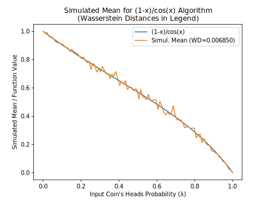 |  |  |
| (1/3)\*x/(1+(1/3)\*x) |  | 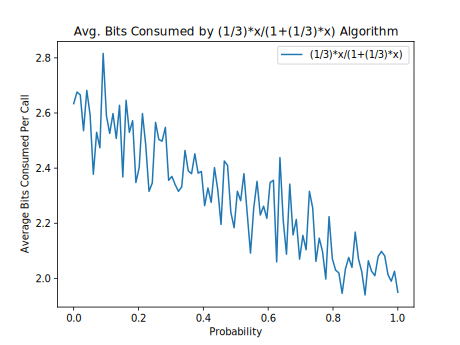 |  |
| (2/3)\*x/(1+(2/3)\*x) |  |  |  |
| (3/2)\*x/(1+(3/2)\*x) | 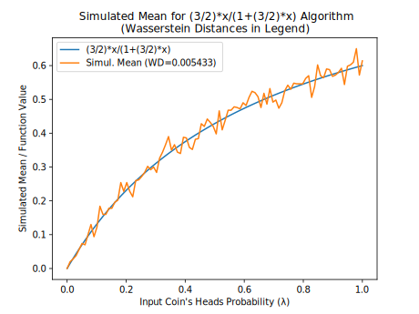 |  | 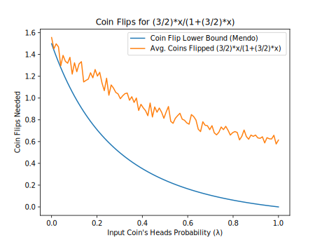 |
| 0.5\*x/(1+0.5\*x) |  | 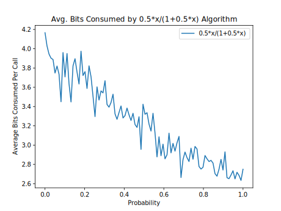 |  |
| 1 - ln(1+x) (Alt. Series) |  |  | 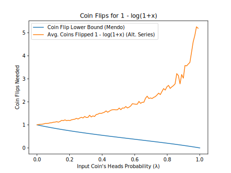 |
| 1/(1+x) (Alt. Series) |  | 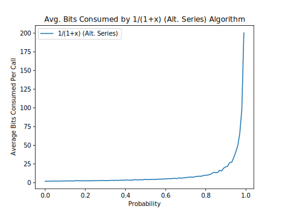 | 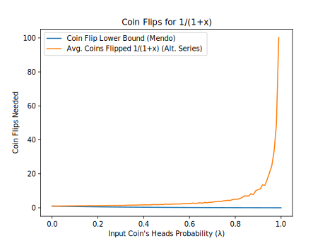 |
| 1/(1+x) (Even Parity) |  |  |  |
| 1/(1+x) (Two-Coin Special Case) |  |  |  |
| 1/(3+x) |  |  |  |
| 1/(5+x) | 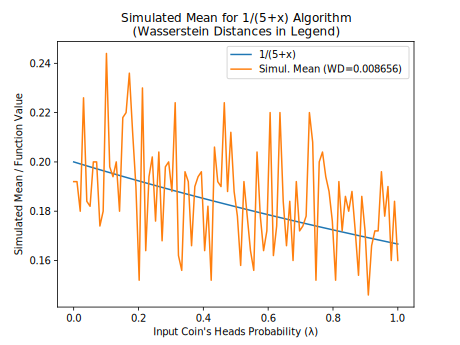 |  |  |
| 2014 1.200000 eps=0.050000 |  |  |  |
| 2014 1.500000 eps=0.050000 | 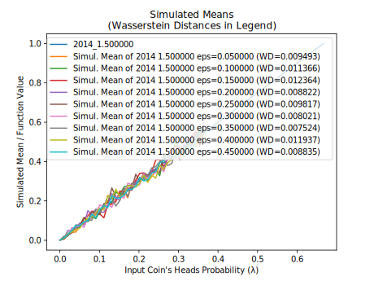 |  | 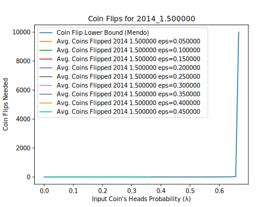 |
| 2014 2.000000 eps=0.050000 | 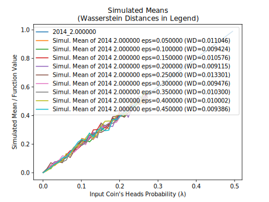 |  | 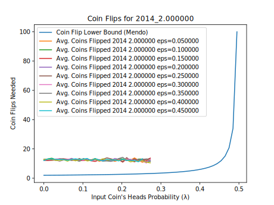 |
| 2014 3.000000 eps=0.050000 |  | 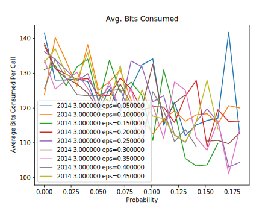 |  |
| 2014 5.000000 eps=0.050000 |  | 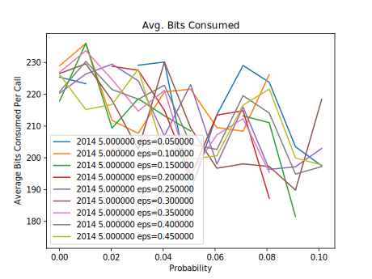 |  |
| 2014 Add. x+0.1 |  |  |  |
| 2014 Add. x+0.2 |  |  |  |
| 2014 Add. x+0.3 |  | 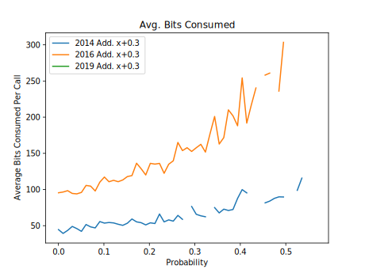 |  |
| 2014 Add. x+0.5 | 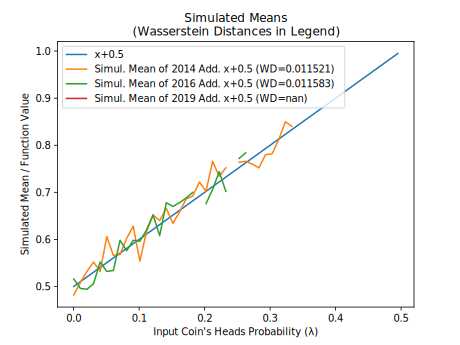 |  |  |
| 2014 Lin. x\*1.3 |  | 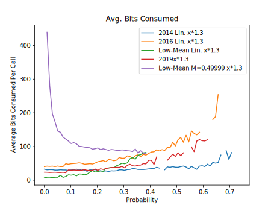 |  |
| 2014 Lin. x\*1.5 |  |  |  |
| 2014 Lin. x\*2.0 | 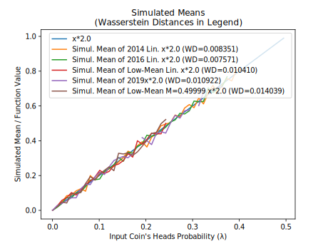 |  |  |
| 2014 Lin. x\*4.0 |  |  |  |
| 2014 Lin. x\*6.0 | 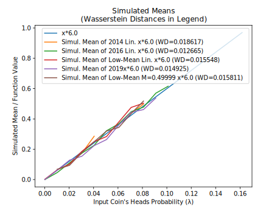 |  |  |
| 2014 Lin. x\*8.0 |  |  |  |
| 2016 1.200000 eps=0.050000 | 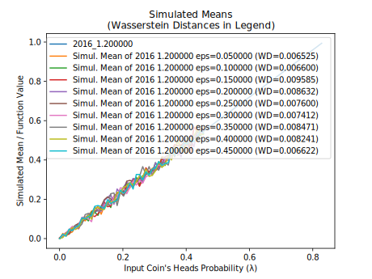 |  |  |
| 2016 1.500000 eps=0.050000 | 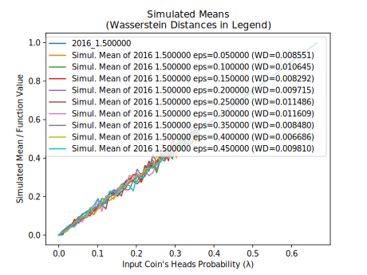 |  | 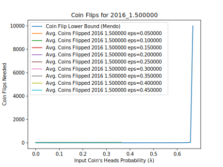 |
| 2016 2.000000 eps=0.050000 |  |  | 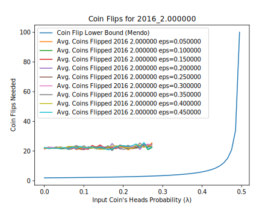 |
| 2016 3.000000 eps=0.050000 |  |  |  |
| 2016 5.000000 eps=0.050000 |  | 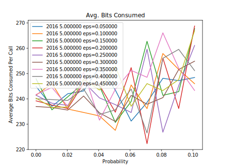 |  |
| 2019 1.200000 eps=0.050000 | 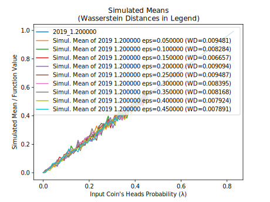 | 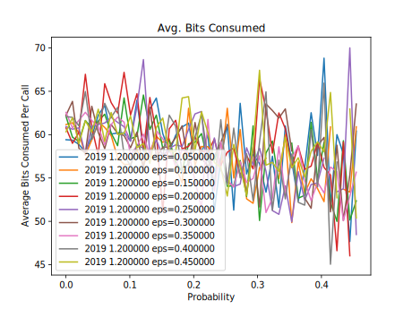 |  |
| 2019 1.500000 eps=0.050000 | 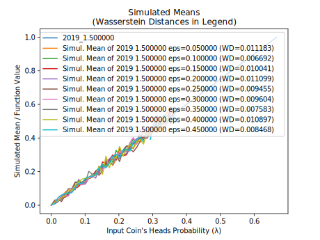 | 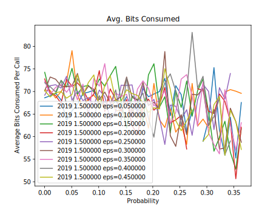 |  |
| 2019 2.000000 eps=0.050000 | 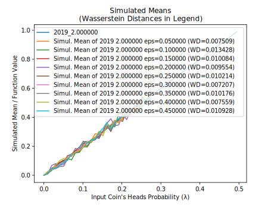 |  |  |
| 2019 3.000000 eps=0.050000 |  |  | 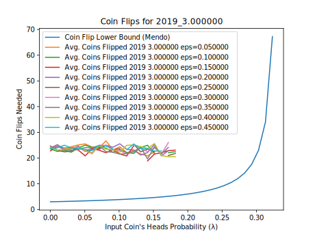 |
| 2019 5.000000 eps=0.050000 | 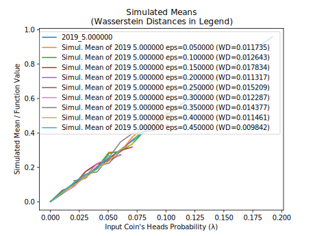 |  |  |
| Bernstein 0.2,0.6,0.3 |  | 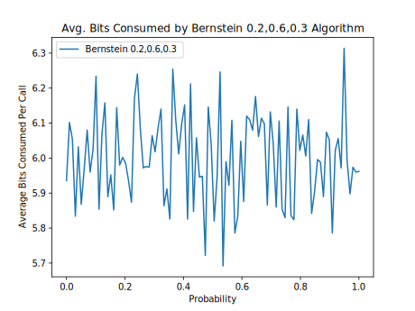 | 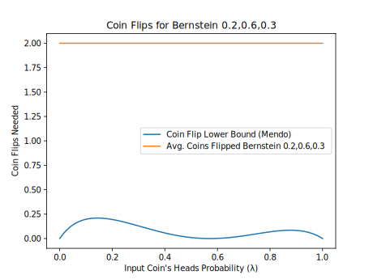 |
| arcsin(x)+sqrt(1-x\*x)-1 |  |  |  |
| arcsin(x)/2 |  |  |  |
| arctan(x) (Flajolet) |  |  |  |
| arctan(x) (Two-Coin Special Case) |  |  |  |
| cos(x) |  |  |  |
| exp(-x) (Alg. 2) |  |  |  |
| exp(-x) (Alt. Series) | 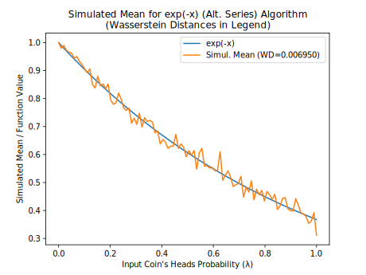 |  |  |
| exp(-x) (Flajolet) |  |  | 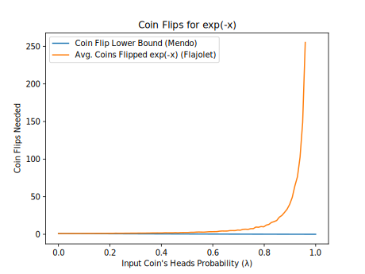 |
| exp(x)\*(1-x) |  |  |  |
| ln(1+x) (Flajolet) |  |  |  |
| ln(1+x) (Two-Coin Special Case) |  |  |  |
| pow(x,1/3) |  |  |  |
| pow(x,2/1) |  |  |  |
| pow(x,2/4) |  |  |  |
| pow(x,3/4) |  |  |  |
| pow(x,4/5) |  |  |  |
| pow(x,5/1) |  | 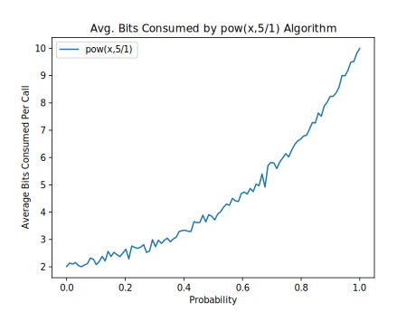 |  |
| pow(x,5/4) |  |  |  |
| sin(x) | 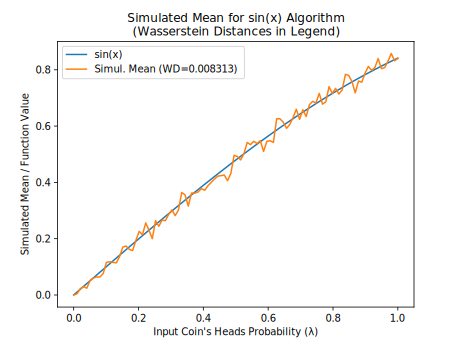 |  |  |
| sqrt(x) |  |  |  |

<a id=Notes></a>
## Notes

- <small><sup id=Note1>(1)</sup> Flajolet, P., Pelletier, M., Soria, M., "[**On Buffon machines and numbers**](https://arxiv.org/abs/0906.5560v2)", arXiv:0906.5560v2  [math.PR], 2010.</small>
- <small><sup id=Note2>(2)</sup> Keane,  M.  S.,  and  O'Brien,  G.  L., "A Bernoulli factory", _ACM Transactions on Modeling and Computer Simulation_ 4(2), 1994.</small>
- <small><sup id=Note3>(3)</sup> Huber, M., "[**Nearly optimal Bernoulli factories for linear functions**](https://arxiv.org/abs/1308.1562v2)", arXiv:1308.1562v2  [math.PR], 2014.</small>
- <small><sup id=Note4>(4)</sup> Nacu, Şerban, and Yuval Peres. "Fast simulation of new coins from old", The Annals of Applied Probability 15, no. 1A (2005): 93-115.</small>
- <small><sup id=Note5>(5)</sup> Mendo, Luis. "An asymptotically optimal Bernoulli factory for certain functions that can be expressed as power series." Stochastic Processes and their Applications 129, no. 11 (2019): 4366-4384.</small>
- <small><sup id=Note6>(6)</sup> Łatuszyński, K., Kosmidis, I.,  Papaspiliopoulos, O., Roberts, G.O., "[**Simulating events of unknown probabilities via reverse time martingales**](https://arxiv.org/abs/0907.4018v2)", arXiv:0907.4018v2 [stat.CO], 2009/2011.</small>
- <small><sup id=Note7>(7)</sup> Devroye, L., [**_Non-Uniform Random Variate Generation_**](http://luc.devroye.org/rnbookindex.html), 1986.</small>
- <small><sup id=Note8>(8)</sup> Shaddin Dughmi, Jason D. Hartline, Robert Kleinberg, and Rad Niazadeh. 2017. Bernoulli Factories and Black-Box Reductions in Mechanism Design. In _Proceedings of 49th Annual ACM SIGACT Symposium on the Theory of Computing_, Montreal, Canada, June 2017 (STOC’17).</small>
- <small><sup id=Note9>(9)</sup> Gonçalves, F. B., Łatuszyński, K. G., Roberts, G. O. (2017).  Exact Monte Carlo likelihood-based inference for jump-diffusion processes.</small>
- <small><sup id=Note10>(10)</sup> Another algorithm for this function uses the general martingale algorithm, but uses more bits on average as &lambda; approaches 1.  Here, the alternating series is `1 - x + x^2/2 - x^3/3 + ...`, whose coefficients are 1, 1, 1/2, 1/3, ...</small>
- <small><sup id=Note11>(11)</sup> Vats, D., Gonçalves, F. B., Łatuszyński, K. G., Roberts, G. O. "[**Efficient Bernoulli factory MCMC for intractable likelihoods**](https://arxiv.org/abs/2004.07471v1)", arXiv:2004.07471v1 [stat.CO], 2020.</small>
- <small><sup id=Note12>(12)</sup> Huber, M., "[**Optimal linear Bernoulli factories for small mean problems**](https://arxiv.org/abs/1507.00843v2)", arXiv:1507.00843v2 [math.PR], 2016.</small>
- <small><sup id=Note13>(13)</sup> Morina, G., Łatuszyński, K., et al., "[**From the Bernoulli Factory to a Dice Enterprise via Perfect Sampling of Markov Chains**](https://arxiv.org/abs/1912.09229v1)", arXiv:1912.09229v1 [math.PR], 2019.</small>
- <small><sup id=Note14>(14)</sup> One of the only implementations I could find of this, if not the only, was a [**Haskell implementation**](https://github.com/derekelkins/buffon/blob/master/Data/Distribution/Buffon.hs).</small>
- <small><sup id=Note15>(15)</sup> Huber, M., "[**Designing perfect simulation algorithms using local correctness**](https://arxiv.org/abs/1907.06748v1)", arXiv:1907.06748v1 [cs.DS], 2019.</small>
- <small><sup id=Note16>(16)</sup> Lee, A., Doucet, A. and Łatuszyński, K., 2014. Perfect simulation using atomic regeneration with application to Sequential Monte Carlo, arXiv:1407.5770v1  [stat.CO].</small>
- <small><sup id=Note17>(17)</sup> Mossel, Elchanan, and Yuval Peres. New coins from old: computing with unknown bias. Combinatorica, 25(6), pp.707-724.</small>
- <small><sup id=Note18>(18)</sup> Smith, N. A. and Johnson, M. (2007).  Weighted and probabilistic context-free grammars are equally expressive. Computational Linguistics, 33(4):477–491.</small>
- <small><sup id=Note19>(19)</sup> Icard, Thomas F., "Calibrating generative models: The probabilistic Chomsky–Schützenberger hierarchy." Journal of Mathematical Psychology 95 (2020): 102308.</small>
- <small><sup id=Note20>(20)</sup> Thomas, A.C., Blanchet, J., "[**A Practical Implementation of the Bernoulli Factory**](https://arxiv.org/abs/1106.2508v3)", arXiv:1106.2508v3  [stat.AP], 2012.</small>
- <small><sup id=Note21>(21)</sup> Goyal, V. and Sigman, K., 2012. On simulating a class of Bernstein polynomials. ACM Transactions on Modeling and Computer Simulation (TOMACS), 22(2), pp.1-5.</small>
- <small><sup id=Note22>(22)</sup> Wästlund, J., "[**Functions arising by coin flipping**](http://www.math.chalmers.se/~wastlund/coinFlip.pdf)", 1999.</small>
- <small><sup id=Note23>(23)</sup> An algebraic function is a function that can be a root of a polynomial system.</small>
- <small><sup id=Note24>(24)</sup> The probability given in Theorem 3.2 of the Flajolet paper, namely just "&Sigma; <sub>_k_ = 0, 1, 2, ... </sub> (W(_k_) * (&lambda;/2)<sup>_k_</sup>)", appears to be incorrect in conjunction with Figure 4 of that paper.</small>
- <small><sup id=Note25>(25)</sup> Brassard, G., Devroye, L., Gravel, C., "Remote Sampling with Applications to General Entanglement Simulation", Entropy 2019(21)(92), doi:10.3390/e21010092.</small>
- <small><sup id=Note26>(26)</sup> Bill Gosper, "Continued Fraction Arithmetic", 1978.</small>
- <small><sup id=Note27>(27)</sup> Borwein, J.M., Calkin, N.J., et al., "Continued logarithms and associated continued fractions", 2016.</small>
- <small><sup id=Note28>(28)</sup> Canonne, C., Kamath, G., Steinke, T., "[**The Discrete Gaussian for Differential Privacy**](https://arxiv.org/abs/2004.00010v2)", arXiv:2004.00010v2 [cs.DS], 2020.</small>
- <small><sup id=Note29>(29)</sup> Forsythe, G.E., "Von Neumann's Comparison Method for Random Sampling from the Normal and Other Distributions", _Mathematics of Computation_ 26(120), October 1972.</small>
- <small><sup id=Note30>(30)</sup> von Neumann, J., "Various techniques used in connection with random digits", 1951.</small>
- <small><sup id=Note31>(31)</sup> Pae, S., "Random number generation using a biased source", dissertation, University of Illinois at Urbana-Champaign, 2005.</small>
- <small><sup id=Note32>(32)</sup> Peres, Y., "Iterating von Neumann's procedure for extracting random bits", Annals of Statistics 1992,20,1, p. 590-597.</small>
- <small><sup id=Note33>(33)</sup> Kozen, D., [**"Optimal Coin Flipping"**](http://www.cs.cornell.edu/~kozen/Papers/Coinflip.pdf), 2014.</small>
- <small><sup id=Note34>(34)</sup> Devroye, L., Gravel, C., "[**Sampling with arbitrary precision**](https://arxiv.org/abs/1502.02539v5)", arXiv:1502.02539v5 [cs.IT], 2015.</small>
- <small><sup id=Note35>(35)</sup> As used here and in the Flajolet paper, a geometric random number is the number of successes before the first failure, where the success probability is &lambda;.</small>
- <small><sup id=Note36>(36)</sup> Flajolet, P., Sedgewick, R., "Analytic Combinatorics", 2009.</small>
- <small><sup id=Note37>(37)</sup> Monahan, J.. “Extensions of von Neumann’s method for generating random variables.” Mathematics of Computation 33 (1979): 1065-1069.</small>

<a id=Appendix></a>
## Appendix

&nbsp;

<a id=Randomized_vs_Non_Randomized_Algorithms></a>
### Randomized vs. Non-Randomized Algorithms

A _non-randomized algorithm_ is a simulation algorithm that uses nothing but the input coin as a source of randomness (in contrast to _randomized algorithms_, which do use other sources of randomness) (Mendo 2019)<sup>[**(5)**](#Note5)</sup>.  Instead of generating outside randomness, a randomized algorithm can implement a [**_randomness extraction_**](https://peteroupc.github.io/randextract.html) procedure to generate that randomness using the input coins themselves.  In this way, the algorithm becomes a _non-randomized algorithm_.  For example, if an algorithm implements the **two-coin special case** by generating a random bit in step 1, it could replace generating that bit with flipping the input coin twice until the coin returns 0 then 1 or 1 then 0 this way, then taking the result as 0 or 1, respectively (von Neumann 1951)<sup>[**(30)**](#Note30)</sup>.

In fact, there is a lower bound on the average number of coin flips needed to turn a coin with one bias (&lambda;) into a coin with another bias (&tau; = _f_(&lambda;)).  It's called the _entropy bound_ (see, e.g., (Pae 2005)<sup>[**(31)**](#Note31)</sup>, (Peres 1992)<sup>[**(32)**](#Note32)</sup>) and is calculated as&mdash;

&nbsp;&nbsp;&nbsp;&nbsp;((&tau; &minus; 1) * ln(1 &minus; &tau;) &minus; &tau; * ln(&tau;)) /<br/>
&nbsp;&nbsp;&nbsp;&nbsp;&nbsp;&nbsp;((&lambda; &minus; 1) * ln(1 &minus; &lambda;) &minus; &lambda; * ln(&lambda;)).

For example, if _f_(&lambda;) is a constant, non-randomized algorithms will generally require a growing number of coin flips to simulate that constant if the input coin is strongly biased towards heads or tails (the bias is &lambda;).  Note that this formula only works if nothing but coin flips is allowed as randomness.  (For certain values of &lambda;, Kozen (2014)<sup>[**(33)**](#Note33)</sup> showed a tighter lower bound of this kind, but this bound is non-trivial and assumes &lambda; is known.)

<a id=Simulating_Probabilities_vs_Estimating_Probabilities></a>
### Simulating Probabilities vs. Estimating Probabilities

A Bernoulli factory or another algorithm that produces heads with a given probability acts as an unbiased estimator for that probability (Łatuszyński et al. 2009/2011)<sup>[**(6)**](#Note6)</sup>.  (In this note, an _unbiased probability estimator_ is an unbiased estimator whose estimates are in \[0, 1\] almost surely.) As a result&mdash;

1. finding in some way an unbiased estimate of the input coin's probability of heads (&lambda;), such as by flipping the coin many times and averaging the results;
2. calculating _v_ = _f_(&lambda;);
3. generating a uniform random number in [0,1], call it _u_; and
4. returning 1 if _u_ is less than _v_, or 0 otherwise,

will simulate the probability _f_(&lambda;) in theory.  In practice, however, this method is prone to numerous errors, including estimation error in step 1, and rounding and approximation errors in steps 2 and 3.  For this reason and also because "exact sampling" is the focus of this page, this document does not cover algorithms that directly estimate &lambda; (such as in step 1). As (Mossel and Peres 2005)<sup>[**(17)**](#Note17)</sup> says: "The difficulty here is that [&lambda;] is unknown.  It is easy to estimate [&lambda;], and therefore [_f_(&lambda;)].  However, to get a coin with an exact bias [_f_(&lambda;)] is harder", and that is what Bernoulli factory algorithms are designed to do.

As also shown in (Łatuszyński et al. 2009/2011)<sup>[**(6)**](#Note6)</sup>, however, if _f_(&lambda;) can't serve as a factory function, no unbiased probability estimator of that function is possible, since sampling it isn't possible.  For example, function A can't serve as a factory function, so no simulator (or unbiased probability estimator) for that function is possible.  This _is_ possible for function B, however (Keane and O'Brien 1994)<sup>[**(2)**](#Note2)</sup>.

- Function A: 2 * &lambda;, when &lambda; lies in (0, 1/2).
- Function B: 2 * &lambda;, when &lambda; lies in (0, 1/2 &minus; &#x03F5;), where &#x03F5; is in (0, 1/2).

<a id=Convergence_of_Bernoulli_Factories></a>
### Convergence of Bernoulli Factories

The following Python code illustrates how to test a Bernoulli factory algorithm for convergence to the correct probability, as well as the speed of this convergence.  In this case, we are testing the Bernoulli factory algorithm of _x_<sup>_y_/_z_</sup>, where _x_ is in the interval (0, 1) and _y_/_z_ is greater than 0.  Depending on the parameters _x_, _y_, and _z_, this Bernoulli factory converges faster or slower.

```
# Parameters for the Bernoulli factory x**(y/z)
x=0.005 # x is the input coin's probability of heads
y=2
z=3
# Print the desired probability
print(x**(y/z))
passp = 0
failp = 0
# Set cumulative probability to 1
cumu = 1
iters=4000
for i in range(iters):
  # With probability x, the algorithm returns 1 (heads)
  prob=(x);prob*=cumu; passp+=prob; cumu-=prob
  # With probability (y/(z*(i+1))), the algorithm returns 0 (tails)
  prob=(y/(z*(i+1)));prob*=cumu; failp+=prob; cumu-=prob
  # Output the current probability in this iteration,
  # but only for the first 30 and last 30 iterations
  if i<30 or i>=iters-30: print(passp)
```

As this code shows, as _x_ (the probability of heads of the input coin) approaches 0, the convergence rate gets slower and slower, even though the probability will eventually converge to the correct one. In fact, when _y_/_z_ is less than 1:

- The average number of coin flips needed by this algorithm will grow without bound as _x_ approaches 0, and Mendo (2019)<sup>[**(5)**](#Note5)</sup> showed that this is a lower bound; that is, no Bernoulli factory algorithm can do much better without knowing more information on _x_.
- _x_<sup>_y_/_z_</sup> has a slope that tends to a vertical slope near 0, so that the so-called [**_Lipschitz condition_**](https://en.wikipedia.org/wiki/Lipschitz_continuity) is not met at 0.  And (Nacu and Peres 2005, propositions 10 and 23)<sup>[**(4)**](#Note4)</sup> showed that the Lipschitz condition is necessary for a Bernoulli factory to have an upper bound on the average running time.

Thus, a practical implementation of this algorithm may have to switch to an alternative implementation (such as the one described in the next section) when it detects that the geometric bag's first few digits are zeros.

<a id=Alternative_Implementation_of_Bernoulli_Factories></a>
### Alternative Implementation of Bernoulli Factories

Say we have a Bernoulli factory algorithm that takes a coin with probability of heads of _p_ and outputs 1 with probability _f_(_p_).  If this algorithm takes a geometric bag (a partially-sampled uniform random number or PSRN) as the input coin and flips that coin using **SampleGeometricBag**, the algorithm could instead be implemented as follows in order to return 1 with probability _f_(_U_), where _U_ is the number represented by the geometric bag (see also (Brassard et al., 2019)<sup>[**(25)**](#Note25)</sup>, (Devroye 1986, p. 769)<sup>[**(7)**](#Note7)</sup>, (Devroye and Gravel 2015)<sup>[**(34)**](#Note34)</sup>:

1. Set _v_ to 0 and _k_ to 1.
2. Set _v_ to _b_ * _v_ + _d_, where _b_ is the base (or radix) of the geometric bag's digits, and _d_ is a digit chosen uniformly at random.
3. Calculate an approximation of _f_(_U_) as follows:
    1. Set _n_ to the number of items (sampled and unsampled digits) in the geometric bag.
    2. Of the first _n_ items in the geometric bag, sample each of the unsampled digits uniformly at random.  Then let _uk_ be the geometric bag's digit expansion up to the first _n_ digits after the point.
    3. Calculate the lowest and highest values of _f_ in the interval \[_uk_, _uk_ + _b_<sup>&minus;_n_</sup>\], call them _fmin_ and _fmax_. If abs(_fmin_ &minus; _fmax_) <= 2 * _b_<sup>&minus;_k_</sup>, calculate (_fmax_ + _fmin_) / 2 as the approximation.  Otherwise, add 1 to _n_ and go to the previous substep.
4. Let _pk_ be the approximation's digit expansion up to the _k_ digits after the point.  For example, if _f_(_U_) is &pi;, _b_ is 10, and _k_ is 2, _pk_ is 314.
5. If _pk_ + 1 <= _v_, return 0. If _pk_ &minus; 2 >= _v_, return 1.  If neither is the case, add 1 to _k_ and go to step 2.

However, the focus of this article is on algorithms that don't rely on calculations of irrational numbers, which is why this section is in the appendix.

<a id=Correctness_Proof_for_the_Continued_Logarithm_Simulation_Algorithm></a>
### Correctness Proof for the Continued Logarithm Simulation Algorithm

**Theorem.** _The algorithm given in "Continued Logarithms" returns 1 with probability exactly equal to the number represented by the continued logarithm c, and 0 otherwise._

_Proof._ This proof of correctness takes advantage of Huber's "fundamental theorem of perfect simulation" (Huber 2019)<sup>[**(15)**](#Note15)</sup>.  Using Huber's theorem requires proving two things:

- First, we note that the algorithm clearly halts almost surely, since step 1 will stop the algorithm if it reaches the last coefficient, and step 2 always gives a chance that the algorithm will return a value, even if it's called recursively or the number of coefficients is infinite.
- Second, we show the algorithm is locally correct when the recursive call in step 3 is replaced with an oracle that simulates the correct "continued sub-logarithm".  If step 1 reaches the last coefficient, the algorithm obviously passes with the correct probability.  Otherwise, we will be simulating the probability (1 / 2<sup>_c_\[_i_\]</sup>) / (1 + _x_), where _x_ is the "continued sub-logarithm" and will be at most 1 by construction.  Steps 2 and 3 define a loop that divides the probability space into three pieces: the first piece takes up one half, the second piece (step 3) takes up a portion of the other half (which here is equal to _x_/2), and the last piece is the "rejection piece" that reruns the loop.  Since this loop changes no variables that affect later iterations, each iteration acts like an acceptance/rejection algorithm already proved to be a perfect simulator by Huber.  The algorithm will pass at step 2 with probability _p_ = (1 / 2<sup>_c_\[_i_\]</sup>) / 2 and fail either at step 2 with probability _f1_ = (1 &minus; 1 / 2<sup>_c_\[_i_\]</sup>) / 2, or at step 3 with probability _f2_ = _x_/2 (all these probabilities are relative to the whole iteration).  Finally, dividing the passes by the sum of passes and fails (_p_ / (_p_ + _f1_ + _f2_)) leads to (1 / 2<sup>_c_\[_i_\]</sup>) / (1 + _x_), which is the probability we wanted.

Since both conditions of Huber's theorem are satisfied, this completes the proof. &#x25a1;

<a id=Correctness_Proof_for_Continued_Fraction_Simulation_Algorithm_3></a>
### Correctness Proof for Continued Fraction Simulation Algorithm 3

**Theorem.** _Suppose a generalized continued fraction's partial numerators are b[i] and all greater than 0, and its partial denominators are a[i] and all greater than 0, and suppose further that each b[i]/a[i] is 1 or less. Then the algorithm given as Algorithm 3 in "Continued Fractions" returns 1 with probability exactly equal to the number represented by that continued fraction, and 0 otherwise._

_Proof._ We use Huber's "fundamental theorem of perfect simulation" again in the proof of correctness.

- The algorithm halts almost surely for the same reason as the similar continued logarithm simulator.
- If the call in step 3 is replaced with an oracle that simulates the correct "sub-fraction", the algorithm is locally correct.  If step 1 reaches the last element of the continued fraction, the algorithm obviously passes with the correct probability. Otherwise, we will be simulating the probability _b_\[_i_\] / (_a_\[_i_\] + _x_), where _x_ is the "continued sub-fraction" and will be at most 1 by assumption.  Steps 2 and 3 define a loop that divides the probability space into three pieces: the first piece takes up a part equal to _h_ = _a_\[_i_\]/(_a_\[_i_\] + 1), the second piece (step 3) takes up a portion of the remainder (which here is equal to _x_ * (1 &minus; _h_)), and the last piece is the "rejection piece".  The algorithm will pass at step 2 with probability _p_ = (_b_\[_i_\] / _a_\[_pos_\]) * _h_ and fail either at step 2 with probability _f1_ = (1 &minus; _b_\[_i_\] / _a_\[_pos_\]) * _h_, or at step 3 with probability _f2_ = _x_ * (1 &minus; _h_) (all these probabilities are relative to the whole iteration).  Finally, dividing the passes by the sum of passes and fails leads to _b_\[_i_\] / (_a_\[_i_\] + _x_), which is the probability we wanted, so that both of Huber's conditions are satisfied and we are done.  &#x25a1;

<a id=The_von_Neumann_Schema></a>
### The von Neumann Schema

(Flajolet et al., 2010)<sup>[**(1)**](#Note1)</sup> describes what it calls the _von Neumann schema_ (sec. 2).  Although the von Neumann schema is used in several Bernoulli factories given here, it's not a Bernoulli factory itself since it could produce random numbers other than 0 and 1, which is why this section appears in the appendix.  Given a permutation class and an input coin, the von Neumann schema generates a random non-negative integer _n_ with probability equal to&mdash;

- (&lambda;<sup>_n_</sup> * V(_n_) / _n_!) / EGF(&lambda;),

where&mdash;

- EGF(&lambda;) = &Sigma;<sub>_k_ = 0, 1, ...</sub> (&lambda;<sup>_k_</sup> * V(_k_) / _k_!) (the _exponential generating function_ or EGF, which completely determines a permutation class), and
- V(_n_) is the number of _valid_ permutations of size _n_ (and must be in the interval \[0, _n_!\]).

Effectively, a geometric(&lambda;) random number _G_<sup>[**(35)**](#Note35)</sup> is accepted with probability V(_G_)/_G_! (where _G_! is the number of _possible_ permutations of size _G_, or 1 if _G_ is 0), and rejected otherwise.  The probability that _r_ geometric random numbers are rejected this way is _p_*(1 &minus; _p_)<sup>_r_</sup>, where _p_ = (1 &minus; &lambda;) * EGF(&lambda;).

Examples of permutation classes include&mdash;

- single-cycle permutations (EGF(&lambda;) = Cyc(&lambda;) = ln(1/(1 &minus; &lambda;)); V(_n_) = (_n_ &minus; 1)!)
- sorted permutations (EGF(&lambda;) = Set(&lambda;) = exp(&lambda;); V(_n_) = 1),
- all permutations (EGF(&lambda;) = Seq(&lambda;) = 1/(1 &minus; &lambda;); V(_n_) = _n_!),
- alternating permutations of even size (EGF(&lambda;) = 1/cos(&lambda;); the V(_n_) starting at _n_ = 0 is [**A000364**](https://oeis.org/A000364) in the _On-Line Encyclopedia of Integer Sequences_), and
- alternating permutations of odd size (EGF(&lambda;) = tan(&lambda;); the V(_n_) starting at _n_ = 0 is [**A000182**](https://oeis.org/A000182)),

using the notation in "Analytic Combinatorics" (Flajolet and Sedgewick 2009)<sup>[**(36)**](#Note36)</sup>.

The following algorithm generates a random number that follows the von Neumann schema.

1. Set _r_ to 0. (This is the number of times the algorithm rejects a random number.)
2. Flip the input coin until the coin returns 0.  Then set _G_ to the number of times the coin returns 1 this way.
3. With probability V(_G_)/_G_!, return _G_ (or _r_ if desired).  (In practice, the probability check is done by generating _G_ uniform random numbers and determining whether those numbers satisfy the given permutation class, or generating as many of those numbers as necessary to make this determination.  This is especially because _G_!, the factorial of _G_, can easily become very large.)
4. Add 1 to _r_ and go to step 2.

A variety of Bernoulli factory probability functions can arise from the von Neumann schema, depending on the EGF and which values of _G_ and/or _r_ the Bernoulli factory algorithm treats as heads or tails.  The following Python functions use the SymPy computer algebra library to find probabilities and other useful information for applying the von Neumann schema, given a permutation class's EGF.

```
def coeffext(f, x, power):
    # Extract a coefficient from a generating function
    px = 2
    for i in range(10):
      try:
        poly=Poly(series(f, x=x, n=power+px).removeO())
        if power == 0:
          return poly.coeff_monomial(1)
        return poly.as_expr().coeff(x**power)
      except:
        px+=2
    # Failed, assume 0
    return 0

def number_n_prob(f, x, n):
    # Probability that the number n is generated
    # for the von Neumann schema with the given
    # exponential generating function (e.g.f.)
    # Example: number_n_prob(exp(x),x,1) --> x**exp(-x)
    return (x**n*coeffext(f, x, n))/f

def r_rejects_prob(f, x, r):
    # Probability that the von Neumann schema
    # with the given e.g.f. will reject r random numbers
    # before accepting the next one
    p=(1-x)*f
    return p*(1-p)**r

def valid_perm(f, x, n):
    # Number of valid permutations of size n for the
    # von Neumann schema with the given e.g.f.
    return coeffext(f, x, n)*factorial(n)
```

> **Note:** The von Neumann schema can simulate any _power series distribution_ (such as Poisson, negative binomial, geometric, and logarithmic series), given a suitable exponential generating function.

<a id=Probabilities_Arising_from_the_Forsythe_Method></a>
### Probabilities Arising from the Forsythe Method

The Forsythe method of random sampling (Forsythe 1972)<sup>[**(29)**](#Note29)</sup> gives rise to a class of interesting probability functions.

Let _D_ and _E_ be two probability distributions.  Draw one number from _D_ (&delta;).  Then draw numbers from _E_ (_e1_, _e2_, etc.) until a number drawn this way is greater than the previous drawn number (which can be &delta;).  Then count the numbers drawn from _E_ this way, call the count _k_.  Then the probability that &delta; is less than _x_ given that&mdash;

- _k_ is odd is (&int;<sub>(&minus;&infin;, _x_)</sub> exp(&minus;ECDF(_z_)) * DPDF(_z_) _dz_) / (&int;<sub>(&minus;&infin;, &infin;)</sub> exp(&minus;ECDF(_z_)) * DPDF(_z_) _dz_) (Formula 1; see Theorem 2.1(iii) of (Devroye 1986, Chapter IV)<sup>[**(7)**](#Note7)</sup>), or
- _k_ is even is (&int;<sub>(&minus;&infin;, _x_)</sub> (1 &minus; exp(&minus;ECDF(_z_))) * DPDF(_z_) _dz_) / (&int;<sub>(&minus;&infin;, &infin;)</sub> (1 &minus; exp(&minus;ECDF(_z_))) * DPDF(_z_) _dz_) (Formula 2; see also (Monahan 1979)<sup>[**(37)**](#Note37)</sup>),

where DPDF is the probability density function (PDF) of _D_, and ECDF is the cumulative distribution function  (CDF) of _E_.  For example, the algorithm to simulate [**erf(_x_)/erf(1)**](#erf__x__erf_1) uses the fact that when&mdash;

- DPDF is the uniform(0,1) distribution's PDF, which is 1 in the interval [0, 1] and 0 elsewhere, and
- ECDF is the CDF for the maximum of two uniform(0,1) random numbers, which is simply _z_<sup>2</sup>,

then Formula 1 above becomes&mdash;

- (&int;<sub>[0, _x_]</sub> exp(&minus;(_z_<sup>2</sup>)) _dz_) / (&int;<sub>[0, 1]</sub> exp(&minus;(_z_<sup>2</sup>)) _dz_), &nbsp;&nbsp;&nbsp;(Formula 3)

and thus erf(_x_)/erf(1).  If the last step in the algorithm reads "Return 0" rather than "Go to step 1", then the algorithm simulates the probability erf(_x_)\*sqrt(&pi;)/2 (and the denominator in Formulas 1 and 3 becomes 1).

<a id=Probabilities_Arising_from_Certain_Permutations></a>
### Probabilities Arising from Certain Permutations

Consider the following algorithm:

1. Generate a uniform random number _u_, then set _k_ to 1.
2. Generate another uniform random number _v_.
3. If _k_ is odd and _u_ is less than _v_, or if _k_ is even and _v_ is less than _u_, return _k_.
4. Set _u_ to _v_, then add 1 to _k_, then go to step 2.

This algorithm generates an alternating sequence of a random length, and in so doing, it returns the number _n_ with a probability given by the following recursive formula:

_C_(_n_) = (1 &minus; _a_<sub>_n_ + 1</sub>/(_a_<sub>_n_</sub> * (_n_ + 1)) ) * (1 &minus; &Sigma;<sub>_j_ = 0, ..., _n_ &minus; 1</sub> _C_(_j_) ),

where _a_<sub>_i_</sub> is the integer at position _i_ (starting at 0) of the sequence [**A000111**](https://oeis.org/A000111) in the _On-Line Encyclopedia of Integer Sequences_.

Inspired by the [**von Neumann schema**](#The_von_Neumann_schema) given earlier in this appendix, we can extend the algorithm to certain kinds of permutation as follows:

1. Create an empty list.
2. Generate a uniform random number _u_, and add _u_ to the list.
3. If the items in the list do not form a valid permutation, return the number of items in the list minus 1.  Otherwise, go to step 2.

This algorithm returns the number _n_ with the following probability:

_C_(_n_) = (1 &minus; V(_n_ + 1)/(V(_n_) * (_n_ + 1)) ) * (1 &minus; &Sigma;<sub>_j_ = 0, ..., _n_ &minus; 1</sub> _C_(_j_) ),

where _V_(_n_) is the number of valid permutations of size _n_. For this algorithm, _V_(_n_) must be in the interval \(0, _n_!\], except that _V_(0) can be 0. _V_(_n_) can be a sequence associated with an _exponential generating function_ (EGF) for the kind of permutation involved in the algorithm, and examples of EGFs were given in the section on the von Neumann schema.  For example, the first algorithm in this section expresses the special case of alternating permutations and corresponds to the EGF tan(&lambda;)+sec(&lambda;).

For either algorithm, the probability that the generated _n_&mdash;

- is odd is 1 &minus; 1 / EGF(1), or
- is even is 1 / EGF(1).

For example, if the second algorithm treates sorted permutations as valid (making the EGF exp(&lambda;)), then the algorithm returns an odd number with probability 1 &minus; 1/exp(1). If that algorithm instead treats alternating permutations as valid (making the EGF tan(&lambda;)+sec(&lambda;)), then the algorithm returns an odd number with probability 1 &minus; 1/(tan(1)+sec(1)).

<a id=Other_Algorithms_for_exp_minus_lambda></a>
### Other Algorithms for exp(&minus;&lambda;)

The following two algorithms also simulate exp(&minus;&lambda;), but converge slowly as &lambda; approaches 1.

The algorithm in (Flajolet et al., 2010)<sup>[**(1)**](#Note1)</sup> calls for generating a Poisson(&lambda;) random number and returning 1 if that number is 0, or 0 otherwise.  The Poisson generator in turn involves generating a geometric(&lambda;) random number _G_<sup>[**(35)**](#Note35)</sup>, then _G_ uniform random numbers, then returning _G_ only if all _G_ uniform numbers are sorted (see "[**The von Neumann Schema**](#The_von_Neumann_Schema)" in the appendix).  The algorithm follows.

1. Flip the input coin until the coin returns 0.  Then set _G_ to the number of times the coin returns 1 this way.
2. If _G_ is 0, return 1.
3. Generate a uniform random number _w_, and set _i_ to 1.
4. While _i_ is less than _G_:
    1. Generate a uniform random number _U_.
    2. If _w_ is less than _U_, break out of this loop and go to step 1.
    3. Add 1 to _i_, and set _w_ to _U_.
5. Return 0.  (_G_ is now a Poisson(&lambda;) random number, but is other than 0.)

An alternative version of the algorithm above doesn't generate a geometric random number at the outset.

1. Set _k_ and _w_ each to 0.
2. Flip the input coin.  If the coin returns 0 and _k_ is 0, return 1.  Otherwise, if the coin returns 0, return 0.
3. Generate a uniform random number _U_.
4. If _k_ > 0 and _w_ is less than _U_, go to step 1.
5. Set _w_ to _U_, add 1 to _k_, and go to step 2.

<a id=Sketch_of_Derivation_of_the_Algorithm_for_1_pi></a>
### Sketch of Derivation of the Algorithm for 1 / &pi;

The Flajolet paper presented an algorithm to simulate 1 / &pi; but provided no derivation.  Here is a sketch of how this algorithm works.

The algorithm is an application of the [**convex combination**](#Convex_Combinations) technique.  Namely, 1 / &pi; can be seen as a convex combination of two components:

- _g_(_n_): 2<sup>6 * _n_</sup> * (6 * _n_ + 1) / 2<sup>8 * _n_ + 2</sup> = 2<sup>&minus;2 * _n_</sup> * (6 * _n_ + 1) / 4 = (6 * _n_ + 1) / (2<sup>2 * _n_ + 2</sup>), which is the probability that the sum of two geometric(1/4) random numbers<sup>[**(35)**](#Note35)</sup> and one Bernoulli(5/9) random number, all of which are independent, equals _n_.  This corresponds to step 1 of the convex combination algorithm and steps 2 through 4 of the 1 / &pi; algorithm.  (This also shows that there may be an error in the identity for 1 / &pi; given in the Flajolet paper: the "8 _n_ + 4" should probably read "8 _n_ + 2".)
    - Note 1: 9 * (_n_ + 1) / (2<sup>2 * _n_ + 4</sup>) is the probability that the sum of two independent geometric(1/4) random numbers equals _n_.
    - Note 2: _p_<sup>_n_</sup> * (1 &minus; _p_)<sup>_m_</sup> * choose(_n_ + _m_ &minus; 1, _m_ &minus; 1) is the probability that the sum of _m_ independent geometric(_p_) random numbers equals _n_ (a _negative binomial distribution_).
    - Note 3: _f_(_z_) * (1 &minus; _p_) + _f_(_z_ &minus; 1) * _p_ is the probability that the sum of two independent random numbers &mdash; a Bernoulli(_p_) number and a number _z_ with probability function _f_(.) &mdash; equals _z_.
- _h_<sub>_n_</sub>(): (choose(_n_ * 2, _n_) / 2<sup>_n_ * 2</sup>)<sup>3</sup>, which is the probability of heads of the "coin" numbered _n_.  This corresponds to step 2 of the convex combination algorithm and step 5 of the 1 / &pi; algorithm.

<a id=License></a>
## License

Any copyright to this page is released to the Public Domain.  In case this is not possible, this page is also licensed under [**Creative Commons Zero**](https://creativecommons.org/publicdomain/zero/1.0/).
