
## Correctness and Performance Charts

The following charts show the correctness of many of the algorithms in "[Bernoulli Factory Algorithms](https://peteroupc.github.io/bernoulli.md)" and show their performance in terms of the number of bits they use on average.  For each algorithm, and for each of 100 &lambda; values evenly spaced from 0.0001 to 0.9999:

- 500 runs of the algorithm were done.  Then...
- The number of bits used by the runs were averaged, as were the return values of the runs (since the return value is either 0 or 1, the mean return value will be in the interval [0, 1]).  The number of bits used included the number of bits used to produce each coin flip, assuming the coin flip procedure for &lambda; was generated using the `Bernoulli#coin()` method in _bernoulli.py_, which produces that probability in an optimal or near-optimal way.

For each algorithm, if a single run was detected to use more than 5000 bits for a given &lambda;, the entire data point for that &lambda; was suppressed in the charts below.

In addition, for each algorithm, a chart appears showing the minimum number of input coin flips that any fast Bernoulli factory algorithm will need on average to simulate the given function, based on work by Mendo (2019)[**(5)**](#Note5).  Note that some functions require a growing number of coin flips as &lambda; approaches 0 or 1.  Note that for the 2014, 2016, and 2019 algorithms&mdash;

- an &#x03F5; of 1 &minus; (_x_ + _c_) * 1.001 was used (or 0.0001 if &#x03F5; would be greater than 1), and
- an &#x03F5; of (_x_ &minus; _c_) * 0.9995 for the subtraction variants.

Points with invalid &#x03F5; values were suppressed.  For the low-mean algorithm, an _m_ of max(0.49999, _x_*_c_*1.02) was used unless noted otherwise.

### The Charts

| Algorithm | Simulated Mean | Average Bits Consumed | Coin Flips |
 --- | --- | --- | --- |
| (1-x)\*tan(x) |  |  |  |
| (1-x)/cos(x) |  | 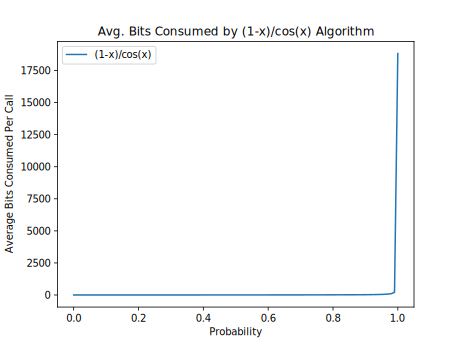 | 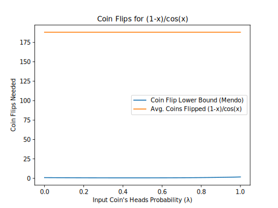 |
| (1/3)\*x/(1+(1/3)\*x) | 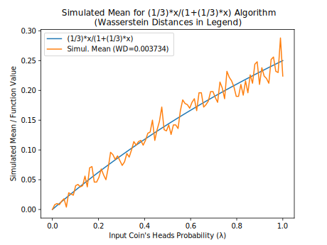 |  |  |
| (2/3)\*x/(1+(2/3)\*x) |  |  |  |
| (3/2)\*x/(1+(3/2)\*x) |  | 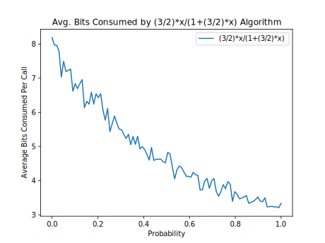 |  |
| 0.5\*x/(1+0.5\*x) |  |  | 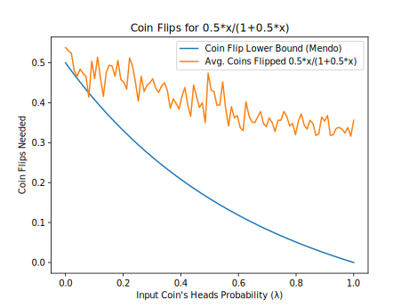 |
| 1 - ln(1+x) (Alt. Series) |  |  |  |
| 1/(1+x) (Alt. Series) |  |  |  |
| 1/(1+x) (Even Parity) |  |  |  |
| 1/(1+x) (Two-Coin Special Case) |  |  |  |
| 1/(3+x) |  |  | 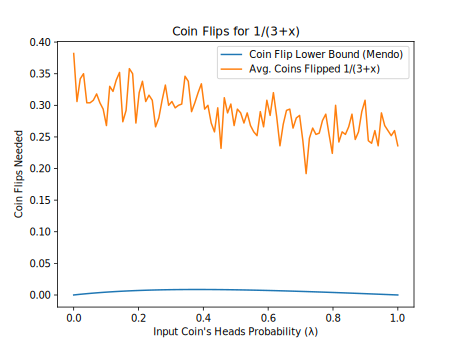 |
| 1/(5+x) |  |  |  |
| 2014 1.200000 eps=0.050000 | 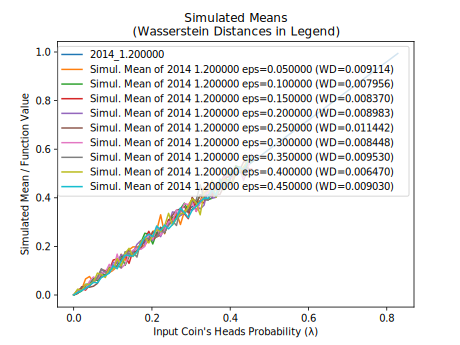 |  |  |
| 2014 1.500000 eps=0.050000 |  | 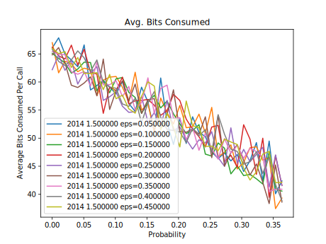 |  |
| 2014 2.000000 eps=0.050000 |  |  |  |
| 2014 3.000000 eps=0.050000 |  |  |  |
| 2014 5.000000 eps=0.050000 |  |  |  |
| 2014 Add. x+0.1 | 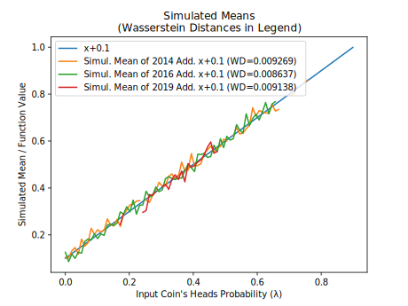 |  | 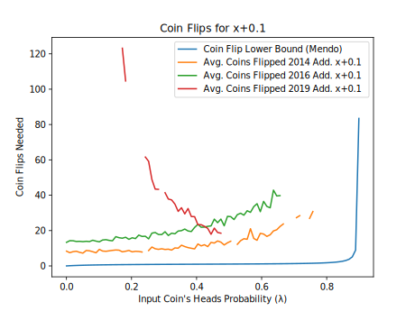 |
| 2014 Add. x+0.2 | 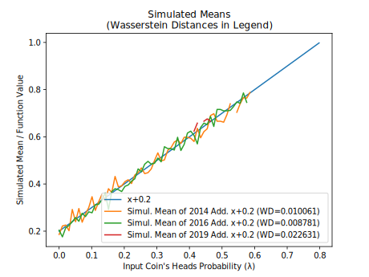 | 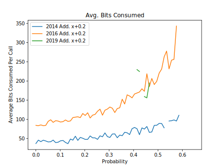 |  |
| 2014 Add. x+0.3 |  |  |  |
| 2014 Add. x+0.5 |  |  |  |
| 2014 Lin. x\*1.3 |  |  | 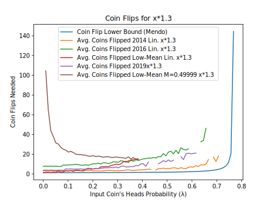 |
| 2014 Lin. x\*1.5 | 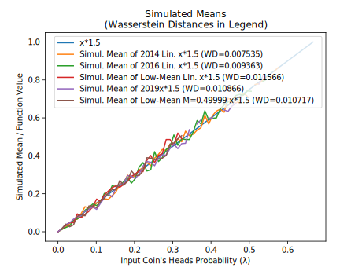 |  |  |
| 2014 Lin. x\*2.0 |  |  |  |
| 2014 Lin. x\*4.0 |  |  |  |
| 2014 Lin. x\*6.0 |  |  |  |
| 2014 Lin. x\*8.0 | 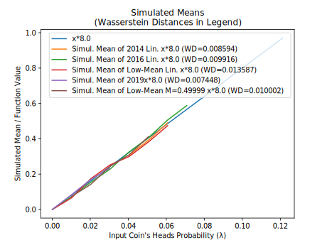 |  |  |
| 2016 1.200000 eps=0.050000 |  |  | 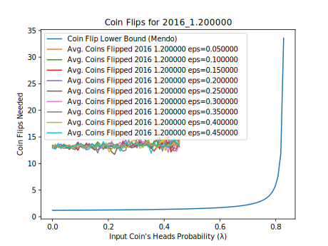 |
| 2016 1.500000 eps=0.050000 |  |  |  |
| 2016 2.000000 eps=0.050000 | 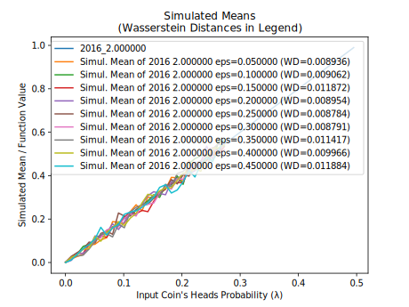 | 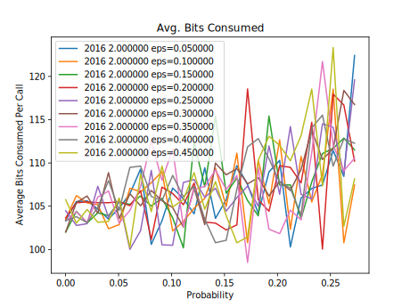 |  |
| 2016 3.000000 eps=0.050000 | 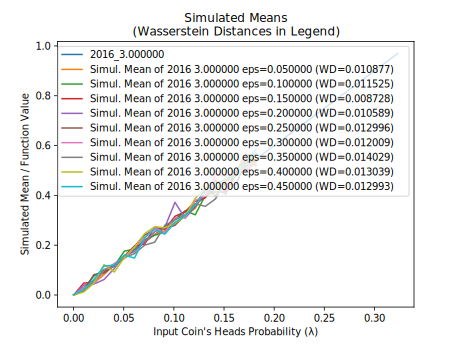 | 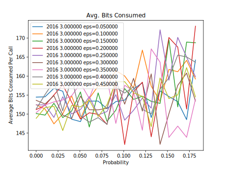 |  |
| 2016 5.000000 eps=0.050000 |  |  |  |
| 2019 1.200000 eps=0.050000 |  |  | 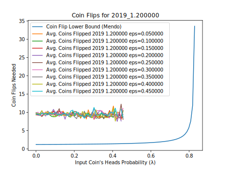 |
| 2019 1.500000 eps=0.050000 |  |  | 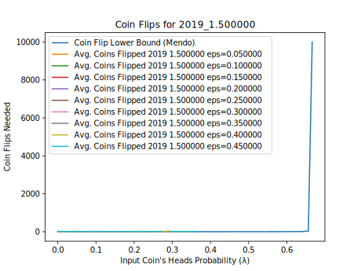 |
| 2019 2.000000 eps=0.050000 |  | 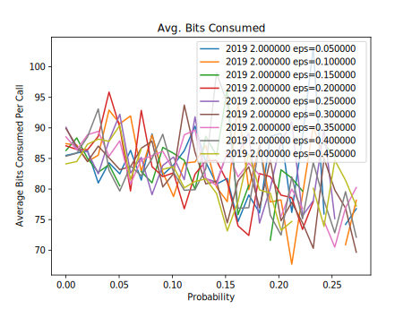 | 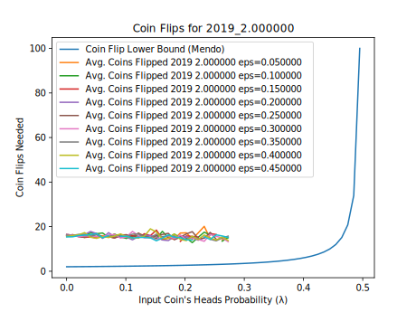 |
| 2019 3.000000 eps=0.050000 |  |  |  |
| 2019 5.000000 eps=0.050000 |  |  |  |
| Bernstein 0.2,0.6,0.3 |  |  |  |
| arcsin(x)+sqrt(1-x\*x)-1 |  |  |  |
| arcsin(x)/2 |  | 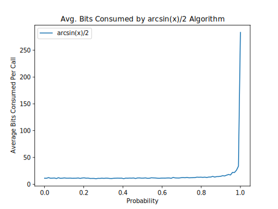 | 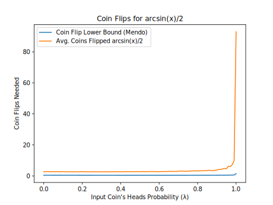 |
| arctan(x) (Flajolet) | 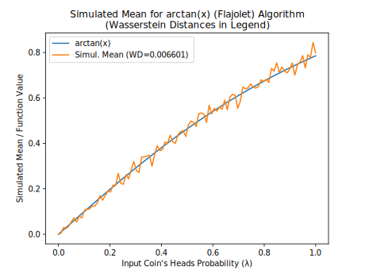 |  | 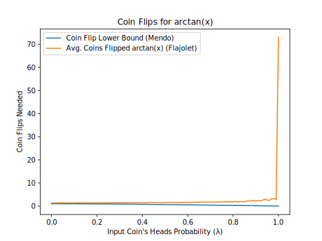 |
| arctan(x) (Two-Coin Special Case) |  |  |  |
| cos(x) | 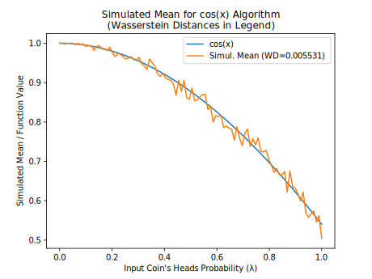 |  | 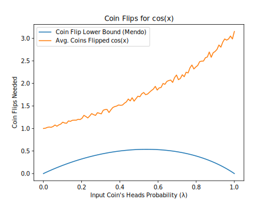 |
| exp(-x) (Alg. 2) |  |  |  |
| exp(-x) (Alt. Series) |  |  |  |
| exp(-x) (Flajolet) |  | 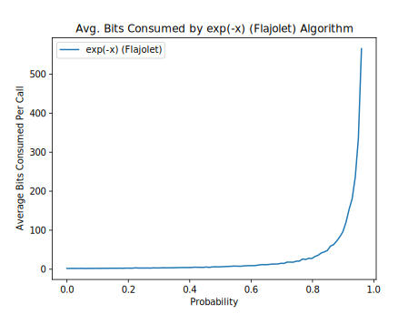 |  |
| exp(x)\*(1-x) |  | 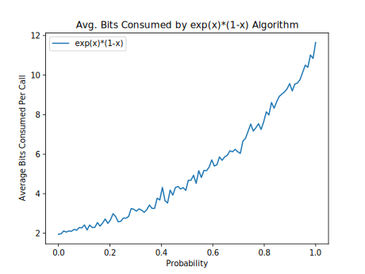 | 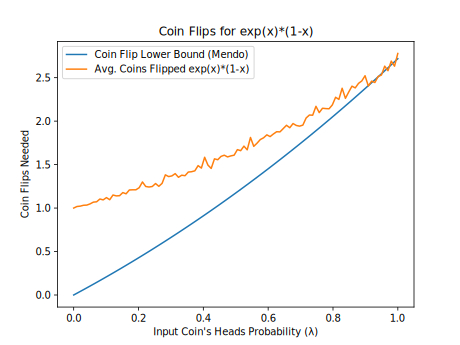 |
| ln(1+x) (Flajolet) | 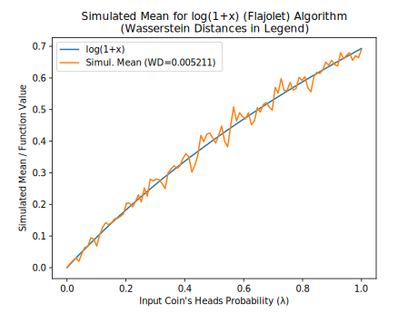 |  |  |
| ln(1+x) (Two-Coin Special Case) |  |  | 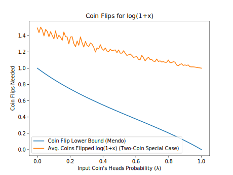 |
| pow(x,1/3) |  |  | 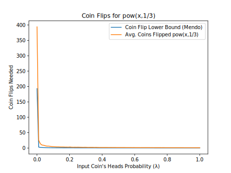 |
| pow(x,2/1) |  |  |  |
| pow(x,2/4) |  |  |  |
| pow(x,3/4) |  |  |  |
| pow(x,4/5) |  |  |  |
| pow(x,5/1) |  |  |  |
| pow(x,5/4) |  |  |  |
| sin(x) |  |  | 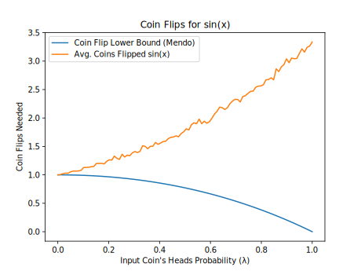 |
| sqrt(x) |  |  |  |
